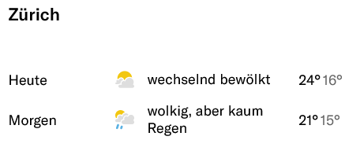

```{r set-options, echo=FALSE, cache=FALSE, purl=FALSE, message=FALSE, warning=FALSE}
options(width = 100)
library(knitr)
library(bookdown)
```


# Prerequisites

- Sign in to Nuvolos here: https://az.nuvolos.cloud/login using your Unisg E-Mail address.
- Nuvolos is a cloud-based service that allows you to use R and the IDE RStudio through your browser. In the scope of this course, there is no need to install R locally on your machine.
- If you do not have a GitHub account, create one here: https://github.com/join. Accounts are free. No need to use your Unisg E-Mail address.

# Part I: Introduction

# Why R?^[From @umatter_2018]

## The 'data language'
The programming language and open-source statistical computing environment [R](www.r-project.org) has over the last decade become a core tool for data science in industry and academia. It was originally designed as a tool for statistical analysis. Many characteristics of the language make R particularly useful to work with data. With the rise of the 'data economy' and 'data science', R is increasingly used in various domains, going well beyond the traditional applications of academic research.  

## High-level language, relatively easy to learn
R is a relatively easy computer language to learn for people with no previous programming experience. The syntax is rather intuitive and error messages not too cryptic to understand (facilitates learning by doing). Moreover, with R's recent stark rise in popularity, there are plenty of freely accessible resources online that help beginners to learn the language.

## Free, open-source, large community
Due to its vast base of contributors, R serves as a valuable tool for users in various fields related to data analysis and computation (economics/econometrics, biomedicine, business analytics, etc.). R users have direct access to thousands of freely available 'R-packages' (small software libraries written in R), covering diverse aspects of data analysis, statistics, data preparation, and data import.

Hence, a lot of people using R as a tool in their daily work do not actually 'write programs' (in the traditional sense of the word) but apply those packages. Applied econometrics with R is a good example of this. Almost any function a modern commercial computing environment with a focus on statistics and econometrics (such as [STATA](http://www.stata.com/)) is offering can also be found within the R environment. Furthermore, there are R packages covering all the areas of modern data analytics, including natural language processing, machine learning, big data analytics, etc. (see the [CRAN Task Views](https://cran.r-project.org/web/views/) for an overview). We thus do not actually have to write a program for many tasks we perform with R. Instead, we can build on already existing and reliable packages.


# The tools: R/RStudio

R is the high-level (meaning 'more user friendly') programming language for statistical computing. Once we have installed R on our computer, we can run it...

 a. ...locally:
 - Install the latest R version. R is open-source and freely available from here: https://stat.ethz.ch/CRAN/. Click on the respective link for your operating system (Windows, Mac, Linux), and follow the instructions.
 - Once R is installed, install RStudio from here: https://www.rstudio.com/products/rstudio/download/#download. Under “Installers for Supported Platforms”, click on the respective installer for your operating system (Windows, Mac, etc.) and follow the instructions. 
 
 c. ...using Nuvolos:

```{r rstudio, echo=FALSE, fig.align='center', fig.cap="(ref:rstudio)", out.width="75%", purl=FALSE}
include_graphics("../../img/rstudio_panels.png")
```
(ref:rstudio) Running R in RStudio (IDE).

The latter is what we will do throughout this course. 

In the following, we have a look at each of the main panels we will use in this course.


## The R-Console

When working in an interactive session, we simply type R commands directly into the R console. Typically, the output R returns, when we give it a command this way, is printed in the console as well.

```{r console, echo=FALSE, fig.align='center', fig.cap="(ref:console)", out.width="75%", purl=FALSE}
include_graphics("../../img/rstudio_console.png")
```
(ref:console) Running R in the Mac/OSX terminal.

For example, we can tell R to print the phrase `Hello world` to the console by typing to following command in the console and hitting enter:

```{r}
print("Hello world")
```


## R-Scripts

Apart from very short interactive sessions, it usually makes sense to write R code not directly in the command line but to a R-script in the script panel. This way, execute several lines at once, comment the code (to explain what it does), save it on our hard disk, and further develop the code later on.

```{r rscript, echo=FALSE, fig.align='center', fig.cap="(ref:script)", out.width="75%", purl=FALSE}
include_graphics("../../img/rstudio_script.png")
```
(ref:script) The R Script window in RStudio.


## R Environment

The environment pane shows what variables, objects, and data are loaded in our current R session. Moreover, it offers functions to open documents and import data.

```{r renvironment, echo=FALSE, fig.align='center', fig.cap="(ref:environment)", out.width="50%", purl=FALSE}
include_graphics("../../img/rstudio_environment.png")
```
(ref:environment) The environment window in RStudio.


## File Browser

With the File browser window, we can navigate through the folder structure and files on our computer's hard disk, modify files, and set the working directory of our current R session. Moreover, it has a pane to show plots generated in R and a pane with help pages and R documentation.

```{r rfiles, echo=FALSE, fig.align='center', fig.cap="(ref:files)", out.width="50%", purl=FALSE}
include_graphics("../../img/rstudio_files.png")
```
(ref:files) The file browser window in RStudio.

# A Note on GitHub

## What is GitHub?

GitHub is a code hosting platform where developers can store and manage their code. GitHub allows for version control and collaboration (it builds on the version control system Git). On GitHub, you and others can work together on projects from anywhere. Usually, one repository (or repo) is used to organize a single project. Repositories can be public (for everyone to see) or private (only for you and your team). There are functionalities like branching for version control (i.e., making a temporary separate copy of the project) or raising issues.

### Version Control: Why make such a Big Deal?

Have you ever stored files like this: 'file_final.txt', 'file_really_final.txt', 'file_really_final2.txt', etc.? Gets out of hands quickly (even more so if you work in a team)! Also, in software development, it is not safe if a developer works on the 'official' source code directly (the definitive code on which a program runs, referred to as the master branch on GitHub). Rather, the developer works on a separate copy of the master branch  (referred to as a branch). Once the developers' suggested changes have been approved by others, they can be merged from the separate branch to the master branch.

### What are Issues?

Raising an issue means that you create a flag to keep track of bugs, enhancements, or team members' tasks. You can think of issues in a similar fashion as of e-mails. However, issues can be shared and discussed. They are also helpful when using a (publicly accessible) program written by someone else: if you suspect there is a bug in the program, you can go to the GitHub repository associated with the program and raise an issue. Sometimes, you will see that someone else has already reported the bug, and possibly the owner of the repo has already suggested a solution.

## Why is GitHub helpful for Economists and Data Scientists?

GitHub is useful in data science for reasons similar to those in software development: whenever you work with code, you will want to check if your changes do not break anything before merging them with the definitive code. Moreover, many data scientists or econometricians publicly share their programs on GitHub. You can thus build on what others have done, interact with them, and upload your own code for others to use and to get feedback on it. Your GitHub repo can also enable others to replicate your research results.
As this course shows, GitHub is convenient to store and work on code, but it can incorporate other components like data, text components, or slides. We encourage you to contribute to this course by raising issues (if you spot mistakes or have ideas for improvements). As a side note: in principle, you can also use GitHub for version control in a completely coding-free project.


# Part II: First steps with R

Before introducing some of the key functions and packages for data analysis with R, we should understand how such programs basically work and how we can write them in R. Once we understand the basics of the R language and how to write simple programs, understanding and applying already implemented programs is much easier.^[In fact, since R is an open source environment, you can directly look at already implemented programs in order to learn how they work.] 


## Variables and Vectors
```{r}
# a simle integer vector
a <- c(10,22,33, 22, 40)

# give names to vector elements
names(a) <- c("Andy", "Betty", "Claire", "Daniel", "Eva")
a

# indexing either via number of vector element (start count with 1)
# or by element name
a[3]
a["Claire"]

# Inspect the object you are working with
class(a) # returns the class(es) of the object
str(a) # returns the structure of the object ("what is in variable a?")

```

## Math Operators
R knows all basic math operators and has a variety of functions to handle more advanced mathematical problems. One basic practical application of R in academic life is to use it as a sophisticated (and programmable) calculator.
```{r}
# basic arithmetic 
2+2
sum_result <- 2+2
sum_result
sum_result -2
4*5
20/5

# order of operations
2+2*3
(2+2)*3
(5+5)/(2+3)

# work with variables
a <- 20
b <- 10
a/b

# arithmetic with vectors
a <- c(1,4,6)
a * 2

b <- c(10,40,80)
a * b
a + b 


# other common math operators and functions
4^2
sqrt(4^2)
log(2)
exp(10)
log(exp(10))

# special numbers
# Euler's number
exp(1)
# Pi
pi


```


# Part III: Data processing illustration

## Downloading/accessing a website

```{r htmldownload, echo=FALSE, out.width = "60%", fig.align='center', fig.cap= "Components involved in visiting a website.", purl=FALSE}
include_graphics("../../img/script-htmldownload_w.jpg")
```


## Downloading/accessing a website

```{r htmldownloaddata, echo=FALSE, out.width = "60%", fig.align='center', fig.cap= "Data involved in visiting a website.", purl=FALSE}
include_graphics("../../img/script-htmldownloaddata_w.jpg")
```

## How can we do this in R? 

Download the website (read its source code into RAM)

```{r}
weatherHTML <- readLines("https://www.nzz.ch/wetter/wetter-heute")
```

Have a look at the first lines of the webpage's source code:

```{r}
head(weatherHTML, 3)
```


## Searching/filtering the webpage

Search the source code for the line that contains the part of the website with todays maximum temperature:

```{r}
line_number <- grep('weatherlist__temp--max', weatherHTML)
```

We can now check on which line the text was found.

```{r}
line_number
```

And display those two lines.
```{r}
weatherHTML[line_number]
```
At a closer look, we see that the first and second objects correspond to the weather today and tomorrow. 

```{r webpage, echo=FALSE, fig.align='center', fig.cap="(ref:webpage)", out.width="50%", purl=FALSE}

```
(ref:webpage) The lines of interest on the webpage.

## Searching/filtering the webpage


```{r ramcalc, echo=FALSE, out.width = "60%", fig.align='center', fig.cap= "Accessing data in RAM, processing it, and storing the result in RAM.", purl=FALSE}
include_graphics("../../img/script-ramcalc_w.jpg")
```


## Output to local hard drive


```{r eval=FALSE}
writeLines(weatherHTML, "weather.html")
```


## Output to local hard drive


```{r htmlstore, echo=FALSE, out.width = "60%", fig.align='center', fig.cap= "Writing data stored in RAM to a Mass Storage device (hard drive).", purl=FALSE}
include_graphics("../../img/script-htmlstore_w.jpg")
```


# References
