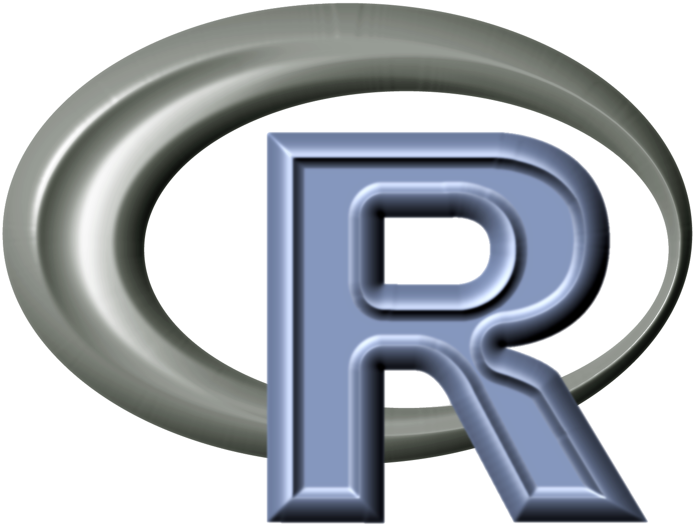
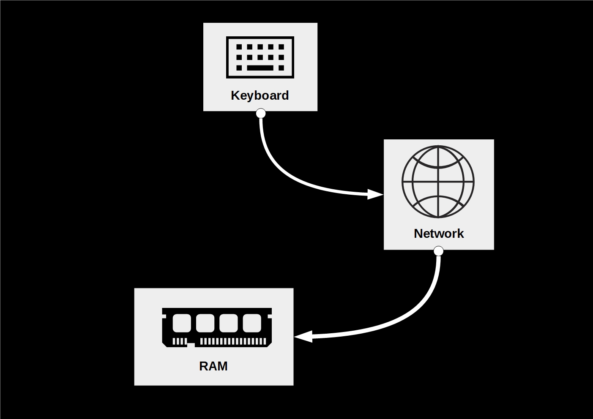
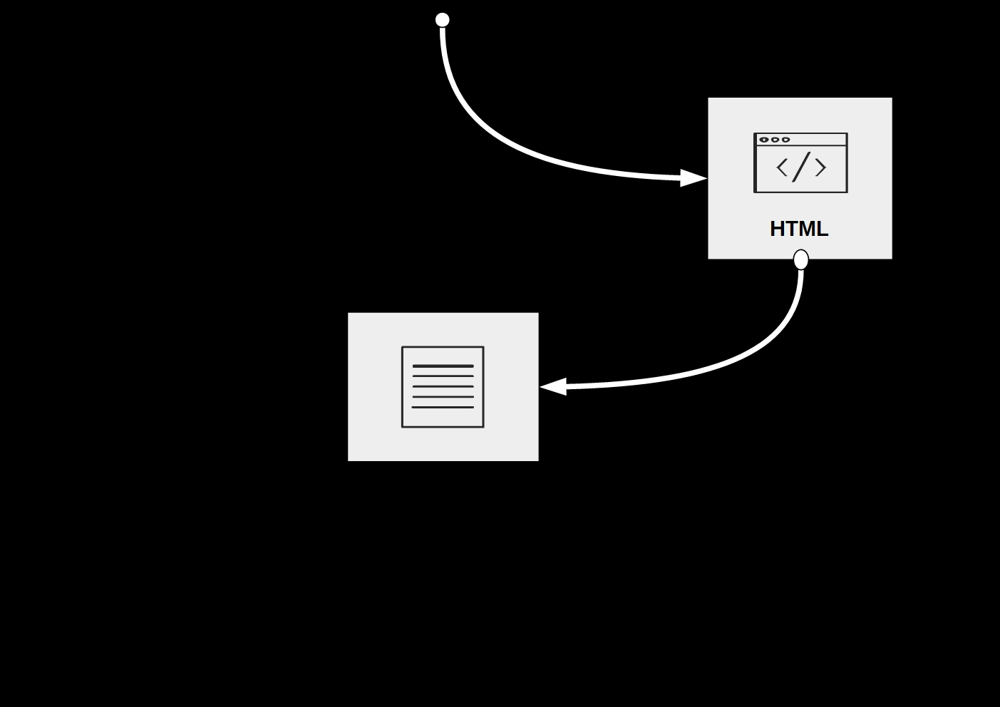
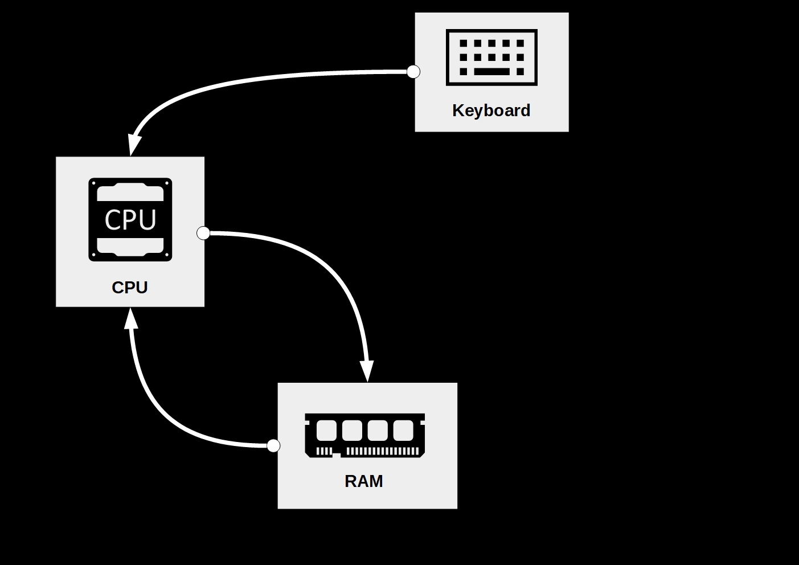
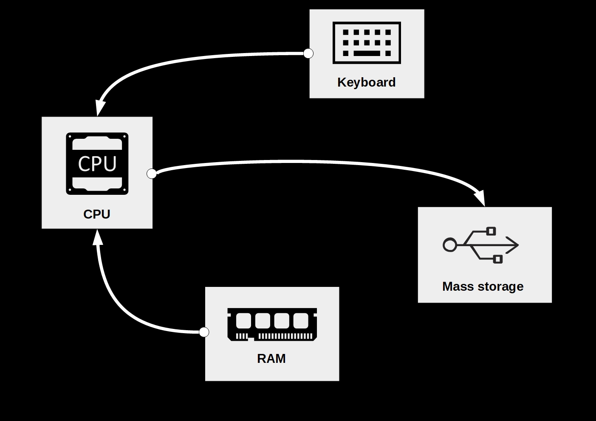

```{r set-options, echo=FALSE, cache=FALSE, warning=FALSE, message=FALSE}
options(width = 100)
library(knitr)
```


# Why R?


## The 'data language'
- Widely used in Data Science jobs.
- Originally designed as a tool for statistical analysis.
- Particularly useful to program with data.


## High-level language
- Relatively easy to learn.
- A lot of free tutorials and support online.


## Free, open-source, large community
- Used in various fields.
- Thousands of 'R-packages' covering diverse aspects of data analysis.
- Learn from open sources.


# Part I: The Tools

## R

```{r echo=FALSE, fig.align='center', out.width="55%"}



```
Install R from [here](https://stat.ethz.ch/CRAN/)!


## RStudio

```{r echo=FALSE, fig.align='center', out.width="55%"}

include_graphics("../../img/rstudio.png")

```
Install RStudio from [here](https://www.rstudio.com/products/rstudio/download/#download)!

## Nuvolos
```{r echo = FALSE, fig.align = 'center', out.width="55%"}


```
Sign in [here]("https://az.nuvolos.cloud/login")!

## GitHub

```{r echo=FALSE, fig.align='center', out.width="55%", purl=FALSE}


```
Install Git as explained [here](https://git-scm.com/book/en/v2/Getting-Started-Installing-Git) and create a GitHub account [here](https://github.com/join)!


# Exercises

## Exercise A: Start RStudio via Nuvolos {.smaller}

1. Open the Nuvolos website and sign in using your HSG email and password.

2. Click on the RStudio logo.

An RStudio Session should open up on your screen.


## Exercise B: Setting up a Working Environment {.smaller}

 1. Get familiar with the file browser pane on the lower right. In Nuvolos navigate to the folder "files". When you work on your PC locally, navigate to a location of your choice.

 2. Use the 'New Folder'-button to create a new folder. Name this new folder `r_course`. 

 3. You should see the new folder listed in the file browser. Click on it to navigate to its contents. Now, click on the 'More' button and select 'Set as Working Directory' in the drop-down menu.

 4. Again, use the 'New Folder'-button in order to create two new folders called `data` and `code`.

 5. Finally, click on the project button in the top-right corner of the RStudio window () and select 'New Project' in the drop-down menu. In the pop-up window, select 'Existing directory', browse to and select your `r_course` folder, then click 'Create Project'.

Now you know how to set up a meaningful basic folder structure and working environment for an R project. The next exercise teaches you how to write R scripts in this environment.

Pro Tips:
You can check your working directory by typing the command
```{r, eval = FALSE}
getwd()
```
in the console. Similarly, you can set your working directory by:
```{r, eval = FALSE}
setwd("your_path")
```

Heads-up: Be aware that R does not accept "\" in a path (replace "\" with "/"). 

## Exercise C: R Scripts {.smaller}

1. Switch to the R console and type the following line of code and hit enter (see example from above).

```{r eval=FALSE, purl=FALSE}
print("Hello world")
```
You should see the words `"Hello world"` printed on screen. This is the usual way of working with R in an interactive session. However, in most circumstances, it makes sense to write the R code to an R script (in order to store and document it) and then execute the code from there.

2. In the RStudio Menu-bar select `File/New File/R Script` to create a new file, shown/opened in the Script pane.

3. Type `print("Hello world")` to the first line of the script, and click on 'Run' () to execute the code in the console.


# Part II: First Steps in R

## Variables and Vectors
Assign the numeric value `2` to variable `a`:
```{r}
a <- 2
```
Type `a` and hit enter (Prints the value of a variable to screen)
```{r}
a
```

## Variables and Vectors
Initiate an integer vector `a`
```{r}
a <- c(10, 22, 33, 22, 40)
```
Give names to the vector's elements
```{r}
names(a) <- c("Andy", "Betty", "Claire", "Daniel", "Eva")
```


## Indexing
By number of element (R starts counting with 1!) 
```{r}
a[3]
```
By the element's name
```{r}
a["Claire"]
```

## Inspect variables/vectors ('R objects')
See what 'class' an object belongs to
```{r}
class(a)
```
Get a summary of its structure
```{r}
str(a)
```


## Math Operators

| Math Symbol | R Syntax|
|:-------------:|:----------:|
| $+$ | `+` |
| $-$ | `-` |
| $\times$ |  `*`|
| $\div$  | `/`|

## More Math
| Math Symbol | R Syntax|
|:-------------:|:----------:|
|$a^n$| `a^n`|
|$\sqrt{a}$| `sqrt(a)`|
|$\ln{a}$| `log(a)`|
|$e^n$| `exp(n)`|
|Euler's number| `exp(1)`|
|$\pi$| `pi`|


# Part III: Data processing illustration

## Downloading/accessing a website

```{r htmldownload, echo=FALSE, out.width = "60%", fig.align='center', fig.cap= "Components involved in visiting a website.", purl=FALSE}

```


## Downloading/accessing a website

```{r htmldownloaddata, echo=FALSE, out.width = "60%", fig.align='center', fig.cap= "Data involved in visiting a website.", purl=FALSE}

```


## How can we do this in R? 

Download the website (read its source code into RAM)

```{r}
weatherHTML <- readLines("https://www.nzz.ch/wetter/wetter-heute")
```

Have a look at the first lines at the webpage's source code:

```{r}
head(weatherHTML, 3)
```
You can have a more in-depth look at the webpage's source code by typing:
```{r, eval = FALSE}
View(weatherHTML)
```


## Searching/filtering the webpage

Search the source code for the line that contains todays maximum temperature:

```{r}
line_number <- grep('weatherlist__temp--max', weatherHTML)
```

We can now check on which line the text was found.

```{r}
line_number
weatherHTML[line_number]
```

At a closer look, we see that the first and second objects correspond to the weather today and tomorrow. 

In the scope of the course, you will learn how we could extract the temperature of today: (not relevant for now)

```{r}
strsplit(weatherHTML[line_number[1]], split = "span")
```
We can pick the corresponding line and filter for the text for numbers:
```{r}
temperature <- strsplit(weatherHTML[line_number[1]], split = "span")[[1]][5]
gsub("\\D", "", temperature)
```
<!-- Alternatively: -->
<!-- ```{r} -->
<!-- library(rvest) -->
<!-- a = read_html("https://www.nzz.ch/wetter/wetter-heute") -->
<!-- b = a %>% html_node("li.weatherlist__item div.weatherlist__temp span.weatherlist__temp--max") %>% html_text() -->
<!-- b  -->
<!-- ``` -->


## Searching/filtering the webpage


```{r ramcalc, echo=FALSE, out.width = "60%", fig.align='center', fig.cap= "Accessing data in RAM, processing it, and storing the result in RAM.", purl=FALSE}

```


## Output to local hard drive


```{r eval=FALSE}
writeLines(weatherHTML, "weather.html")
```


## Output to local hard drive


```{r htmlstore, echo=FALSE, out.width = "60%", fig.align='center', fig.cap= "Writing data stored in RAM to a Mass Storage device (hard drive).", purl=FALSE}

```


# Part IV: Point Nemo

## Setup and Data Import

1. Open Nuvolos and start RStudio.
2. In the lower right corner click on the tab "Files".
3. Go to the folder "files" and click on the file "PointNemo.txt".
4. Inspect the data carefully.

PointNemo.txt is an ASCII-file containing time series data on the monthly mean air temperature at [Point Nemo]("https://en.wikipedia.org/wiki/Pole_of_inaccessibility"). If you click on the file, it should open in a new tab. 

## Read Raw ASCII Data

```{r echo=FALSE, purl = FALSE}
# read the data
point_nemo <- 
  read.table("../data/PointNemo.txt", skip = 9,
           colClasses = c("character",
                          "NULL", "numeric"),
           col.names = c("date", "",  "temp"))
```


```{r eval=FALSE }
# read the data
point_nemo <- 
  read.table("PointNemo.txt", skip = 9,
           colClasses = c("character",
                          "NULL", "numeric"),
           col.names = c("date", "",  "temp"))

```

```{r}
# inspect the first rows
head(point_nemo)

```


## Exercise D  {.smaller}

 - Repeat what we've just done for a different point on earth: the Eurasian Pole of Inaccessibility (46.17 N, 86.4 E). 


## Read Raw ASCII Data


```{r echo=FALSE}
# read the data
eurasia <- 
  read.table("../data/Eurasia.txt", skip = 9,
           colClasses = c("character",
                          "NULL", "numeric"),
           col.names = c("date", "",  "temp"))


```

```{r eval=FALSE, purl=FALSE}
# read the data
eurasia <- 
  read.table("Eurasia.txt", skip = 9,
           colClasses = c("character",
                          "NULL", "numeric"),
           col.names = c("date", "",  "temp"))

```


```{r}

# inspect the first rows
head(eurasia)

```

# Part V: GitHub

## Exercise E  {.smaller}

Remember, Git is a revision control system (to manage different versions of your code). GitHub is a hosting service for Git repositories. So Git is a tool, and GitHub a service for projects that use this tool.

 - Clone the repository of this course. Cloning means that you create a local copy of the repo on your computer. Follow these instructions: https://help.github.com/en/articles/cloning-a-repository. (Alternatively, you could also download the entire repository as a zip-file using the graphical user interface, GUI, on the GitHub page.)


# Q&A


<style>
slides > slide { overflow: scroll; }
slides > slide:not(.nobackground):after {
  content: '';
}
</style>

[//]: # (References {.smaller})