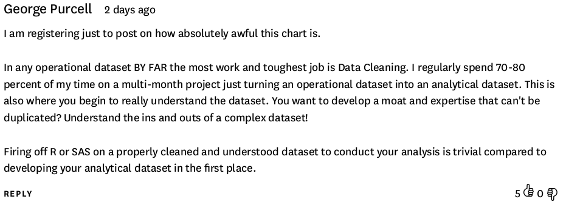

```{r set-options, echo=FALSE, cache=FALSE}
options(width = 100)
library(knitr)
```

<style>
pre {
  font-size: 21px;
}
</style>

# Updates

## Reminder: Guest Lecture!

## 15/11/2018: Guest Lecture by Dr. Michael Zehnder

```{r mzehnder, echo=FALSE, out.width = "65%", fig.align='center',  purl=FALSE}

```

<center>
*Michael Zehnder*, PhD, Trium EMBA<br/>
Co-Founder & CEO Swiss Data Labs AG
<center/>


# Data Science Realsatire

## 2x2 Data Skills Matrix

```{r purl=FALSE, echo=FALSE, fig.align='center', out.width = "65%"}

```

## 2x2 Data Skills Matrix

```{r purl=FALSE, echo=FALSE, fig.align='center', out.width = "90%"}

```


# Do not simply 'apply', think yourself!

## Do not simply 'apply', think yourself!

```{r purl=FALSE, echo=FALSE,  fig.align='center', out.width = "90%"}
include_graphics("../../img/new_abacus.jpg")
```


# Exercises

## Exercise A: Write a Sum Function


```{r eval=FALSE, purl=FALSE}
my_sum <- 
     function(x){
          
       return()
     }

```


## Exercise B: Robustness and Warnings
Once you have implemented and successfully tested `my_sum()`, see what happens if you call it with the following vector as input

```{r}
numbers2 <- c("1", "2", "3")
```


Why do we get an error? Investigate by comparing the vector `numbers` from the code example above with the new vector `numbers2` (the functions `str()` and `class()` might help you).

## Exercise B: Robustness and Warnings

Extend your `my_sum()` function with a control statement that checks whether the input is of the right class for the function to work (Hint: `class(x)!="numeric"`). The goal is to make the function more robust to wrong input. That is, if the input is wrong, issue a warning but don't break down with an error. Use the following code for the warning message:

```{r eval=FALSE, purl=FALSE}
warning("Wrong input! This function only accepts numeric or integer values!")
```

Test your enhanced sum function with the two input vectors `numbers` and `numbers2`.


## Exercise C: Standard Deviation Function
During the lecture on Programming with Data we have step-by-step implemented our own R function to compute the mean. Now implement an R function called `my_sd` that computes the standard deviation, defined as: $SD = \sqrt{\frac{1}{N-1} \sum_{i=1}^N (x_i - \overline{x})^2}$. (Hint: revisit the math operators section in the notes on the first exercise session: https://umatter.github.io/courses/datahandling/notes/html/E01_tools_textfiles.html).

Test your implementation by comparing its output with the already implemented `sd()` function.


# Mock Exam Questions

# More Programming Exercises


## Exercise D: Standard Error Function
Building on the function written in Exercise C, implement a function to compute (the estimate of) the sample mean standard error as defined here: $\text{SE}_{\bar{x}} = \frac{SD}{\sqrt{n}}$. Hint: the idea is to use your own implementation (in Exercise C) to compute $SD$ as a first step of your standard error function.

## Breaking up complex problems into smaller problems

Exercises C and D should illustrate how you can approach more complex problems by breaking them up in smaller problems and addressing each of these step-by-step. That is, when looking at the problem of computing $\text{SE}_{\bar{x}} = \frac{SD}{\sqrt{n}}$, you see that computing $SD$ is a part of the overall problem, which can be addressed separately.

## Exercise E: T-test
Implement a function for the one-sample [t-test](https://en.wikipedia.org/wiki/Student%27s_t-test):
$t = \frac{\bar{x} - \mu_0}{\frac{SE}{\sqrt{n}}}$.
