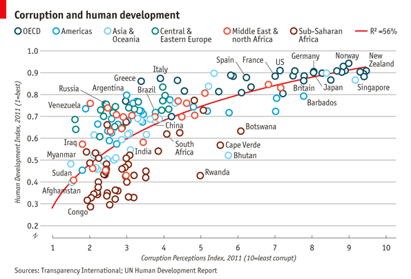

```{r set-options, echo=FALSE, cache=FALSE, purl=FALSE, message=FALSE, warning=FALSE}
options(width = 100)
library(knitr)
library(bookdown)
```

# Exercises

## Exercise A: Summary Stats and Data Display

Install and load the R package `nycflights13` and load `tidyverse`. 

```{r message=FALSE, warning=FALSE}
# install and load packages
# install.packages("nycflights13")
library(nycflights13)
library(tidyverse)

```

Loading the `nycflights13`-package automatically imports a large `data.frame`/`tibble` called `flights`. Have a look at the dimensions, data types, variables, and first few observations. Also use `str()` to get a summary overview over the structure of the dataset.

```{r}
flights
str(flights)
```

The dataset is on flights departing from New York City in 2013 (original data provided by the US Bureau of Transportation Statistics). You can have a closer look at what the variables describe by looking at the provided documentation: `?flights`. 

The following table summarises and nicely displays one of the key variables in the dataset. Use your data preparation, data analysis, and data display skills to reproduce the table (output in either HTML, LaTeX/PDF, or Word format).

```{r echo=FALSE, purl=FALSE, message=FALSE, warning=FALSE}
# for date formats
# loc <- Sys.setlocale(locale = "en_US.utf8")
```


```{r echo=FALSE, message=FALSE}
# select data
boston_flights <- filter(flights, origin == "BOS" | dest == "BOS")

# summarize data
bf_by_months <- group_by(boston_flights, month)
bf_sum <- summarise(bf_by_months,
                    mean_air_time= mean(air_time, na.rm = TRUE),
                    median_air_time = median(air_time, na.rm = TRUE),
                    sd_air_time=sd(air_time, na.rm = TRUE),
                    min_air_time = min(air_time, na.rm = TRUE),
                    max_air_time = max(air_time, na.rm = TRUE)
                    )

# format data
bf_sum[,2:ncol(bf_sum)] <- round(bf_sum[,2:ncol(bf_sum)], digits = 2)

# improve data display
# show month names
library(lubridate)
bf_sum$month <- months(parse_date_time(bf_sum$month, "m"))
# Improve column headers
names(bf_sum) <- c("Month", "Mean", "Median", "Std. Deviation", "Min. Value", "Max. Value")


```


```{r echo=FALSE}
kable(bf_sum, row.names = FALSE, digits = 2, caption = "Summary Statistics: Air time (in minutes) for flights between NYC and BOS (2013)" )
```

Hint: The `lubridate` package might be helpful to parse the month column. The function `months()` (base package) extracts the months from `Date` variables.


\newpage
## Exercise B: R Graphics with `ggplot2`

Again working with the `flights` dataset, reproduce the following figure with `ggplot()`. Hint: Some preparations are needed (filtering, formatting, and removal of missing values). Note that the figure only compares flights in December with flights in June for the destinations "BOS", "ORD", and "LAX".

```{r echo=FALSE, message=FALSE }
# select subset
plotdata <- select(flights, month, Destination = dest, arr_delay, dep_delay)
plotdata <- na.omit(filter(plotdata, month == 6 | month == 12, Destination %in% c("BOS", "ORD", "LAX")))

# format months
plotdata$month <- months(parse_date_time(plotdata$month, "m"))

# plot
flights_plot <- 
  ggplot(plotdata, aes(x=dep_delay, y=arr_delay)) +
  geom_point(aes(colour=Destination)) +
  geom_smooth(colour="black") +
  facet_wrap(~month) + 
  theme_minimal() +
  ylab("Arrival Delay (in minutes)") +
  xlab("Departure Delay (in minutes)") +
  theme(legend.position = "top")

flights_plot
```

\newpage

## Exercise C: `ggplot2` challenge on COVID

Plot the cumulative confirmed COVID cases (on a log scale) for China, France, Germany, Italy, Switzerland, the United Kingdom, and the US. Use John Hopkinds GitHub data. Your graph will look like the example shown below.

Hint: download the data as follows:

```{r message=FALSE, warning=FALSE, eval=FALSE}
confirmedraw <- read.csv(
    "https://raw.githubusercontent.com/CSSEGISandData/COVID-19/master/
    csse_covid_19_data/csse_covid_19_time_series/time_series_covid19_confirmed_global.csv")
```

Various cleaning steps are required (gathering data, reformatting date values, calculating the cumulative sum of cases, ...). For plotting, replace the dates by numbers (the first date is day 1, the second date day 2, etc. -- as shown in the graph). This exercise is inspired by https://mdl.library.utoronto.ca/technology/tutorials/covid-19-data-r.


```{r echo=FALSE, message=FALSE, warning=FALSE}

confirmedraw <- read.csv("https://raw.githubusercontent.com/CSSEGISandData/COVID-19/master/csse_covid_19_data/csse_covid_19_time_series/time_series_covid19_confirmed_global.csv")

confirmed <- confirmedraw %>% gather(key="date", value="confirmed", -c(Country.Region, Province.State, Lat, Long)) %>% group_by(Country.Region, date) %>% summarize(confirmed=sum(confirmed))
# summary(confirmed)

# str(confirmed)
confirmed$date <- confirmed$date %>% sub("X", "", .) %>% as.Date("%m.%d.%y")
# str(confirmed)
confirmed <- confirmed %>% group_by(Country.Region) %>% mutate(cumconfirmed=cumsum(confirmed), days = date - first(date) + 1)

countryselection <- confirmed %>% filter(Country.Region==c("US", "Italy", "China", "France", "United Kingdom", "Germany", "Switzerland"))
ggplot(countryselection, aes(x=days, y=confirmed, colour=Country.Region)) + geom_line(size=1) +
  theme_classic() +
  labs(title = "Covid-19 Confirmed Cases by Country", x= "Days", y= "Confirmed cases (log scale)") +
  theme(plot.title = element_text(hjust = 0.5)) +
  scale_y_continuous(trans="log10")
```


\newpage
# Additional Exercises (not exam-relavant)

## Exercise D: `ggplot2` challenge on corruption
Import the dataset `EconomistData.csv` (provided in `data.zip`) to R. The underlying data sources have been used by The Economist (2nd December 2011, ['Corrosive Corruption']( https://www.economist.com/graphic-detail/2011/12/02/corrosive-corruption)) to generate the following figure:

```{r echo=FALSE}

```

Given the data, the challenge is to reproduce (or get as close to) the original figure with `ggplot2`.

<!-- # References -->
<!-- http://tutorials.iq.harvard.edu/R/Rgraphics/Rgraphics.html -->