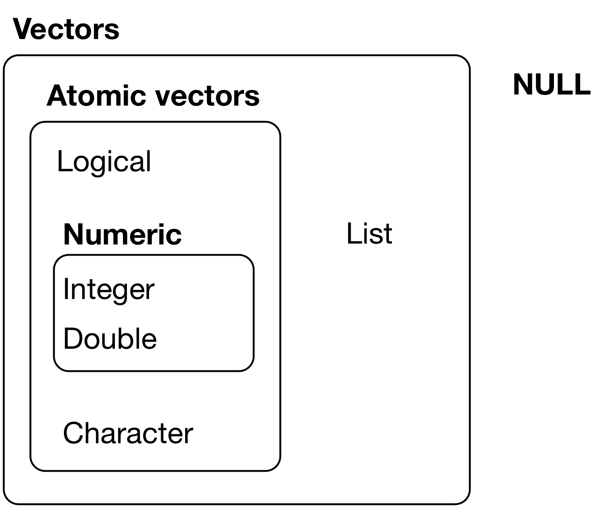

```{r}
#| label: setup
#| include: false
options(width = 100)
knitr::opts_chunk$set(results = "hold")
library(knitr)
library(purrr)
```


# Basic Programming Concepts in R


## The R environment
Elementary commands consist of either expressions or assignments. If an expression is given as a command, it is evaluated, printed (unless specifically made invisible), and the value is lost. An assignment also evaluates an expression and passes the value to a variable but the result is not automatically printed.

Commands are separated either by a semi-colon (‘;’), or by a newline. Elementary commands can be grouped together into one compound expression by braces (‘{’ and ‘}’). Comments can be put almost anywhere, starting with a hash mark (‘#’), everything to the end of the line is a comment.


## Objects

The entities that R creates and manipulates are known as objects. These may be variables, arrays of numbers, character strings, functions, or more general structures built from such components.

  - Assign a variable in the environment using `<-` or `=`. However, `<-` is the more traditional and preferred way, especially in scripts and functions.
  - Manipulate the variable
  
During an R session, objects are created and stored by name. The R command `objects()` or `ls()` can be used to display the names of (most of) the objects which are currently stored within R. The collection of objects currently stored is called the **workspace**.

To remove objects the function `rm()` (for remove) is available.

```{r}
2 + 2  # This command does not create an object in the environment

my_variable <- 10 # This command assigns the numeric 10 to the variable my_variable
class(my_variable)
objects()
rm(my_variable)

# Assignment
b <- 1 + 1
3 -> my_var

# Avoid global assignment in this course
# b <<- 1 + 1
```

Objects have different **classes**. In R, classes describe the type or "kind" of an object. They are a way for R to tag an object so that functions know how to handle it. Many R functions behave differently depending on the class of the input.


```{r}
my_integer <- 9L
class(my_integer)
mean(my_integer)

my_character <- "aurelien"
class(my_character)
mean(my_character) # works differently: returns an error

my_logical <- TRUE
class(my_logical)
```

## Vector basics

The fundamental building block of data in R is a vector (collections of related values, objects, other data structures, etc).

R has two types of vectors:

  - **atomic vectors**: homogeneous collections of the same type (e.g. all logical values, all numbers, or all character strings).

  - **lists**: heterogeneous collections of any type of R object, even other lists (meaning they can have a hierarchical/tree-like structure).
  
```{r, echo = F, fig.cap = "Source: https://r4ds.had.co.nz/vectors.html",  out.width = "70%"}

```


### Atomic vectors

The four types of vectors that are used the most are: **logical, integer, double, character**. Integer and double vectors are known as numeric vectors. In R, numbers are doubles by default. To make an integer, place an L after the number.

Atomic vectors are constructed using the concatenation function `c()`. With `typeof()`, you can access the type of the vector.

```{r}
vector_double <- c(1, 2, 3)
c(c(3, 4), c(10, 11))
vector_logical <- c(TRUE, FALSE, FALSE)
vector_integer <- c(1L, 2L, 3L)
vector_character <- c("a", "b")

typeof(vector_double)
typeof(vector_logical)
```

### Subsetting vectors
```{r}
vector_double <- c(1, 2, 3)
vector_double[1]
vector_double[3]
vector_double[c(1, 2)]
```


## Matrices are combinations of vectors

Matrices or more generally arrays are multi-dimensional generalizations of vectors. In fact, they are vectors that can be indexed by two or more indices and will be printed in special ways.

A Matrix is a 2-dimensional array. You can create a matrix using the `matrix()` function, or by combining vectors using `cbind()` (column bind) or `rbind()` (row bind).

```{r}
v1 <- c(1, 2, 3, 4)
v2 <- c(10, 9, 8, 7)

m1 <- cbind(v1, v2)
print(m1)

m2 <- rbind(v1, v2)
m2

matrix(nrow=3, ncol = 3, 1:9, byrow = FALSE) # fills by column by default
```
The dimensions of a matrix are always given as **number of rows** x **number of columns**. We can subset and access elements of the matrix using square brackets `[]`.

```{r}
mymatrix <- matrix(c(1,2,3,11,12,13,1,10), 
                   nrow = 2, 
                   ncol = 4,
                   byrow = FALSE)
print(mymatrix)
dim(mymatrix)
mymatrix[1,2] # element in row 1, column 2
mymatrix[2,4] # element in row 2, column 4
mymatrix[,3]  # all elements in column 3
mymatrix[1,]  # all elements in row 1
```

<br>

## Operators

Most of the operators in R are **vectorized**, meaning they work element-wise on vectors of the same length (or on a vector and a single value, which is recycled).

```{r}
vect <-  c(1, 2, 3, 4)
vect + 10
```


### Recycling*
**Recycling** means that when you perform an operation on two vectors of different lengths, R will repeat (or "recycle") the shorter vector until it matches the length of the longer vector. This can lead to unexpected results if you're not careful.

```{r}
x <- c(2, 4, 6)
y <- c(1, 1, 1, 2, 2)
x > y # warning. 
x == y
```
Here, the vector `x` is recycled to `c(2, 4, 6, 2, 4)` to match the length of `y`. The comparison is then done element-wise.


### Arithmetic operators

```{r, eval = T}
2+2
4*5
20/5
20^5
sum_result <- 2+2
sum_result -2
```

```{r, eval = T}
# Modulo (remainder)
5 %% 3 

# Integral division
5 %/% 3
```

These operators are vectorized (element-wise)

```{r, eval = T}
a <- c(2, 3, 4)
b <- c(1, 2, 3)
a + b
a * b
a / b

a %% b 
a %/% b
```

Matrix multiplication:

```{r, eval = T}
a %*% b
```


## Comparison operators

Table: Comparison operators in R (Source: Shawn Santo)

| Operator | Comparison               | Vectorized?    |
|----------|--------------------------|----------------|
| `x < y`  | less than                | Yes            |
| `x > y`  | greater than             | Yes            |
| `x <= y` | less than or equal to    | Yes            |
| `x >= y` | greater than or equal to | Yes            |
| `x != y` | not equal to             | Yes            |
| `x == y` | equal to                 | Yes            |
| `x %in% y` | contains               | Yes (over `x`) |

```{r}
a <- c(2, 3, 4)
b <- c(1, 2, 3)

# Comparison
a == b
1 == 7
a != b
a > b
a < b
a >= b
a <= b
a %in% b
1 %in% 2
```


## Logical/Booleans operators

Table: Logical operators in R (Source: Shawn Santo)

| Operator   | Operation      | Vectorized? |
|------------|----------------|-------------|
| `x | y`    | or             | Yes         |
| `x & y`    | and            | Yes         |
| `!x`       | not            | Yes         |
| `x || y`   | or             | No          |
| `x && y`   | and            | No          |
| `xor(x, y)`| exclusive or   | Yes         |


```{r}
# Logical
TRUE & FALSE
TRUE | FALSE
TRUE || FALSE
!TRUE
```

```{r}
x <- c(TRUE, FALSE, TRUE, TRUE)
y <- c(FALSE, FALSE, TRUE, FALSE)

x & y
x | y
xor(x, y)
```

### Short-circuit operators*
The double operators `&&` and `||` only evaluate the first element of each vector (instead of all elements of the vectors). They are known as **short-circuit** operators. These operators only evaluate the first element of each vector, and then immediately return a result without evaluating the remaining elements, as long as the result can be determined based on the first element.

To understand the short-circuit, the following function can be programmed to show how the conditions are evaluated (credits to ChatGPT 5)

```{r}
check <- function() {
  cat("Second condition is evaluated!\n")
  FALSE
}

TRUE || check()  # check() is not evaluated
TRUE | check()  # check() is not evaluated

FALSE && check()
FALSE & check()

```


Use concise operators. For instance, `x %in% c(1, 2, 3)` is more concise than `x == 1 | x == 2 | x == 3`. 


## Other common operators and functions

### Math operators
```{r}
sqrt(4^2)
log(2)
exp(10)
log(exp(10))
```


### Set operators

Table: Set operators in R 

| Operator   | Operation      | Vectorized? |
|------------|----------------|-------------|
| `union(x,y)`        | union             | Yes         |
| `intersect(x,y)`    | intersection            | Yes         |
| `setdiff(x, y)`     | difference            | Yes         |
| `setequal(x, y)`    | equality             | No          |

```{r}
a <- c(2,3,4)
b <- c(1,2,3)

union(a, b) # all unique elements in a or b
intersect(a, b) # all unique elements in both a and b
setdiff(a, b) # all unique elements in a but not in b
setequal(a, b) # are a and b equal (same elements, not necessarily in the same order)
setequal(c(1,2,3), c(3,2,1))
```


### Sequence operators

The colon operator `:` generates regular sequences. It is equivalent to `seq(from, to)` in the `seq()` function.

```{r}
1:10
```


# Loops

R supports three types of loops: for, while, and repeat.

## for-loop

A for loop is used to iterate over a vector in R.

```{r}
# Numeric vector
for (i in c(2, 4, 6, 8)) {
  print(i)
}


# Character vector
vector_loop <- c("brian", "mark", "sophia")
for (i in vector_loop) {
  sentence <- paste(i, "likes icecream.")
  print(sentence)
}
```

In for loops, the output is not automatically printed. You need to use the `print()` function to display the output.


## while-loop

while loops are used to loop until a specific condition is met.

```{r}
x <- 1

while (x <= 10) {
  print("88")
  x <- x + 1
}
```


## repeat-loop

A repeat loop repeatedly executes a block of code without automatically checking for an exit condition. To stop the loop, you must explicitly include a condition inside the loop and use a break statement. If no break is provided, the loop will run indefinitely.

```{r}
# Initiate variable
x <- 1

# Start repeat loop
repeat {
  print(x)
  x = x + 1
  
  # Break statement
  ################
  if (x == 6){ 
    break
  }
  ################
}
```


## Loop helper functions*

Use `length()`, `seq()`, `seq_along()`, and `seq_len()` to loop over indices of an object. 

```{r}
vect <- c(10, 20, 30, 40)
seq_along(vect)
length(vect)
seq_len(length(vect))

# Both loops do the same thing
for (i in seq_along(vect)) {
  print(vect[i] + 10)
} 

for (i in (vect)) {
   print(i + 10)
}
```


## Tips for loops*

  1. Preallocate memory for objects that will grow inside a loop: create an empty vector before the loop starts and fill it in during each iteration -> Significant improvement in performance. 
  
```{r}
# Don't: 
a <- c() # create an empty vector with size 0
for (i in seq_len(10)) {
  a <- c(a, i ^ 3) # fill the vector by concatenation
}

# Do: 
a <- numeric(10) # create an empty vector of given size 10
for (i in seq_len(10)) {
  a[i] <- i ^ 3 # fill the vector
}
```
  2. Don't use loops if vectorization is possible

```{r}
(1:10) ^ 3
```


# Logical and control statements

```{r}
condition <- TRUE
if (condition) {
  print("This is true!")
} else {
  print("This is false!")
}
```

```{r}
if (1 != 0) {
  print("Yes, 1 is not equal to 0.")
}
```


## Multiple conditions*

Note that `if` is not vectorized. The following code returns an error (in the most recent R versions).

```{r, eval = F}
if (c(1, 0, 1)) {
  print("Other types are coerced to logical if possible.")
}
```

Use `any()` or `all()` to check multiple conditions.

```{r}
if (any(c(1, 0, 1) == 1)) {
  print("At least one element was equal to 1.")
}

if (all(c(1, 0, 1) == 1)) {
  print("All elements were equal to 1.")
}
```


# Functions

## What is a function?

A function maps inputs to outputs. In R, functions can be built-in (from base or packages) or user-defined.

```{r}
# install.packages("<PACKAGE NAME>")
# library(<PACKAGE NAME>)
```

## Three components of a function

```{r}
myfun <- function(x, y) {
  z <- x + y
  return(z)
}
```

```{r}
formals(myfun)
```

```{r}
body(myfun)
```

```{r}
environment(myfun)
```

## Example: a simple power function

```{r}
powerFunction <- function(base, exponent) {
  results <- base ^ exponent
  return(results)
}

powerFunction(exponent = 2, base = 3)
powerFunction(base = 2, exponent = 3)
powerFunction(2, 3)
powerFunction(c(2, 4, 3), 3)
```


# Step up your game: functionals

A functional is a function that takes a function as input and returns a vector or list. Functionals are alternative to for-loops. They can be programmed using the `apply` family (`apply`, `lapply`, `tapply`), or the `purrr::map()` family.


## Example of a functional

```{r}
# User-defined function
triple <- function(x) {
  y <- x * 3
  return(y)
}

triple(1); triple(2); triple(3); triple(4)

# Base R
t1 <- lapply(1:4, triple)
t1

# purrr
map_dbl(1:4, triple)
map(1:4, triple)
```


## The "apply" functional

`apply` applies a function to columns or rows of a matrix. It loops over rows (`MARGIN = 1`) or columns (`MARGIN = 2`) of a matrix. 

```{r}
# Empty matrix with 2 rows and 4 columns
mymatrix <- matrix(c(1, 2, 3, 11, 12, 13, 1, 10), nrow = 2, ncol = 4)
mymatrix

# Row sums with a for-loop
for (i in 1:2) {
  s <- sum(mymatrix[i, ])
  print(s)
}

# Row sums with apply
apply(mymatrix, MARGIN = 1, sum)
```


# Tutorials

## Tutorial 1: a function to compute the mean

Starting point: the mean is

$\bar{x} = \frac{1}{n}\sum_{i=1}^n x_i.$

Write a function `meaN(x)` that computes the mean of a numeric vector.

```{r}
meaN <- function(x) {
  # your code
}
```

::: {.callout-note collapse=true title="Solution"}
```{r}
meaN <- function(x){
  m <- sum(x) / length(x)
  return(m)
}

meaN(c(1, 2, 3))
vector <- c(1, 3, 5, 3, 2)
meaN(vector)
```

:::

## Tutorial 2: on slow and fast sloths

We simulate two sloth populations over time. At the beginning of year 1 there are 1000 slow sloths and 1 fast sloth. Each year, each sloth has one offspring. Slow sloths have 40% mortality; fast sloths 30% mortality. Find the first year when fast sloths outnumber slow sloths.

```{r}
# your code
```

::: {.callout-note collapse=true title="Solution"}

```{r}
i <- 1
Nslow <- 1000
Nfast <- 1

while (Nslow > Nfast) {
  Nslow <- (Nslow * 2) * 0.6
  Nfast <- (Nfast * 2) * 0.7
  i <- i + 1
}

i

# Optional check
Nslow <- 1000; Nfast <- 1
for (k in 1:48) {
  Nslow <- c(Nslow, (Nslow[k] * 2) * 0.6)
  Nfast <- c(Nfast, (Nfast[k] * 2) * 0.7)
}
# tail(Nslow); tail(Nfast)
```

:::

## Tutorial 3: a loop function

Create a function that repeatedly appends the sum of the current last three elements of a vector `lst` to `lst`, looping 25 times. Hint: use `append()` and `tail()`.

```{r}
appendsums <- function(lst) {
  # your code
}

# Example to test:
# sum_three <- c(0, 1, 2)
# appendsums(sum_three)
# After running, check: sum_three[10] == 125
```

::: {.callout-note collapse=true title="Solution"}

```{r}
appendsums <- function(lst){
  for (i in 1:25) {
    lst <- append(lst, sum(tail(lst, 3)))
  }
  lst
}

sum_three <- c(0, 1, 2)
sum_three <- appendsums(sum_three)
sum_three[10]
```

:::

# Appendix: quick reference

* Vector constructors: `c()`, `seq()`, `rep()`
* Matrix builders: `matrix()`, `cbind()`, `rbind()`
* Apply family: `lapply()`, `sapply()`, `vapply()`, `apply()`
* purrr mappers: `map()`, `map_lgl()`, `map_int()`, `map_dbl()`, `map_chr()`
* Subsetting: `x[i]`, `x[i, j]` for matrices, logical masks
* Comparison: `==`, `!=`, `<`, `<=`, `>`, `>=`
* Logical: `&`, `|`, `!`


# Sources

  - [An Introduction to R](https://cran.r-project.org/doc/manuals/r-release/R-intro.html#Top)
  - [Wickham, Hadley: Advanced R](https://adv-r.hadley.nz/index.html)
  - [Shawn Santo, Introduction and Fundamentals of R, Duke University](https://www2.stat.duke.edu/courses/Spring21/sta323.001/slides/lecture/lec_01.html#1)