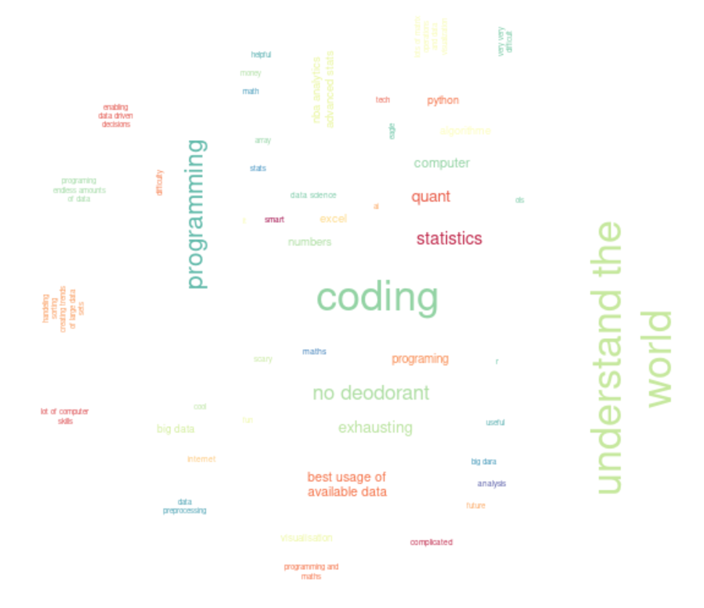
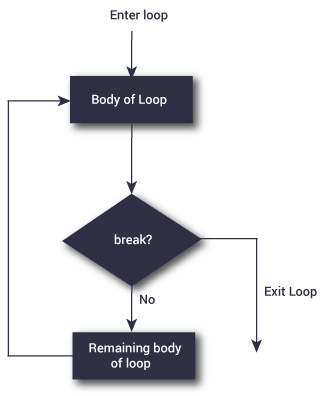

```{r set-options, echo=FALSE, cache=FALSE, warning=FALSE}
options(width = 100)
library(knitr)
library(purrr)
```

## {class="inverse"}

Recap

## 

```{r , echo=FALSE, out.width = "85%", fig.align='center', purl=FALSE}
include_graphics("../../img/data_science_pipeline.png")
```


## 

**At the end of the course, you will be able to...**

- [**Use essential tools for working with data**]{.green-bold} <br> We will work with the programming language R, but the concepts apply to any programming language.
- [**Manage a data project from start to finish**]{.green-bold} <br> You will practice collecting, cleaning, and analyzing data to carry out a complete project in Economics (research, consulting, ...).
- [**Formulate meaningful questions from data**]{.green-bold} <br> You will learn how to explore datasets and identify relevant questions.
- [**Communicate insights effectively**]{.green-bold} <br> You will gain experience in presenting results clearly and persuasively.


<!-- --- -->
<!-- class: right, bottom -->
<!-- background-image: url("https://upload.wikimedia.org/wikipedia/commons/thumb/d/d6/Apprenticeship.jpg/1280px-Apprenticeship.jpg") -->
<!-- background-size: cover -->


## When you think of data science, you think of...

```{r , echo=FALSE, out.width = "85%", fig.align='center', purl=FALSE}

```


## {class="inverse"}

Course organization


## Replacement session

📅 To compensate for the session we missed on September 19th, please note the following changes to the schedule:

  - Thursday, October 9th, 10:15–12:00: Lecture
  - Thursday, October 9th, 16:15–18:00: Lecture (instead of exercises)
  - **Friday, October 10th, 16:15–18:00, Room 01-011**: Exercise Session 2 with Federica


## Examination for HSG students in exchange

For HSG-students currently abroad on an exchange semester (not exchange students at HSG):

  - Decentral exams as announced on the fact sheet are mandatory.
  - I am allowed to offer an alternative examination as a sign of **goodwill** and **fairness** (**exception**!).

#### Oral exam as alternative
Exchange students will have the possibility to take an **oral exam** during the central examination period. 
Students in exchange must email me before **October 10th, 2025** to register.


#### Summary of the examination process for exchange students:

  - Central examination (50%): as planned, with all course participants.
  - Group project (35%): completed remotely with your group.
  - Decentral exam (15%): oral examination during the central examination period.
 


## Group formation for the group project

❌  **Option 1: Random group formation**

  - Students will be randomly assigned to groups of five.


🟢 **Option 2: Students create their own groups **

  - Groups with fewer than five students will be completed by the instructors.
  - Students who do not join a group will be randomly assigned.
 
<br>

#### Important for both options:
  - Depending on class size, some groups may have fewer or more than five members.
  - Groups are **compulsory** for the group project submission.
  - Once created, groups remain **fixed** for the entire project. No reshuffling is allowed.

 

## Now, the vote:

```{r , echo=FALSE, out.width = "85%", fig.align='center', purl=FALSE}

```


## {class="inverse"}

Today

## Basic Programming Concepts in R

**Goals: **

- Understand the basic programming concepts in R
- Write simple R scripts using loops, functions, and conditionals
- Understand the concept of functionals and how to use them


## The R environment

A collection of objects. These may be variables, arrays of numbers, character strings, functions, or more general structures built from such components.


## Values and Variables

Assign values to objects using `<-`.


## Vectors

R has two types of vectors:

  - **atomic vectors**: homogeneous collections of the same type ⚛️
    - Atomic Vectors are the most fundamental data structures in R
    
  - **lists**: heterogeneous collections of any type of R object, even other lists


## Vectors

```{r, echo = F, fig.cap = "Source: https://r4ds.had.co.nz/vectors.html",  out.width = "70%"}
include_graphics("../../img/data-structures-overview.png")
```


## Vectors

The four types of atomic vectors that are used the most are: **logical, integer, double, character**.
  
## Vectors

```{r echo=FALSE, fig.align='center', out.width="10%"}
include_graphics("../../img/numvec.png")
```


## Vectors

```{r echo=FALSE, fig.align='center', out.width="10%"}
include_graphics("../../img/charvec.svg")
```


## Matrices

```{r echo=FALSE, fig.align='center', out.width="40%"}
include_graphics("../../img/matrix.png")
```


## Matrices are atomic vector arranged in 2D form

Homogeneous vectors with an added `dim` attribute that gives it rows and columns.

:::: {.columns}

::: {.column width="50%"}
```{r, eval=FALSE, `code-line-numbers`= "1-1"}
cbind(c(1,2,3), c(4,5,6), c(7,8,9)) 
rbind(c(1,4,7), c(2,5,8), c(3,6,9))
matrix(nrow = 3, ncol = 3, 1:9)

dim(cbind(c(1,2,3), c(4,5,6), c(7,8,9)))
```
:::
::: {.column width="50%"}
```{r echo=FALSE}
cbind(c(1,2,3), c(4,5,6), c(7,8,9)) 
```
:::
::::

## Matrices are atomic vector arranged in 2D form

Homogeneous vectors with an added `dim` attribute that gives it rows and columns.

:::: {.columns}

::: {.column width="50%"}
```{r, eval=FALSE, `code-line-numbers`="2-2"}
cbind(c(1,2,3), c(4,5,6), c(7,8,9)) 
rbind(c(1,4,7), c(2,5,8), c(3,6,9)) 
matrix(nrow = 3, ncol = 3, 1:9)

dim(cbind(c(1,2,3), c(4,5,6), c(7,8,9)))
```
:::

::: {.column width="50%"}
```{r echo=FALSE}
rbind(c(1,4,7), c(2,5,8), c(3,6,9))
```
:::
::::

## Matrices are atomic vector arranged in 2D form

Homogeneous vectors with an added `dim` attribute that gives it rows and columns.

:::: {.columns}
::: {.column width="50%"}
```{r, eval = F, `code-line-numbers`="3-3"}
cbind(c(1,2,3), c(4,5,6), c(7,8,9)) 
rbind(c(1,4,7), c(2,5,8), c(3,6,9)) 
matrix(nrow = 3, ncol = 3, 1:9) 

dim(cbind(c(1,2,3), c(4,5,6), c(7,8,9)))
```
:::

::: {.column width="50%"}
```{r echo=FALSE}
matrix(nrow=3, ncol = 3, 1:9) 
```
:::
::::

## Matrices are atomic vector arranged in 2D form

Homogeneous vectors with an added `dim` attribute that gives it rows and columns.

:::: {.columns}
::: {.column width="50%"}
```{r, eval = F, `code-line-numbers`="5-5"}
cbind(c(1,2,3), c(4,5,6), c(7,8,9)) 
rbind(c(1,4,7), c(2,5,8), c(3,6,9)) 
matrix(nrow = 3, ncol = 3, 1:9) 

dim(cbind(c(1,2,3), c(4,5,6), c(7,8,9)))
```
:::

::: {.column width="50%"}
```{r echo=FALSE}
dim(cbind(c(1,2,3), c(4,5,6), c(7,8,9)))
```
:::
::::


# Operators

## Most Operators are vectorized in R

```{r}
vect <-  c(1, 2, 3, 4)
vect + 10
```

<br>

ℹ️ When a function or operator is called vectorized, it means that it can take a whole vector as input and apply the operation element by element, without writing an explicit loop.


## Math operators: basic arithmetic

:::: {.columns}
::: {.column width="50%"}
```{r, eval = F}
# Basic arithmetic
2+2
4*5
20/5
sum_result <- 2+2
sum_result -2
```

<br>

```{r, eval = F}
# Modulo (remainder)
5 %% 3 

# Integral division
5 %/% 3
```
:::

::: {.column width="50%"}
```{r echo=FALSE}
# basic arithmetic
2+2
4*5
20/5
sum_result <- 2+2
sum_result -2
```


```{r, echo=FALSE}
# Modulo (remainder)
5 %% 3 

# Integral division
5 %/% 3
```
:::
::::


## Comparison operators

Table: Comparison operators in R (Source: Shawn Santo)

| Operator | Comparison               | Vectorized?    |
|----------|--------------------------|----------------|
| `x < y`  | less than                | Yes            |
| `x > y`  | greater than             | Yes            |
| `x <= y` | less than or equal to    | Yes            |
| `x >= y` | greater than or equal to | Yes            |
| `x != y` | not equal to             | Yes            |
| `x == y` | equal to                 | Yes            |
| `x %in% y` | contains               | Yes (over `x`) |


## Logical/Booleans operators

Table: Logical operators in R (Source: Shawn Santo)

| Operator   | Operation      | Vectorized? |
|------------|----------------|-------------|
| `x | y`    | or             | Yes         |
| `x & y`    | and            | Yes         |
| `!x`       | not            | Yes         |
| `x || y`   | or*             | No          |
| `x && y`   | and*            | No          |
| `xor(x, y)`| exclusive or `(x | y) & !(x & y)`   | Yes         |


## Logical operators

<br>

**Question:** 

Given `x = 1` and `y = 6`, what is: `x < 5 & y < 5`?


## Other common operators and functions

```{r other operators, eval=FALSE}
sqrt(4^2)
log(2)
exp(10)
log(exp(10))
```


## Set operators

Table: Set operators in R 

| Operator   | Operation      | Vectorized? |
|------------|----------------|-------------|
| `union(x,y)`        | union             | Yes         |
| `intersect(x,y)`    | intersection            | Yes         |
| `setdiff(x, y)`     | difference            | Yes         |
| `setequal(x, y)`    | equality             | No          |


## Sequence operators

The colon operator `:` generates regular sequences. It is equivalent to `seq(from, to)` in the `seq()` function.

```{r}
1:10
```


# Loops

## for-loop
  
```{r echo=FALSE, fig.align='center', out.width="35%"}
include_graphics("../../img/forloop_black.png")
```


## for-loop

```{r eval=FALSE}
# number of iterations
n <- 100

# start loop
for (i in 1:n) {
  
  # BODY
  
}

```


## while-loop

```{r while, echo= FALSE, fig.align="center", out.width="50%"}
include_graphics("../../img/while_loop_black_own.png")
```


## while-loop 
```{r eval=FALSE}
# initiate variable for logical statement
x <- 1

# start loop
while (x == 1) {
  
  # BODY
  
}

```


## repeat-loop

```{r repeat, echo= FALSE, fig.align="center", out.width="50%"}

```

## repeat-loop
```{r eval = FALSE}
# Initiate variable
x <- 1

# Start repeat loop
repeat {
  
  x = x + 1
  
  # Break statement
  if (x == 6){ 
    break
  }
}
```


# Logical and control statements
  

## Control statements 
```{r}
condition <- TRUE

if (condition) {
  print("This is true!")
} else {
  print("This is false!")
}
```


# Functions


## Functions

<p style="text-align: center;font-size: 25pt;">$$f:X \rightarrow Y$$</p>
  

## Functions
  
  <p style="text-align: center;font-size: 25pt;">$$2\times X = Y$$</p>
  
  
## Functions in R

Functions in R are either **built-in** or **user-defined**.
  
Load built-in functions from a R-package:
  
```{r eval=FALSE, purl=FALSE}
# install a package
install.packages("<PACKAGE NAME>")

# load a package
library(<PACKAGE NAME>)
```


## Functions in R

Functions have three elements:
  
  1. [formals()]{.green-bold}, the list of arguments that control how you call the function 
  2. [body()]{.green-bold}, the code inside the function
  3. [environment()]{.green-bold}, the data structure that determines how the function finds the values associated with the names (not the focus of this course)


## Functions in R

```{r eval=TRUE, purl=FALSE}
myfun <- function(x, y){
  
  # BODY
  z <- x + y
  
  # What the function returns
  return(z)
}

```


#### Formals
```{r}
formals(myfun)
```


## Functions in R

```{r eval=TRUE, purl=FALSE}
myfun <- function(x, y){
  
  # BODY
  z <- x + y
  
  # What the function returns
  return(z)
}

```

#### Body
```{r}
body(myfun)
```


## Functions in R
```{r eval=TRUE, purl=FALSE}
myfun <- function(x, y){
  
  # BODY
  z <- x + y
  
  # What the function returns
  return(z)
}

```

#### Environment
```{r}
environment(myfun)
```


## Functions in R

A simple power function

```{r eval=TRUE, echo = TRUE, purl=FALSE, results = 'hide'}
powerFunction <- function(base, exponent){
  
  results <- base ^ exponent
  
  return(results)
}

powerFunction(exponent = 2, base = 3)
powerFunction(base = 2, exponent = 3)
powerFunction(2, 3)
powerFunction(c(2,4,3), 3)
```


# Step-up your game: Functionals

## Functionals

  - A functional is a function that takes a function as an input and returns a vector or a list as output. 
  - Functionals are alternative to for-loops.
  - Functionals can be programmed using the `apply` family (`apply`, `lapply`, `tapply`), or the `purrr::map()` family.


## Functionals: representation with `map()`

```{r functionals, echo= FALSE, fig.align="center", out.width="50%"}
include_graphics("../../img/functionals.png")
```


## Example of a functional

```{r eval=TRUE, purl=FALSE}
# Install purrr and load
# library(purrr)

# Set a user-defined function
triple <- function(x) x * 3

# With lapply
lapply(1:3, triple)

# Apply the function to a vector. map_dbl Returns a vector 
map_dbl(1:3, triple)
```


## The "apply" functional

`apply` applies a function to columns or rows of a matrix. It loops over rows (`MARGIN = 1`) or columns (`MARGIN = 2`) of a matrix. 


:::: {.columns}
::: {.column width="50%"}
```{r, eval = F}
# Empty matrix with 2 rows and 4 columns
mymatrix <- matrix(c(1,2,3,11,12,13,1,10), 
                   nrow = 2, 
                   ncol = 4)
```
:::

::: {.column width="50%"}
```{r echo=FALSE}
mymatrix <- matrix(c(1,2,3, 11,12,13, 1,10), 
                   nrow = 2, 
                   ncol = 4)
print(mymatrix)
```
:::
::::

:::: {.columns}
::: {.column width="50%"}
```{r, eval = F}
# Apply the sum function on each column
apply(mymatrix, MARGIN = 2, sum)
```

```{r, eval = F}
# Apply the sum function on each row
apply(mymatrix, MARGIN = 1, sum)
```
:::

::: {.column width="50%"}
```{r, echo = F}
apply(mymatrix, MARGIN = 2, sum)
```

```{r, echo = F}
apply(mymatrix, MARGIN = 1, sum)
```
:::
::::


# Recap

## Loops and functionals

<br>

| **for-loops** | **functionals** |
|:-:|:-:|
| Gets messy fast | Elegant and readable, allow for better syntax  |
| Long code | Short code, based on functions  |
| Standard base R | `apply` family: standard R. `map` family: `purrr` package|


# Tutorials

## Tutorial 1: A Function to Compute the Mean

Write a function `meaN(x)` that computes the mean of a numeric vector. We are not allowed to call it "mean" because `mean()` is already a function in R.

Starting point: we should be aware of how the mean is defined:
  
$$\bar{x} = \frac{1}{n}\left (\sum_{i=1}^n{x_i}\right ) = \frac{x_1+x_2+\cdots +x_n}{n}$$
  

## Tutorial 1: A Function to Compute the Mean
  
```{r}
#####################################
# Mean Function:
# Computes the mean, given a 
# numeric vector.

meaN <- function(x){
  
}

```


```{r mean solution, eval=FALSE, include=FALSE}

meaN <- function(x){
  
  mean <- (sum(x)/length(x))
  
  return(mean)
  
}

meaN(c(1,2,3))

vector <- c(1,3,5,3,2)
meaN(vector)

```


## Tutorial 2: on slow and fast sloths

We can use loops to simulate natural processes over time. Write a program that calculates the populations of two kinds of sloths over time. At the beginning of year 1, there are **1000 slow sloths** and **1 fast sloth**. This one fast sloth is a new mutation that is genetically able to use roller blades. Not surprisingly, being fast gives it an advantage, as it can better escape from predators. 

:::: {.columns}

::: {.column width="50%"}
```{r , echo= FALSE, fig.align="center", out.width="50%", fig.cap = "A slow sloth"}
include_graphics("../../img/slowsloth.png")
```
:::
::: {.column width="50%"}
```{r , echo= FALSE, fig.align="center", out.width="50%",fig.cap = "A fast sloth in its natural element "}
include_graphics("../../img/fastsloth.png")
```
:::
::::

  
  
## Tutorial 2: on slow and fast sloths
  
Each year, each sloth has one offspring. There are no further mutations, so slow sloths beget slow sloths, and fast sloths beget fast sloths. Also, each year 40% of all slow sloths die each year, while only 30% of the fast sloths do.

At the beginning of year one there are 1000 slow sloths. Another 1000 slow sloths are born. But, 40% of these 2000 slow sloths die, leaving a total of 1200 at the end of year one. Meanwhile, in the same year, we begin with 1 fast sloth, 1 more is born, and 30% of these die, leaving 1.4.

|Beginning of Year   |Slow Sloths   |Fast Sloths   |
|---|---|---|
|1   |1000   |1   |
|2   |1200   |1.4  | 
|3   |1440   |1.96   | 
  
**Enter the first year in which the fast sloths outnumber the slow sloths.** 
  
  
```{r sloth solution, eval=FALSE, include=FALSE}
i <- 1
Nslow <- 1000
Nfast <- 1

while(Nslow > Nfast){
  Nslow <- (Nslow *2)*0.6 
  Nfast <- (Nfast *2)*0.7 
  
  i <- i + 1
}

print(i)


# Check
Nslow <- 1000
Nfast <- 1
for (i in 1:48){
  Nslow <- c(Nslow, (Nslow[i] *2)*0.6)
  Nfast <- c(Nfast, (Nfast[i] *2)*0.7)
  
  print(i) 
}

Nslow[44:48]
Nfast[44:48]

```


## Tutorial 3: A loop function

Be the function

```{r}
appendsums <- function(lst){
  
  #Repeatedly append the sum of the current last three elements 
  #of lst to lst. 
}
```

Create a function that repeatedly appends the sum of the current last three elements of the vector lst to lst. Hint: use the `append` and `tail` functions. Your function should loop 25 times. To check if your function is correct, run:
  
```{r, eval = FALSE}
sum_three = c(0, 1, 2)
appendsums(sum_three)

# Solution for testing:
sum_three[10] == 125
```


```{r loop solution, eval=FALSE, include=FALSE}
appendsums <- function(lst){
  
  i <- 1
  
  for (i in 1:25){
    lst <- append(lst, sum(tail(lst, 3)))
    i <- i + 1
  }
  
  lst
}

sum_three = c(0, 1, 2)
sum_three <- appendsums(sum_three)

# Solution for testing:
sum_three[10] 

```


# Questions?  
  