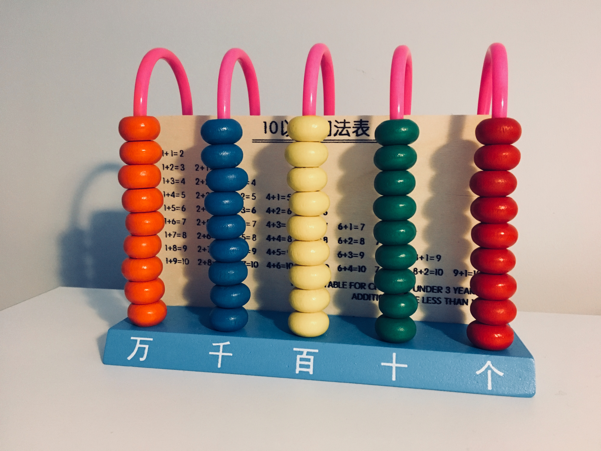

```{r set-options, echo=FALSE, cache=FALSE, warning=FALSE}
options(width = 100)
library(knitr)
library(purrr)
# knitr::opts_chunk$set(class.source = "chunkstyle")
```


## {class="inverse"}

Welcome back!


## {class="inverse"}


<center>

🐢😴 1️⃣ … 🔟 🚀🏃  
**How was the pace last time?**
<br>
<span style="font-size:60%;">Any comments on what felt too fast or too slow?</span>

</center>


## {class="inverse"}

Recap

## Goals of last course and exercise session

- Basic programming concepts.
- Functions and functionals.
- Working installation of R and first coding exercises.

## Atomic Vectors are the most fundamental data structures in R

```{r, echo = F, fig.cap = "Source: https://r4ds.had.co.nz/vectors.html",  out.width = "70%"}
include_graphics("../../img/data-structures-overview.png")
```


## Basic programming concepts

 - Atomic Vectors
 - Operators
 - Matrices
 - Loops
 - Logical statements
 - Control statements
 - Functions
 - Functionals


## Three tutorials

 - Compute the mean with your own function      [-> no solution posted]{.green-bold}
 - Evolution in action: fast and slow sloths    [-> solution in the first exercise session and on Canvas]{.green-bold}
 - Append and lists                             [-> solution in the second exercise session and on Canvas]{.green-bold}

```{r scratch, echo=FALSE, out.width = "35%", fig.align='center', purl=FALSE}
include_graphics("../../img/fastsloth.png")
```


## {class="inverse"}

Information


## Examination

##### Examination for *HSG students in exchange*

For HSG-students currently abroad on an exchange semester (not exchange students at HSG):

  - Central examination (50%): as planned, with all course participants.
  - Group project (35%): completed remotely with your group.
  - Decentral exam (15%): oral examination during the central examination period.

<br>

##### Examination for *exchange students at the HSG*

  - Decentral examination (50%): December 18th.
  - Group project (35%): completed remotely with your group.
  - Decentral exam (15%): December 11th. 


## Group size for the project

<br>
<br>
<br>
<center>
<br>

### 5*

<br>
</center>


<div class="footnote-pin">*No exceptions apply</div>


## {class="inverse"}

Warm-up


## Warm-up

#### Answer the three questions in this week's quiz. 

  - Exam style questions.
  - Use LLM to help you understand the answer.
  - Ask your instructor or TA if you have questions.


## Warm-up

#### Consider the following vector. Which answers are true?
```{r warmup1, echo=TRUE, eval = FALSE}
some_numbers <- c(30, 50, 60)
```

<br>

#### Possible answers

1. `sum(some_numbers[c(2,3)]) == 80`
2. `some_numbers[some_numbers %in% c(30)] == 30`
3. `some_numbers * 5 ` will do `30*5 + 50*5 + 60*5`


## Warm-up

:::: {.columns}

::: {.column width="50%"}
#### We create the following matrix

```{r warmup2a, echo=TRUE, eval = TRUE}
mymatrix <- matrix(c(1,2,3,11,12,13,1,10),
                   nrow = 2,
                   ncol = 4,
                   byrow = FALSE)
```

Which of the answers are correct?
:::

::: {.column width="50%"}
#### Answer 1 (recap lecture 2)

```{r, echo = TRUE, eval = FALSE}
max(mymatrix[, 2]) == 3
```
is `TRUE`

<br>

#### Answer 2 (recap lecture 2)

```{r, echo = TRUE, eval = FALSE}
apply(mymatrix, MARGIN = 2, min) 
```
returns a vector of size 4.
:::

::::


## Warm-up

:::: {.columns}

::: {.column width="50%"}
#### We create the following matrix

```{r warmup2b, echo=TRUE, eval = FALSE}
mymatrix <- matrix(c(1,2,3,11,12,13,1,10),
                   nrow = 2,
                   ncol = 4,
                   byrow = FALSE)
```

Which of the answers are correct?
:::

::: {.column width="50%"}

#### Answer 3 (🌶️)
```{r,  echo = TRUE, eval = FALSE}
m <- apply(mymatrix, MARGIN = 2, min)
```
can be coded as

```{r, echo = TRUE, eval = FALSE}
i <- 1
m <- c()

while(i < (ncol(mymatrix) + 1)){
  m <- append(m, min(mymatrix[,i]))
  i <- i + 1
}
```
:::

::::


## Warm-up

:::: {.columns}

::: {.column width="50%"}
#### We create the following matrix

```{r warmup2c, echo=TRUE, eval = FALSE}
mymatrix <- matrix(c(1,2,3,11,12,13,1,10),
                   nrow = 2,
                   ncol = 4,
                   byrow = FALSE)
```

Which of the answers are correct?
:::

::: {.column width="50%"}

#### Answer 4 (🌶️)

In this code:
  
```{r, echo = TRUE, eval = FALSE}
i <- 1
m <- c()

while(i < (ncol(mymatrix) + 1)){
  m <- append(m, min(mymatrix[,i]))
  i <- i + 1
}

```
we actually don't need to create an empty vector m. We just need to save the output of the loop as an object, i.e.:

```{r, echo = TRUE, eval = FALSE}
i <- 1

m <- while(i < (ncol(mymatrix) + 1)){
  append(m, min(mymatrix[,i]))
  i <- i + 1
}
```
:::

::::


## Warm-up

What is `total_sum`?

```{r warmup3, echo=TRUE, eval = FALSE}
numbers <- 1:4
total_sum <- 0
n <- length(numbers)

# start loop
for (i in 1:n) {
  
  if(i %% 2 == 0){
     total_sum <- total_sum + numbers[i]
  } else {
    total_sum <- total_sum + 2*numbers[i]
  }

}
```


## Don't forget...
```{r rmeme, echo=FALSE, out.width = "40%", fig.align='center', purl=FALSE}
include_graphics("../../img/Rmeme.jpg")
```


## {class="inverse"}

Data Processing

## Goals for today

  1. Get the basics of **data processing**
  2. Learn what **binary** and **hexadecimal** systems are
  3. See why **encoding** is crucial for any data project
  4. Realize that both code and data are just **text** at their core


## Numeral systems as representations 

```{r newabacus, echo=FALSE, out.width = "80%", fig.align='center', purl=FALSE}

```

##

```{r abacus, echo=FALSE, out.width = "85%", fig.align='center', purl=FALSE}
include_graphics("../../img/abacus_black_own.png")
```

##

```{r blackbox, echo=FALSE, out.width = "90%", fig.align='center', purl=FALSE}
include_graphics("../../img/cpu_blackbox.png")
```


## The binary system

Microprocessors can only represent two signs (states): 

 - 'Off' = `0`
 - 'On' = `1`

```{r onoff, echo=FALSE, out.width = "10%", fig.align='center', purl=FALSE}
include_graphics("../../img/on_off.png")
```

## The binary system

```{r matrix, echo=FALSE, out.width = "80%", fig.align='center', purl=FALSE}
include_graphics("../../img/matrix.gif")
```

## The binary counting frame

- Only two signs: `0`, `1`.
- Base 2.
- Columns: $2^0=1$, $2^1=2$, $2^2=4$, and so forth.


## The binary counting frame

What is the decimal number *139* in the binary counting frame?


## The binary counting frame

What is the decimal number *139* in the binary counting frame?
 
 - Solution:
 
$$(1 \times 2^7) + (1 \times 2^3) + (1 \times 2^1) + (1 \times 2^0) = 139.$$


## The binary counting frame

What is the decimal number *139* in the binary counting frame?
 
 - Solution:
 
$$(1 \times 2^7) + (1 \times 2^3) + (1 \times 2^1) + (1 \times 2^0) = 139.$$

  - More precisely:
  
$$(1 \times 2^7) + (0 \times 2^6) +  (0 \times 2^5) +  (0 \times 2^4) + (1 \times 2^3)\\ + (0 \times 2^2) + (1 \times 2^1) +  (1 \times 2^0)  = 139.$$

  - That is, the number `139` in the decimal system corresponds to `10001011` in the binary system.


## Conversion between binary and decimal

Number  | 128 | 64 | 32 | 16 | 8  | 4  | 2  |  1 
-----|-----|----|----|----|----|----|----|----


<!-- ## Conversion between binary and decimal -->


<!-- Number  | 128 | 64 | 32 | 16 | 8  | 4  | 2  |  1  -->
<!-- -----|-----|----|----|----|----|----|----|---- -->
<!-- 0  = | 0   |  0 | 0  |  0 | 0 |  0 | 0  |  0   -->


<!-- ## Conversion between binary and decimal -->


<!-- Number  | 128 | 64 | 32 | 16 | 8  | 4  | 2  |  1  -->
<!-- -----|-----|----|----|----|----|----|----|---- -->
<!-- 0  = | 0   |  0 | 0  |  0 | 0 |  0 | 0  |  0   -->
<!-- 1  = | 0   |  0 | 0  |  0 | 0 |  0 | 0  |  1 -->


<!-- ## Conversion between binary and decimal -->


<!-- Number  | 128 | 64 | 32 | 16 | 8  | 4  | 2  |  1  -->
<!-- -----|-----|----|----|----|----|----|----|---- -->
<!-- 0  = | 0   |  0 | 0  |  0 | 0 |  0 | 0  |  0   -->
<!-- 1  = | 0   |  0 | 0  |  0 | 0 |  0 | 0  |  1 -->
<!-- 2  = | 0   |  0 | 0  |  0 | 0 |  0 | 1  |  0 -->


<!-- ## Conversion between binary and decimal -->


<!-- Number  | 128 | 64 | 32 | 16 | 8  | 4  | 2  |  1  -->
<!-- -----|-----|----|----|----|----|----|----|---- -->
<!-- 0  = | 0   |  0 | 0  |  0 | 0 |  0 | 0  |  0   -->
<!-- 1  = | 0   |  0 | 0  |  0 | 0 |  0 | 0  |  1 -->
<!-- 2  = | 0   |  0 | 0  |  0 | 0 |  0 | 1  |  0 -->
<!-- 3  = | 0   |  0 | 0  |  0 | 0 |  0 | 1  |  1 -->


## Conversion between binary and decimal


Number  | 128 | 64 | 32 | 16 | 8  | 4  | 2  |  1 
-----|-----|----|----|----|----|----|----|----
0  = | 0   |  0 | 0  |  0 | 0 |  0 | 0  |  0  
1  = | 0   |  0 | 0  |  0 | 0 |  0 | 0  |  1
2  = | 0   |  0 | 0  |  0 | 0 |  0 | 1  |  0
3  = | 0   |  0 | 0  |  0 | 0 |  0 | 1  |  1
... |    |   |   |  |  |   |   |  
139 = | 1   |  0 | 0  |  0 |  1 |  0 | 1  |  1    


## The binary counting frame

#### An algorithm to convert an integer to binary:

  1. Divide the integer by 2.
  2. Write down the remainder (0 or 1).
  3. Update the integer to the quotient (integer division).
  4. Repeat until the quotient is 0.
  5. The binary number is the sequence of remainders read from bottom to top.

<br>

#### 🧠 Challenge: use a `while` loop, the operators `%%` and `%/%` to implement this algorithm in R.

```{r, echo=TRUE}
#| code-fold: true
#| code-summary: "Show the function `decimal_to_binary_integers`"

decimal_to_binary_integers <- function(decimal) {
  
  bin <- c()
  
  while(decimal > 0){
    q <- decimal %% 2
    decimal <- decimal %/% 2
    bin <- c(q, bin)
  }
  
  bin <- paste0(bin, collapse = "")
  return(bin)
}
```

```{r, echo=TRUE}
decimal_to_binary_integers(47)
```


## The binary counting frame 

- Sufficient to represent all *natural* numbers in the decimal system.
- Representing fractions is tricky
    - e.g. $1/3=0.333..$ actually constitutes an infinite sequence of 0s and 1s.
    - Solution: 'floating point numbers' (not 100% accurate)


## Floating point numbers

:::: {.columns}

::: {.column width="50%"}
```{r, echo=TRUE, eval=TRUE, `code-line-numbers`="1,2,3"}
# Subtracting two nearly identical floating-point numbers
x <- 0.3 - 0.2
y <- 0.1

# Check if they are equal
result <- x == y
```
:::

::: {.column width="50%"}
```{r, echo = TRUE}
print(x, digits = 20)       
print(y, digits = 20)
```
:::

::::


## Floating point numbers

:::: {.columns}

::: {.column width="50%"}
```{r, echo=TRUE, eval=TRUE, `code-line-numbers`="5,6"}
# Subtracting two nearly identical floating-point numbers
x <- 0.3 - 0.2
y <- 0.1

# Check if they are equal
result <- x == y
```
:::

::: {.column width="50%"}
```{r, echo = TRUE}
print(result)  
```
:::

::::


## Floating point numbers

#### ...now...

<br>

```{r, echo = TRUE}

tolerance <- 1e-9
equal <- abs(x - y) < tolerance
print(equal)  
```


## Floating point numbers

#### An algorithm to convert a fractional to binary:

  1. *Multiply* the fraction by 2.
  2. Write down the integer part.
  3. Repeat 1 using the fractional part.
  4. Repeat until the fractional part is 0.

The binary number is the sequence of remainders read from bottom to top.


#### Challenge: use a `while` loop, the operators `%%` and `%/%` to implement this algorithm in R.

```{r, echo=TRUE}
#| code-fold: true
#| code-summary: "Show the function `decimal_to_binary_fractional`"

decimal_to_binary_fractional <- function(fraction, max_digits) {
  
  bin <- c()
  count <- 0
  
  while(fraction > 0 & count < max_digits){
    
    fraction <- fraction * 2
    int <- fraction %/% 1
    bin <- c(bin, int)
    fraction <- fraction - int
    count <- count + 1
  }
  
  bin <- paste0("0.", paste0(bin, collapse = ""))
  return(bin)
}

```

```{r, echo=TRUE}
decimal_to_binary_fractional(1/3, max_digits = 20)
```


## Floating point numbers

All in all, we can combine both functions to create a converter function `decimal_to_binary`. 


```{r, echo=TRUE}
#| code-fold: true
#| code-summary: "Show the function `decimal_to_binary`"

decimal_to_binary <- function(decimal, max_digits = 20) {
  
  # Separate integer and fractional part
  integer_part <-  decimal %/% 1 
  fractional_part <- decimal %% 1
  
  
  # Part on integer
  # If integer part is 0, we need to retain "0" rather than removing it
  if (integer_part == 0) {
    
    bin_integer <- "0"
    
  } else {
    
    bin_integer <- c()
    
    while(integer_part > 0){
      q <- integer_part %% 2
      integer_part <- integer_part %/% 2
      bin_integer <- c(q, bin_integer)
    }
    
    bin_integer <- paste0(bin_integer, collapse = "")
  }
  
  # Part on fractional
  if (fractional_part == 0){
    bin_fraction <- "0"
  } else {
    
    count <- 0
    bin_fraction <- c()
    
    while(fractional_part > 0 & count < max_digits){
      
      fractional_part <- fractional_part * 2
      int <- fractional_part %/% 1
      bin_fraction <- c(bin_fraction, int)
      fractional_part <- fractional_part - int
      count <- count + 1
    }
    
    bin_fraction <- paste0(bin_fraction, collapse = "")
  }
  
  return(paste0(bin_integer, ".", bin_fraction))
}

```


```{r, echo = TRUE}
decimal_to_binary(9.25, max_digits = 20)
decimal_to_binary(1/2, max_digits = 20)
```


## Floating point numbers

❓ How does the "computer" handle the distinction between the part of a number before and after the decimal point?

- IEEE Standard for Floating-Point Arithmetic (IEEE 754) 
- [Not exam relevant]{.green-bold}. See [this page](https://mathcenter.oxford.emory.edu/site/cs170/ieee754/) for a step-by-step explanation.

```{r IEEE, echo=FALSE, out.width = "30%", fig.align='center', purl=FALSE}
# include_graphics("https://media.geeksforgeeks.org/wp-content/uploads/Single-Precision-IEEE-754-Floating-Point-Standard.jpg")
include_graphics("../../img/IEEE754.jpg")
```


## What time is it?

```{r clock, echo=FALSE, out.width = "90%", fig.align='center', purl=FALSE}
include_graphics("../../img/binarySBB.jpg")
```


## Floating point numbers be like...

```{r meme, echo=FALSE, out.width = "70%", fig.align='center', purl=FALSE}
include_graphics("../../img/meme_floating.webp")
```


## The hexadecimal system

- Binary numbers can become quite long rather quickly.
- Computer Science: refer to binary numbers with the *hexadecimal* system.


## The hexadecimal system

#### 16 symbols >>> base 16

  - `0`-`9` (used like in the decimal system)...
  - and `A`-`F` (for the numbers 10 to 15).
  - each digit represents an increasing power of 16 ($16^{0}$, $16^{1}$, etc.).


## The hexadecimal system

What is the decimal number 139 expressed in the hexadecimal system?


## Decimal numbers in hexadecimal


Number  | ... | $16^2=256$  | $16^1=16$  |  $16^0=1$
------|-----|----|----|----|
0  =  | ... |  0 | 0  |  0
1  =  | ... |  0 | 0  |  1
15 =  | ... |  0 | 0  |  F
16 =  | ... |  0 | 1  |  0
256 = | ... |  1 | 0  |  0
...  | ... |    |    |   
139 = | 0  |  0 | 8  |  B


## The hexadecimal system

What is the decimal number 139 expressed in the hexadecimal system?

- Solution:
$$(8\times 16^1) +  (11\times 16^0) = 139.$$

- More precisely:
$$(8\times 16^1) +  (B\times 16^0) = 8B = 139.$$

<!-- ## The hexadecimal system -->

<!-- What is the decimal number 139 expressed in the hexadecimal system? -->

<!-- - Solution: -->
<!-- $$(8\times 16^1) +  (11\times 16^0) = 139.$$ -->

<!-- - More precisely: -->
<!-- $$(8\times 16^1) +  (B\times 16^0) = 8B = 139.$$ -->

- Hence: `10001011` (in binary) = `8B` (in hexadecimal) = `139` in decimal.


## The hexadecimal system

#### Challenge: update your function `decimal_to_binary_integers` to write in hexadecimal system. 

```{r, echo=TRUE}
#| code-fold: true
#| code-summary: "Show the function `decimal_to_binary_integers`"

decimal_to_hexa_integers <- function(decimal) {
  
  hex <- c()
  
  while(decimal > 0){
    q <- decimal %% 16
    
    q <- if(q - 10 >= 0) {
      q <- if(q == 10) "A" 
      else if(q == 11) "B"
      else if(q == 12) "C"
      else if(q == 13) "D"
      else if(q == 14) "E"
      else if(q == 15) "F"
    } else {
      q
    }
    
    decimal <- decimal %/% 16
    hex <- c(q, hex)
  }
  
  hex <- paste0(hex, collapse = "")
  return(hex)
}

decimal <- 31
```

```{r, echo=TRUE}
lapply(c(1, 2, 12, 48, 255, 256), decimal_to_hexa_integers)
```


## The hexadecimal system

#### Advantages (when working with binary numbers)

1. Shorter than raw binary representation
2. Much easier to translate back and forth between binary and hexadecimal than binary and decimal.

&nbsp;

<center>
*WHY?*

😆
</center>

<!-- ## The hexadecimal system -->
<!-- Advantages (when working with binary numbers)... -->

<!-- - Hexadecimal digits can always be represented in four-digit binary equivalent. -->
<!-- -  $8=1000$, $B=11=1011$, thus... -->
<!-- - `8B` (in hexadecimal) = `10001011` (`1000 1011`) in binary. -->


## {class="inverse"}

Character Encoding


## Computers and text

How can a computer understand text if it only understands `0`s and `1`s?


## Computers and text

How can a computer understand text if it only understands `0`s and `1`s?

  - **Standards** define how `0`s and `1`s correspond to specific letters/characters of different human languages.
  - These standards are usually called **character encodings**.


```{r binarykeyboard, echo=FALSE, out.width = "40%", fig.align='center', purl=FALSE}
include_graphics("../../img/binary_keyboard.jpg")
```


## Computers and text
How can a computer understand text if it only understands `0`s and `1`s?

  - **Standards** define how `0`s and `1`s correspond to specific letters/characters of different human languages.
  - These standards are usually called **character encodings**.
  - Coded character sets that map unique numbers (in the end in binary coded values) to each character in the set.
  - For example, **ASCII** (American Standard Code for Information Interchange), now superseded by **utf-8** (Unicode).

```{r ascii, echo=FALSE, out.width = "30%", fig.align='center', fig.cap='ASCII logo. (public domain).', purl=FALSE}
include_graphics("../../img/ascii.gif")
```


## ASCII Table


Binary  | Hexadecimal | Decimal | Character 
-----|-----|----|----
0011 1111 | 3F   |  63 | `?`  
0100 0001 | 41   |  65 | `A`  
0110 0010 | 62  |  98 | `b`


## Character encodings: why should we care?
 
 - In practice, working with data means handling digital data of all formats and shapes.
    - Diverse sources.
    - Different standards.
    - Different languages (Japanese vs English).
    - read and store data.
    
 - At the lowest level, this means understanding/handling encodings.


## {class="inverse"}

Computer Code and Text-Files


## Putting the pieces together...

Two core themes of this course:

  1. How can **data** be **stored** digitally and be **read** by/imported to a computer?
  2. How can we give instructions to a computer by writing **computer code**?


## Putting the pieces together...

Two core themes of this course:

  1. How can **data** be **stored** digitally and be **read** by/imported to a computer?
  2. How can we give instructions to a computer by writing **computer code**?

In both of these domains we mainly work with one simple type of document: [**text files**]{.green-bold}.


## Text-files

::: {.incremental}
 - A **collection of characters** stored in a designated part of the computer memory/hard drive.
 - An easy-to-read representation of the underlying information (`0`s and `1`s)!
 - Common device to store data:
    - Structured data (tables)
    - Semi-structured data (websites)
    - Unstructured data (plain text)
 - Typical device to store computer code.
:::


## Unstructured data in text files

- Store ["Hello World"]{.green-bold} in `helloworld.txt`.
  - Allocation of a block of computer memory containing "Hello World!".
  - Simply a sequence of `0`s and `1`s...
  - `.txt` indicates to the operating system which program to use when opening this file.
  
- Encoding and format tell the computer how to interpret the `0`s and `1`s.


## Inspect a text file

Interpreting `0`s and `1`s as text... using `bash` (scripting language to interact with the operating system):

```{bash, eval=FALSE, echo = TRUE}
cat helloworld.txt; echo
```

```{bash, echo=FALSE}
cat ../../data/helloworld.txt; echo
```


## Inspect a text file

Directly looking at the `0`s and `1`s...

```{bash, eval = FALSE, echo = TRUE}
xxd -b helloworld.txt
```

```{bash, echo = FALSE, eval = FALSE}
xxd -b ../../data/helloworld.txt
```

```{}
00000000: 01001000 01100101 01101100 01101100 01101111 00100000  Hello 
00000006: 01010111 01101111 01110010 01101100 01100100 00100001  World!
```


```{r, eval=FALSE, echo = FALSE}
# Inspecting a text file as binary in R
file_content <- readBin("../../data/helloworld.txt", 
                        what = "raw",
                        n = 12)

binary_content <- paste(as.character(sapply(file_content, function(x) paste0(as.integer(rawToBits(x)), collapse = ""))), collapse = " ")

binary_content
```


## Inspect a text file

Similarly we can display the content in hexadecimal values:


```{bash, eval = FALSE, echo = TRUE}
xxd  data/helloworld.txt
```

```{bash, echo = FALSE, eval = FALSE}
xxd  ../../data/helloworld.txt
```

```{}
00000000: 4865 6c6c 6f20 576f 726c 6421            Hello World!
```


## Encoding issues

#### What is the problem?

```{bash, eval=FALSE, echo = TRUE}
cat hastamanana.txt; echo
```

```{bash, eval=FALSE}
cat ../../data/hastamanana.txt; echo
```

```{}
## Hasta Ma?ana!
```


## Encoding issues

<br> 

```{}
00000000: 4861 7374 6120 4d61 f161 6e61 210d 0a    Hasta Ma.ana!..
```


#### Inspect the encoding

```{bash, eval = FALSE, echo = TRUE}
file -b hastamanana.txt
```

```{bash, echo = FALSE}
file -b ../../data/hastamanana.txt
```

`f1` is the problematic byte. [It corresponds to the "ñ" in ISO-8859.](https://cs.stanford.edu/people/miles/iso8859.html) and is the code `U+00F1` in unicode (Latin-1 supplement). In UTF-8, f1 is not a valid character by itself, [as UTF-8 expects two bytes (c3 b1)](https://www.utf8-chartable.de/).


#### Read the file again, this time with the correct encoding

```{bash, eval = FALSE, echo = TRUE}
iconv -f iso-8859-1 -t utf-8 hastamanana.txt | cat
```

```{bash, echo = FALSE}
iconv -f iso-8859-1 -t utf-8 ../../data/hastamanana.txt | cat
```


## UTF encodings
  - 'Universal' standards.
  - UTF-8 to UTF-16 to UTF-32
  - Contain broad variety of symbols (various languages).
  - Less problems with newer data sources...


## Take-away message
  - **Recognize an encoding issue when it occurs!**
  - Problem occurs right at the beginning of the *data pipeline*!
    - Rest of pipeline affected...
    - ... cleaning of data fails ...
    - ... analysis suffers. 😭


<!-- # Encoding Issues -->

<!-- ## Recognize the problem -->

<!-- ```{r} -->
<!-- FILE <- "../../data/hastamanana.txt" -->
<!-- hasta <- readLines(FILE) -->
<!-- hasta -->
<!-- ``` -->

<!-- (`readLines()` simply reads the content of a text file line by line.) -->

<!-- ## Guess encoding -->

<!-- - Recall that there are no meta data in csv or plain text file informing you about the encoding. -->
<!-- - If no other information is available, we need to make an educated guess. -->
<!-- - `readr` provides a function that does just that: `guess_encoding()` -->

<!-- ```{r} -->
<!-- readr::guess_encoding(FILE) -->
<!-- ``` -->


<!-- ## Handling encoding issues -->

<!-- - `inconv()`: convert a character vector `from` one encoding `to` another encoding. -->
<!-- - Use the guessed encoding for the `from` argument -->

<!-- ```{r} -->
<!-- iconv(hasta, from = "ISO-8859-2", to = "UTF-8") -->
<!-- ``` -->


<!-- ```{r} -->
<!-- iconv(hasta, from = "ISO-8859-1", to = "UTF-8") -->
<!-- ``` -->


## A side note on text editors: RStudio, Atom, VsCode

<p float="left">
  
   
  
  
</p>


Install RStudio from [here](https://www.rstudio.com/products/rstudio/download/#download)!

Install Atom from [here](https://flight-manual.atom.io/getting-started/sections/installing-atom/)!

Install VScode from [here](https://code.visualstudio.com/)!

Install Sublime text from [here](https://www.sublimetext.com/)!


## {class="inverse"}

Data Processing Basics


## Components of a standard computing environment

```{r blackbox2, echo=FALSE, out.width = "75%", fig.align='center', fig.cap= "The 'blackbox' of data processing.", purl=FALSE}
include_graphics("../../img/cpu_blackbox.png")
```

[Reading: please read the document "Data Processing Basics" published on Canvas (in materials/handout). This is exam relevant!]{.green-bold} 


##

<br>
<br>

<center>
*5468616E6B7320616E642073656520796F75206E657874207765656B21*

🤓
</center>


## {class="inverse"}

Q&A


