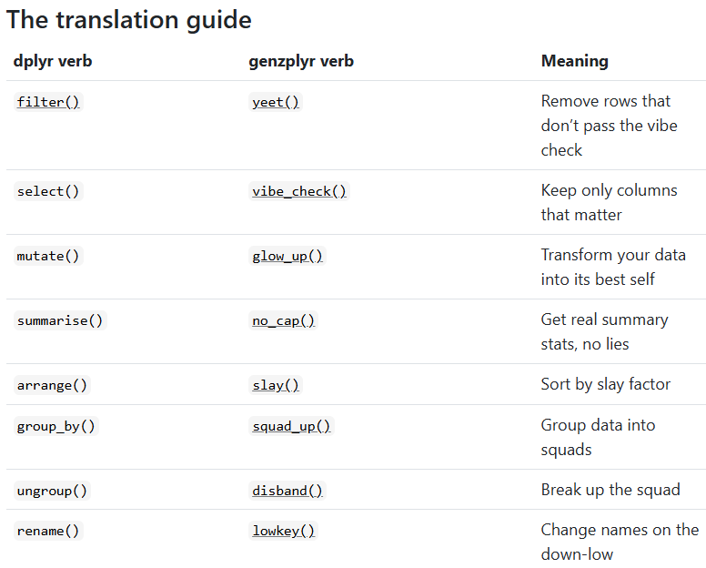

```{r set-options, echo=FALSE, message=FALSE, warning=FALSE, cache=FALSE}
options(width = 100)
library(knitr)
library(dplyr)
library(tidyverse)
library(tidyr)
```


# Recap: Data Manipulation

## Data preparation consists of five main steps

- **Tidy** data.
- **Reshape** datasets from wide to long (and vice versa).
- **Bind** or stack rows in datasets.
- **Join** datasets.
- **Clean** and **manipulate** data.


## **Reshape** datasets from wide to long (and vice versa).
```{r longvswideCode, echo=FALSE, out.width = "80%", fig.align='center', purl=FALSE, fig.cap="Long and wide data. Source: [Hugo Tavares](https://tavareshugo.github.io/r-intro-tidyverse-gapminder/09-reshaping/index.html)"}
include_graphics("../../img/longvswideCode.png")
```


## **Bind** or stack rows in datasets.

```{r, echo=FALSE, out.width = "55%", fig.align='center', purl=FALSE}
include_graphics("../../img/rowbinding_dark.png")
```


## **Join** datasets.

Overview by [R4DS](https://r4ds.hadley.nz/joins):

dplyr (tidyverse)  | base::merge
-------------------|-------------------------------------------
`inner_join(x, y)` | `merge(x, y)`
`left_join(x, y)`  | `merge(x, y, all.x = TRUE)`
`right_join(x, y)` | `merge(x, y, all.y = TRUE)`,
`full_join(x, y)`  | `merge(x, y, all = TRUE)`


::: aside
You are expected to know that `base::merge()` exists. For the exam, please focus on the `dplyr` functions.
:::


## **Clean** and **manipulate** data.

```{r, echo=FALSE, out.width = "90%", fig.align='center', fig.cap = 'Source: [Intro to R for Social Scientists](https://jaspertjaden.github.io/course-intro2r/week3.html)', purl=FALSE}
include_graphics("../../img/dplyr_blocks.png")
```


## OK Boomer

:::: {.columns}

::: {.column width="50%"}
```{r, echo=FALSE, out.width = "90%", fig.align='center', purl=FALSE}

```
:::

::: {.column width="50%"}
```{r, echo=FALSE, out.width = "90%", fig.align='center', purl=FALSE}

```
:::
::::


# Warm up

## Mutating dataframes

Consider the following data frame:

```
main_dataset
  city        temp  scale conversion_factor
1 StGallen    12 Celsius 1.0000000
2 Zürich      14 Celsius 1.0000000
3 Detroit     40 Fahrenheit 0.5555556
```

Select all the statements that are true.

::: {style="font-size: 50%;"}

```{r, eval = FALSE}
main_dataset |> 
  mutate(temp_celsius = ifelse(scale == "Fahrenheit", (temp-32) * conversion_factor, temp))
```
replaces the variable `temp` with `temp_celsius` 
<!-- #NO -->

```{r, eval = FALSE}
main_dataset |> 
  mutate(temp_celsius = ifelse(scale == "Fahrenheit", (temp-32) * conversion_factor, temp))
```
has 3 rows and 5 columns
<!-- YES -->

```{r, eval = FALSE}
main_dataset |> 
  summarize(mean_temp = mean(temp), min_temp = min(temp))
```
returns a tibble containing 2 columns and 1 row
<!-- YES -->

```{r, eval = FALSE}
main_dataset |> 
  summarize(mean_scale = mean(scale), sd_scale = sd(scale))
```
is a good way to get summary statistics about the variable `scale`
<!-- NO -->
:::

## Joining

Consider the following code:

```{r, eval = FALSE}
temperature_conversions <- data.frame(conversion_factor = c(5/9, 1),
                                      scale = c("Fahrenheit", "Celsius"))

temperature <- data.frame(city = c("StGallen", "Zürich", "Detroit"),
                          temp = c(12, 14, 21),
                          scale = c("Cel", "Cel", "F"))
```

Select statements that are true:

-   [`inner_join(temperature, temperature_conversions, by="scale")` returns a data frame with 3 rows.]{style="font-size: smaller;"}
-   [`left_join(temperature, temperature_conversions, by="scale")` returns a data frame with 3 rows.]{style="font-size: smaller;"}
-   [`full_join(temperature, temperature_conversions, by="scale")` returns a data frame with 3 rows.]{style="font-size: smaller;"}


## Question on merging dataframes

:::: {.columns}

::: {.column width="50%"}
::: {style="font-size: 80%;"}

Consider the two following dataframes:

```
> df_family_work <- data.frame(
+   year     = c(2023,2024,2023,2023,2024,2023,2024),
+   name     = c("Peter", "Peter", "Lois", "Lois", "Stewie", 
+               "Stewie", "Stewie"),
+   hours    = c(10, 5, 20, 8, 12, 15, 4)
+ )
> df_family_work
  year   name hours
1 2023  Peter    10
2 2024  Peter     5
3 2023   Lois    20
4 2023   Lois     8
5 2024 Stewie    12
6 2023 Stewie    15
7 2024 Stewie     4


> df_family_budget <- data.frame(
+   name     = c("Peter","Peter","Lois","Stewie","Meg","Meg"),
+   year        = c(2023,2024,2023,2023,2023,2024),
+   budget_k    = c(120, 140,  90, 160, 110, 130)
+ )
> df_family_budget
    name year budget_k
1  Peter 2023      120
2  Peter 2024      140
3   Lois 2023       90
4 Stewie 2023      160
5    Meg 2023      110
6    Meg 2024      130
```
:::
:::

::: {.column width="50%"}

::: {style="font-size: 80%;"}
Now consider the following lines of code. Describe what these lines of code do. What would be the output? What is the problem with the first line? Is `j3` similar to `j4`, and how so?

```
j1 <- left_join(df_family_work, df_family_budget, by = "name")

j2 <- left_join(df_family_work, df_family_budget, by = c("name", "year"))

j3 <- inner_join(df_family_work, df_family_budget, by = c("name", "year"))

j4 <- left_join(df_family_work, df_family_budget, by = "name")  |> 
  filter(year.x == year.y)  |> 
  select(-year.y)  |> 
  rename(year = year.x)
```
:::
:::
::::


# Today

## Goals for the next two lectures

1. Know how to conduct exploratory data analysis (EDA).
2. Visualize data using tables.
3. Visualize data using the grammar of graphics.
4. Produce effective data visualization.


# Exploratory Data Analysis and Descriptive Statistics

## {class="inverse" background-image="../../img/terraincognita.jpg" background-size="100%" background-repeat="cover"}


## Exploratory Data Analysis (EDA) is the first step of data analysis

- 🔎 Get a first understanding of your dataset.
- Show **key aspects of data** by modelling, transforming, and visualizing your data. 
  - Investigate the quality and reliability of your data.
  - Inform your own statistical analysis.
  - Inform audience (helps understand analytics parts).
- ... which in turns generates new questions about your dataset (creative process 🎨).


## Data exploration be like...

#### "To not mislead others and not embarrass yourself, know your data".*

- Understand the **number of observations**, the **units**, the **quality** of data, the **definitions** of variables, what to do with **missing values**.

#### What type of variation occurs within my variables?

- **Typical values**: mean, mode, range, standard deviation.
- **Surprising values**: outliers, rare values, unusual patterns.

#### What type of covariation occurs between my variables?
- **Covariation** and **Patterns**.

<br>

::: {style="font-size: 60%;"}
Source: [R4DS](https://r4ds.hadley.nz/eda), *"Statistics for Public Policy" by Jeremy G. Weber, 2024.
:::

## EDA: first steps in `R`

- Quick overview: `summary()`
- Cross-tabulation: `table()`
- Summarizing tools: `skimr`, `summarytools`, `janitor` (also cleaning)


## EDA: first steps in `R`

#### 1. Functions to compute statistics <br>

  - e.g., `mean()`

<br>

####  2. Functions to *apply* the statistics function to one or several columns in a tidy dataset.
  
  - Including all values in a column.
  - By group (observation categories, e.g. by location, year, etc.)

:::: aside
`summary()` in `base`; `summarise()` in `tidyverse`; `group_by()` in `tidyverse`; `sapply()`, `apply()`, `lapply()`, etc. in `base`; `skimr` package; etc.
::::

## EDA: an example with the `swiss` data

<details> <summary>Show code</summary>
```{r, echo = TRUE}
# Load the built-in 'swiss' dataset from the package "datasets"
data("swiss")

swiss <- rownames_to_column(swiss, var = "municipality")

# Add an outlier in Lausanne
swiss[swiss$municipality == "Lausanne", "Infant.Mortality"] <- 100

# Add a NA for Agriculture in Gruyere
swiss[swiss$municipality == "Gruyere", "Agriculture"] <- NA
```
</details> 
```{r}
swiss
```


## EDA: an example with the `swiss` data

```{r}
summary(swiss)
```

## EDA: using `summarytools()` to generate an overview (does not render well on slides)

```{r, results='asis'}
summarytools::dfSummary(swiss)
```


## EDA: summaries per group 
```{r, echo = TRUE}
swiss |> 
  group_by(Catholic > 50) |> 
  summarize(mean(Fertility))

swiss |> 
  group_by(Catholic > 50) |> 
  summarize(
    across(
      .cols = c(Fertility, Education),
      .fns = list("min" = min, "mean" = mean, "median" = median, "max" = max,
                   "n_na" = ~sum(is.na(.)))
          )
        ) 
```


## The problem of missing values: potential bias


:::: {.columns}

::: {.column width="48%"}

##### 1. How big is the problem?

  - How many observations and variables are affected?
  - Is missingness clustered in groups or time periods?

##### 2. What do missing values represent?
 
  - Not collected, not available, not recorded, not applicable?

:::

::: {.column width="4%"}
<div style="border-left: 20px solid #1c6b08ff; height: 100%; margin: 0 auto;"></div>
:::

::: {.column width="48%"}

##### 3. What is the missingness mechanism? 

  - **MCAR**: missing completely at random / **MAR**: missing at random
    <!-- If the probability of being missing is the same for all cases, then the data are said to be missing completely at random (MCAR). The causes of the missing data are unrelated to the data. If the probability of being missing is the same only within groups defined by the observed data, then the data are missing at random (MAR)./ -->
  - **MNAR**: not missing at random<br><br>

##### 4. What are the risks for your analysis?

  - Missing values can introduce selection bias
  - Missing values can change distributions, shrink variances, or distort associations

:::
::::

<br>

📖 [Flexible Imputation of Missing Data, Van Buuren, 2018](https://stefvanbuuren.name/fimd/)


## How to solve the problem of missing values

- **Complete case analysis** (listwise deletion): remove all observations with missing values.

  - `na.omit()` that thing! 💣
  - `complete.cases(df)` gives the indices of rows that contain NAs
  - Default behavior in many commands (for instance `mean(., na.rm = T)` or `lm()`)

- **Imputation**: replace missing values with a plausible value.
- **Multiple imputation**: create multiple datasets with plausible values.
- **Model-based imputation**: use a model to predict missing values.


## My applied take on missing values

##### 1. **Keep in mind the source of missingness throughout your analysis**

  - In my experience, missingness is rarely random. 
  - Common causes: data entry errors, expensive/unused variables, systematic non-response<br>

##### 2. **Be aware of the trade-off between data loss and bias**

  - **Removing variables**: Loss of information. Usually ok, poorer analysis.
  - **Removing observations**: Risk of sample bias, reduced statistical power. More problematic.<br>

#####  3. **Choose imputation methods wisely** (or maybe, don't bother)
  
  - Simple imputation (mean/median): acceptable for small amounts of missing data
  - Multiple/model-based imputation: reserve for cases where data is highly valuable
  - Document your approach and justify complex methods


## An example of handling missing values

<details> <summary>Show example (see script)</summary>
```{r, echo = TRUE, eval = FALSE}
data <- data.frame(
  Gender = c("Male", "Female", "Male", "Female", "Male", "Female"),
  Participation = c(1, 0, 1, NA, 0, 1),
  Wage = c(30, NA, 35, 28, 40, NA)
)

data

# Complete case analysis ---------------------------------
complete_case <- na.omit(data)


# Imputation ---------------------------------
# Mean imputation for missing Wage
mean_impute <- data |> 
  mutate(
    Wage = ifelse(is.na(Wage), mean(Wage, na.rm = TRUE), Wage),
    Participation = ifelse(
      is.na(Participation), 
      round(mean(Participation, na.rm = TRUE), 0), 
      Participation
      )
    ) 


# Analysis ---------------------------------
# Analyze mean Wage by gender
data |>
  group_by(Gender) |>
  summarize(
    Mean_Wage = mean(Wage, na.rm = TRUE),
    Participation_Rate = mean(Participation, na.rm = TRUE)
  )

complete_case |>
  group_by(Gender) |>
  summarize(
    Mean_Wage = mean(Wage, na.rm = TRUE),
    Participation_Rate = mean(Participation, na.rm = TRUE)
  )

mean_impute |>
  group_by(Gender) |>
  summarize(
    Mean_Wage = mean(Wage, na.rm = TRUE),
    Participation_Rate = mean(Participation, na.rm = TRUE)
  )

```
</details> 

#### Important commands

- `na.omit()`
- `f(..., na.rm = TRUE)` like in `mean()`, `sum()`, etc.  


# Visualizing data

## Data visualization is THE key to effectively delivering insights and to convince people 

:::: {.columns}

::: {.column width="50%"}

```{r echo= FALSE, out.width="70%", fig.align="center", fig.cap = "Du Bois, 1900" }
include_graphics("../../img/dubois_challenge.jpg")
```

:::

::: {.column width="50%"}

```{r echo= FALSE, out.width="75%", fig.align="center", fig.cap = "Trump, 2024"}
include_graphics("../../img/trump_vs_biden.jpg")
```

:::

::::

## Data visualization through tables and graphs

- Two ways: display data through *tables* or *graphs*.

- Depends on the purpose.


## Data visualization through tables and graphs

##### A **chart** typically contains at least one axis, the **values are represented in terms of visual objects** (dots, lines, bars) and axes typically have scales or labels.

  - If we are interested in exploring, analyzing or communicating **patterns** in the data, charts are more useful than tables.
    
<br>

##### A **table** typically contains rows and columns, and the **values are represented by text**.

  - If we are interested in exploring, analyzing or communicating **specific numbers** in the data, tables are more useful than graphs.


# Tables

## Tables

-   Formatting data values for publication.
-   Typical: String operations to make numbers and text look nicer.
    -   Before creating a table or figure...


## Tables

```{r message=FALSE}
# load packages and data
library(tidyverse)
data("swiss")

# compute summary statistics
swiss_summary <- swiss |> 
  summarise(avg_education = mean(Education),
            avg_fertility = mean(Fertility),
            N = n()
  )

swiss_summary
```

*Problems?*


## Tables: round numeric values

```{r}
swiss_summary_rounded <- round(swiss_summary, 2)
swiss_summary_rounded
```

## Tables: detailed formatting of numbers

-   Coerce to text.
-   String operations.
-   Decimal marks, units (e.g., currencies), other special characters for special formats (e.g. coordinates).
-   *`format()`*-function


## Tables: `format()` example

```{r}
swiss_form <- format(swiss_summary_rounded,
                     decimal.mark = ",")
swiss_form 
```


## Helpful functions for formatting text-strings

-   Uppercase/lowercase: `toupper()`/`tolower()`.
-   Remove white spaces: `trimws()`,

```{r}
string <- "AbCD "
toupper(string)
tolower(string)
trimws(tolower(string))
```


## Get creative with tables: `gtExtras` and sparklines

```{r}
head(USArrests, 10)
```

*Showing a raw data frame is not visualization... Problems?*


## Get creative with tables: `gtExtras` and sparklines

```{r message=FALSE, warning=FALSE}
library(gtExtras)

USArrests_summary <- USArrests |> 
  mutate(UrbanPop = case_when(UrbanPop > quantile(UrbanPop, .66) ~ "High",
                                UrbanPop > quantile(UrbanPop, .33) ~ "Middle",
                                UrbanPop > 0 ~ "Low")) |> 
  group_by(UrbanPop) |> 
  summarize(
    "Mean murder" = mean(Murder),
    "SD murder" = sd(Murder),
    Density = list(Murder)
  )

USArrests_summary
```


## Get creative with tables: `gtExtras` and sparklines

```{r}

USArrests_summary |> 
  gt() |> 
  tab_header(
    title = md("Murder rates"),
    subtitle = md("Per high, middle, and low urban population ")
  ) |> 
  gtExtras::gt_plt_dist(Density, type = "density", line_color = "black", 
                         fill_color = "red") %>%
  fmt_number(columns = `Mean murder`:`SD murder`, decimals = 2)


```


## Get creative with tables: other sources

-   `kable()` for `html` / Markdown reports
```{r}
knitr::kable(head(USArrests, 5), format = "html")
```

-   `stargazer` for your LaTeX reports or for your Office Word reports


# Graphs with R (ggplot2)


## Graphs with R

Three main approaches:

1.  The original `graphics` package shipped with the base R installation.


## Graphs with R

Three main approaches:

1.  The original `graphics` package shipped with the base R installation.
2.  The `lattice` package, an implementation of the original Bell Labs 'Trellis' system.

## Graphs with R

Three main approaches:

1.  The original `graphics` package shipped with the base R installation.
2.  The `lattice` package, an implementation of the original Bell Labs 'Trellis' system.
3.  The *`ggplot2`* package, an implementation of Leland Wilkinson's 'Grammar of Graphics'.


## Graphs with R

Three main approaches:

1.  The original `graphics` package shipped with the base R installation.
2.  The `lattice` package, an implementation of the original Bell Labs 'Trellis' system.
3.  The *`ggplot2`* package, an implementation of Leland Wilkinson's 'Grammar of Graphics'.

`ggplot2` is so good that it has become *THE* reference [In python, use `plotnine` to apply the grammar of graphics.]

## `ggplot2`

```{r echo= FALSE, out.width= "25%", fig.align="center"}
include_graphics("../../img/ggplot2.png")
```


## Grammar of graphics

```{r echo= FALSE,out.width="55%", fig.align="center"}
include_graphics("../../img/grammargraphics.jpg")
```


## `ggplot2` basics

Using `ggplot2` to generate a basic plot in R is quite simple. Basically, it involves three key points:

1.  The data must be stored in a `data.frame`/`tibble` (in tidy format!).


## `ggplot2` basics

Using `ggplot2` to generate a basic plot in R is quite simple. Basically, it involves three key points:

1.  The data must be stored in a `data.frame`/`tibble` (in tidy format!).
2.  The starting point of a plot is always the function `ggplot()`.


## `ggplot2` basics

Using `ggplot2` to generate a basic plot in R is quite simple. Basically, it involves three key points:

1.  The data must be stored in a `data.frame`/`tibble` (in tidy format!).
2.  The starting point of a plot is always the function `ggplot()`.
3.  The first line of plot code declares the data and the 'aesthetics' (e.g., which variables are mapped to the x-/y-axes):


## `ggplot2` basics

Using `ggplot2` to generate a basic plot in R is quite simple. Basically, it involves three key points:

1.  The data must be stored in a `data.frame`/`tibble` (in tidy format!).
2.  The starting point of a plot is always the function `ggplot()`.
3.  The first line of plot code declares the data and the 'aesthetics' (e.g., which variables are mapped to the x-/y-axes):

```{r echo=TRUE, eval=FALSE}
ggplot(data = my_dataframe, aes(x= xvar, y= yvar))
```


## Example data set: `swiss`

```{r echo=TRUE}
library(tidyverse) # automatically loads ggplot2

# load the data
data(swiss)
head(swiss)
```


## Add indicator variable

Code a province as 'Catholic' if more than 50% of the inhabitants are catholic:

```{r}

# via tidyverse/mutate
swiss <- mutate(swiss, 
                Religion = 
                  ifelse(50 < Catholic, 'Catholic', 'Protestant'))

# 'old school' alternative
swiss$Religion <- 'Protestant'
swiss$Religion[50 < swiss$Catholic] <- 'Catholic'

# set to factor
swiss$Religion <- as.factor(swiss$Religion)

```


## Data and aesthetics

```{r echo=TRUE, out.width="85%", fig.width=6,fig.height=2.8}
ggplot(data = swiss, aes(x = Education, y = Examination))

```


## Geometries (\~the type of plot)

```{r echo=TRUE, out.width="85%", fig.width=6,fig.height=2.8}
ggplot(data = swiss, aes(x = Education, y = Examination)) + 
     geom_point()

```


## Facets

```{r echo=TRUE, out.width="85%", fig.width=6,fig.height=2.8}
ggplot(data = swiss, aes(x = Education, y = Examination)) + 
     geom_point() +
     facet_wrap(~Religion)

```


## Additional layers and statistics

```{r echo=TRUE, out.width="85%", fig.width=6,fig.height=2.8, message=FALSE}
ggplot(data = swiss, aes(x = Education, y = Examination)) + 
     geom_point() +
     geom_smooth(method = 'loess') +
     facet_wrap(~Religion)
```


## Additional layers and statistics

```{r echo=TRUE, out.width="85%", fig.width=6,fig.height=2.8, message=FALSE}
ggplot(data = swiss, aes(x = Education, y = Examination)) + 
     geom_point() +
     geom_smooth(method = 'lm') +
     facet_wrap(~Religion)
```


## Additional aesthetics

```{r echo=TRUE, out.width="85%", fig.width=6,fig.height=2.8, message=FALSE}
ggplot(data = swiss, aes(x = Education, y = Examination)) + 
     geom_point(aes(color = Agriculture)) +
     geom_smooth(method = 'lm') +
     facet_wrap(~Religion)
```


## Change coordinates

```{r echo=TRUE, out.width="85%", fig.width=6,fig.height=2.8, message=FALSE}
ggplot(data = swiss, aes(x = Education, y = Examination)) + 
     geom_point(aes(color = Agriculture)) +
     geom_smooth(method = 'lm') +
     facet_wrap(~Religion) +
     coord_flip()
```


## Themes

```{r echo=TRUE, out.width="85%", fig.width=6,fig.height=2.8, message=FALSE}
ggplot(data = swiss, aes(x = Education, y = Examination)) + 
     geom_point(aes(color = Agriculture)) +
     geom_smooth(method = 'lm') +
     facet_wrap(~Religion) +
     theme(legend.position = "bottom", axis.text=element_text(size=12) ) 
```

## Themes

```{r echo=TRUE, out.width="85%", fig.width=6,fig.height=2.8, message=FALSE}
ggplot(data = swiss, aes(x = Education, y = Examination)) + 
     geom_point(aes(color = Agriculture)) +
     geom_smooth(method = 'lm') +
     facet_wrap(~Religion) +
     theme_minimal()
```

<!-- ## Themes -->

<!-- ```{r echo=TRUE, out.width="85%", fig.width=6,fig.height=2.8, message=FALSE} -->
<!-- ggplot(data = swiss, aes(x = Education, y = Examination)) +  -->
<!--      geom_point(aes(color = Agriculture)) + -->
<!--      geom_smooth(method = 'lm') + -->
<!--      facet_wrap(~Religion) + -->
<!--      theme_dark() -->
<!-- ``` -->

## Themes

```{r echo=TRUE, fig.height=2.8, fig.width=6, message=FALSE, warning=FALSE, out.width="85%"}
library(ggthemes)

ggplot(data = swiss, aes(x = Education, y = Examination)) + 
     geom_point() +
     geom_smooth(method = 'lm') +
     facet_wrap(~Religion) +
     theme_economist()
```


## Cheat sheet for `ggplot`

```{r, echo=FALSE, out.width = "80%", fig.align='center',  purl=FALSE}
include_graphics("../../img/ggplotcheat.png")
```

Link: https://rstudio.github.io/cheatsheets/html/data-visualization.html


## What graph should I draw? A cheat sheet

```{r, echo=FALSE, out.width = "70%", fig.align='center',  purl=FALSE}
include_graphics("../../img/chart_decision_tree.png")
```


# Two challenges

## EDA: a challenge on summarizing categorical variables

Use what we just saw in the lecture to solve the following problem 💪. You have the following dataset:

```{r, eval = FALSE}
df_p <- data.frame(id = 1:5,
                   first_name = c("Anna", "John", "Claire", "Evan", "Brigitte"),
                   profession = c("Economist", "Data Scientist", 
                                  "Data Scientist", "Economist", "Economist"),
                   salaryK = c("100 ", 120, 90, 110, 105),
                   experienceY = c(10, 10, 10, 10, 10))

df_p
```

  1. Clean the data
  2. Summarize the data. 
  3. Give summary statistics on the categorical variable "profession". What can you show, and how can you code it?
  3. You are interested in quantifying the gender pay gap. Prepare the data accordingly and give an estimate of the gender pay gap.


## Data viz: a challenge

Look at the graph below. What is wrong with it? Create your own version of the graph.

```{r echo= FALSE, out.width="100%", fig.align="center", fig.cap = "A Design Problem" }
include_graphics("../../img/example3problem.gif")
```

<br>

Use the following data to create your own version of the graph:

<details> <summary>Show code</summary>
```{r, echo = TRUE}
dataChallenge <- data.frame(
  Location = rep(c("Bahamas Beach", "French Riviera", "Hawaiian Club"), each = 3),
  Fiscal_Year = rep(c("FY93", "FY94", "FY95"), times = 3),
  Revenue = c(
    200000, 300000, 400000,  # Bahamas Beach (FY93, FY94, FY95)
    250000, 350000, 500000,  # French Riviera (FY93, FY94, FY95)
    150000, 450000, 600000   # Hawaiian Club (FY93, FY94, FY95)
  )
)
```
</details>
