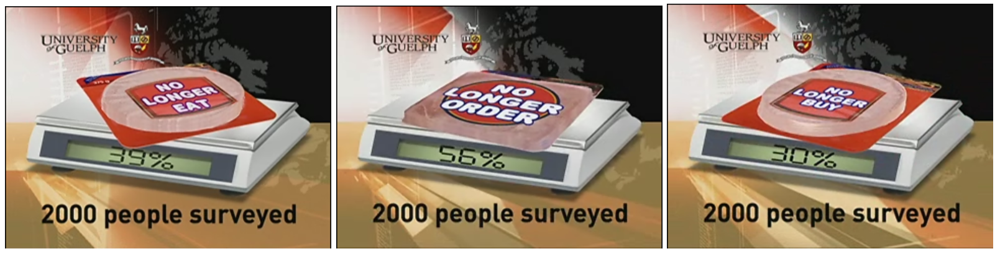
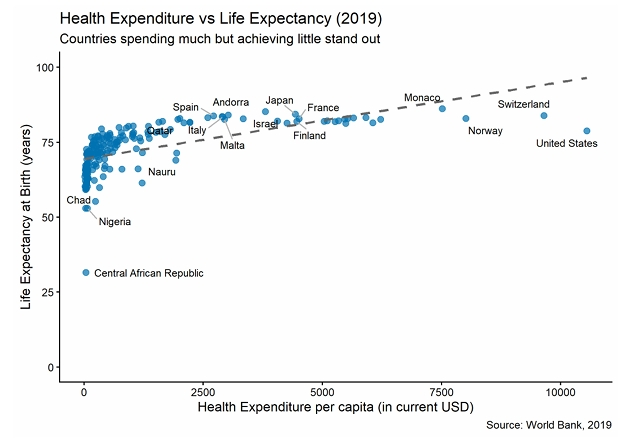
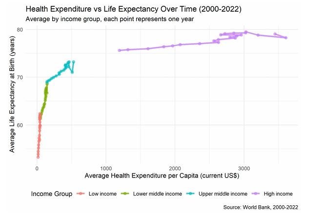

```{r set-options, echo=FALSE, message=FALSE, warning=FALSE, cache=FALSE}
options(width = 100)
library(knitr)
library(dplyr)
library(tidyverse)
library(ggplot2)
library(tidyr)
library(ggthemes)
```


## Plan for today

1. Recap
3. Wrap up course and group project
4. Exam Info
5. Suggested Improvements
6. Concluding remarks
7. Q&A


# Recap: Data Visualization and Text Data


## Data visualization

Two ways: display data through **tables** or **graphs**. Depends on the purpose.

Use `ggplot()` and the grammar of graphics to produce effective graphs.


## A Design Problem (self-study)

What is wrong with the graph below? Create your own version of the graph. 

```{r echo= FALSE, out.width="120%", fig.align="center", fig.cap = "Source: [perceptual edge](https://perceptualedge.com/example3.php)" }
include_graphics("../../img/example3problem.gif")
```

```{r, echo = FALSE}
dataChallenge <- data.frame(
  Location = rep(c("Bahamas Beach", "French Riviera", "Hawaiian Club"), each = 3),
  Fiscal_Year = rep(c("FY93", "FY94", "FY95"), times = 3),
  Revenue = c(
    250000, 275000, 350000,  # Bahamas Beach (FY93, FY94, FY95)
    260000, 200000, 210000,  # French Riviera (FY93, FY94, FY95)
    450000, 500000, 400000   # Hawaiian Club (FY93, FY94, FY95)
  )
)
```

## A first solution: comparative performance

:::: {.columns}

::: {.column width="60%"}
```{r echo=FALSE, out.width="85%", fig.width=4.9, fig.height=3.5, message=FALSE}
ggplot(dataChallenge, aes(x = Fiscal_Year, y = Revenue, fill = Location)) +
  geom_bar(stat = "identity", position = position_dodge()) +
  labs(
    title = "Resort Revenues by Location and Year",
    x = "",
    y = "Revenue (in USD)"
  ) +
  scale_y_continuous(labels = scales::dollar) +
  scale_x_discrete(labels = c("1993", "1994", "1995")) +
  theme_classic() +
  theme(legend.position = "bottom")
```
:::

::: {.column width="40%"}

- The three resorts have been arranged in order of rank, based on revenue, to highlight their comparative performance.
- The years have been arranged from left to right, which is intuitive.
- The legend has been placed below the bars. 

:::
::::
<details> <summary>Show code</summary>
```{r echo=TRUE, eval = FALSE, message=FALSE}
ggplot(dataChallenge, aes(x = Fiscal_Year, y = Revenue, fill = Location)) +
  geom_bar(stat = "identity", position = position_dodge()) +
  labs(
    title = "Resort Revenues by Location and Year",
    x = "Year",
    y = "Revenue (in USD)"
  ) +
  scale_y_continuous(labels = scales::dollar) +
  scale_x_discrete(labels = c("1993", "1994", "1995")) +
  theme_classic() +
  theme(legend.position = "bottom")
```
</details>


## A second solution: change of revenue over time

:::: {.columns}

::: {.column width="60%"}
```{r echo=FALSE, out.width="85%", fig.width=4.9, fig.height=3.5, message=FALSE}
ggplot(dataChallenge, aes(x = Fiscal_Year, y = Revenue, color = Location,
                          group = Location)) +
  geom_line(size = 2) +
  geom_text(data = dataChallenge[dataChallenge$Fiscal_Year == "FY95", ],
            aes(label = Location), hjust = 0, nudge_x = 0.1, nudge_y = 0) +
  labs(
    title = "Resort Revenues by Location and Year",
    x = "",
    y = "Revenue (in USD)"
  ) +
  scale_y_continuous(labels = scales::dollar, limits = c(0, 500000)) +
  scale_x_discrete(labels = c("1993", "1994", "1995"), 
                   expand = expansion(add = c(0.5, 1))) +
  theme_classic() +
  theme(legend.position = "none")  +
  scale_color_brewer(palette = "Set1")
```
:::

::: {.column width="40%"}

- This design makes it easy to see how revenue has changed from year to year at each of these resorts. 

:::
::::
<details> <summary>Show code</summary>
```{r echo=TRUE, eval = FALSE, message=FALSE}
ggplot(dataChallenge, aes(x = Fiscal_Year, y = Revenue, color = Location,
                          group = Location)) +
  geom_line(size = 2) +
  geom_text(data = dataChallenge[dataChallenge$Fiscal_Year == "FY95", ],
            aes(label = Location), hjust = 0, nudge_x = 0.1, nudge_y = 0) +
  labs(
    title = "Resort Revenues by Location and Year",
    x = "",
    y = "Revenue (in USD)"
  ) +
  scale_y_continuous(labels = scales::dollar, limits = c(0, 500000)) +
  scale_x_discrete(labels = c("1993", "1994", "1995"), 
                   expand = expansion(add = c(0.5, 1))) +
  theme_classic() +
  theme(legend.position = "none")  +
  scale_color_brewer(palette = "Set1")
```
</details>


## Tufte's principles of data visualization

:::: {.columns}

::: {.column width="33%"}
#### Minimize the **Lie Factor** <br>
$\frac{\text{size of effect shown in graphic}}{\text{size of effect in data}}$ 

:::

::: {.column width="33%"}

<br>

#### Maximize the **Data-ink Ratio** <br>
$\frac{\text{ink used for data points}}{\text{total ink used to print the graphic}}$ 
<!-- = proportion of a graphic's ink devoted to the non-redundant display of data-information -->
<!-- The closer this ratio is to 1 the less distracted the user will be and the easier it will be to visualize the data. -->
:::

::: {.column width="33%"}

<br>

<br>

#### Maximize the **Data density** <br>
$\frac{\text{number of entries in data matrix}}{\text{area of data graphic}}$

:::
::::

## Minimize the **Lie Factor** 

```{r echo=FALSE, eval = TRUE, out.width = "100%", message=FALSE, warning=FALSE}
two_by_two_matrix <- data.frame(Candidate = c("Alex", "Nora"),
                                results = c(100, 92.5))

```

:::: {.columns}

::: {.column width="50%"}

```{r echo=FALSE, eval = TRUE, out.width = "100%", message=FALSE, warning=FALSE, fig.align='center'}
ggplot(two_by_two_matrix, aes(x = Candidate, y = results, fill = Candidate)) +
  geom_col() +
  labs(title = "Lie Factor = 1",
       # caption = "Theme = WSJ",
       x = "Candidate",
       y = "Votes") +
  scale_fill_stata() +
  coord_cartesian(ylim = c(0, 100)) +
  scale_y_continuous(limits = c(0, 100), expand = c(0, 0)) +
  theme_wsj() +
  theme(legend.position = "none")
```

:::

::: {.column width="50%"}

```{r echo=FALSE, eval = TRUE, out.width = "100%", message=FALSE, warning=FALSE, fig.align='center'}
ggplot(two_by_two_matrix, aes(x = Candidate, y = results, fill = Candidate)) +
  geom_col(with = 1) +
  labs(title = "Lie Factor = ?",
       # caption = "Theme = WSJ",
       x = "Candidate",
       y = "Votes") +
  scale_fill_stata() +
  coord_cartesian(ylim = c(90, 100)) +
  scale_y_continuous(limits = c(0, 100), expand = c(0, 0), breaks = c(seq(0, 100, by = 2.5))) +  # No padding
  theme_wsj()+
  theme(legend.position = "none")
```
<details> <summary>Lie Factor</summary>
The Lie Factor is 3.7 ((10/2.5)/(100/92.5))
</details>
:::

:::aside
Do you recognize the theme?
:::
::::


## Maximize the **Data-ink Ratio** 

```{r echo=FALSE, eval = TRUE, out.width = "100%", message=FALSE, warning=FALSE}
library(ggpattern)
library(ggtext)   # To color words in title


# Sample Data with Two Values per Facility
data <- data.frame(
  Facility = rep(c("Public psychiatric hospitals", "RTCs for children", "Veteran Administration medical centers",
                   "Private psychiatric hospitals", "RTCs for adults", "Community mental health centers"), 2),
  Setting = rep(c("Hospital inpatient", "Residential"), each = 6),
  Beds = c(162, 67, 59, 66, 40, 29, 136, 45, 38, 32, 62, 25)
)
```

:::: {.columns}

::: {.column width="50%"}

```{r echo=FALSE, eval = TRUE, out.width = "100%", message=FALSE, warning=FALSE, fig.align='center'}
ggplot(data, aes(x = Setting, y = Beds, pattern = Facility, fill = Facility, group = Facility)) +
  geom_col_pattern(
    aes(pattern = Facility, fill = Facility, pattern_fill = Facility), 
    colour = 'black', 
        width = 0.7,
    position = position_dodge(width = 0.8), 
    pattern_density          = 0.35) +
    scale_pattern_fill_manual(
      values = c("Public psychiatric hospitals"='blue', 
                 "RTCs for children"='red', 
                 "Veteran Administration medical centers"='yellow', 
                 "Private psychiatric hospitals"='darkgreen', 
                 "RTCs for adults" = 'orange', 
                 "Community mental health centers" = 'purple')) +
  labs(title = "Median number of designated beds for mental health treatment per facility",
       subtitle = "By service setting and facility type: April 29, 2016",
       x = "", 
       y = "Median number of designated beds per facility") +
  theme_stata(base_size = 12) +
  theme(legend.position = "bottom",
        axis.text.x = element_text(angle = 0, hjust = 0.5))
```

<details> <summary>Show code for the graphs</summary>
```{r echo=TRUE, eval = FALSE}
ggplot(data, aes(x = Setting, y = Beds, pattern = Facility, fill = Facility, group = Facility)) +
  geom_col_pattern(
    aes(pattern = Facility, fill = Facility, pattern_fill = Facility), 
    colour = 'black', 
        width = 0.7,
    position = position_dodge(width = 0.8), 
    pattern_density          = 0.35) +
    scale_pattern_fill_manual(
      values = c("Public psychiatric hospitals"='blue', 
                 "RTCs for children"='red', 
                 "Veteran Administration medical centers"='yellow', 
                 "Private psychiatric hospitals"='darkgreen', 
                 "RTCs for adults" = 'orange', 
                 "Community mental health centers" = 'purple')) +
  labs(title = "Median number of designated beds for mental health treatment per facility",
       subtitle = "By service setting and facility type: April 29, 2016",
       x = "", 
       y = "Median number of designated beds per facility") +
  theme_stata(base_size = 12) +
  theme(legend.position = "bottom",
        axis.text.x = element_text(angle = 0, hjust = 0.5))
```
</details>
:::

::: {.column width="50%"}

```{r echo=FALSE, eval = TRUE, out.width = "100%", message=FALSE, warning=FALSE, fig.align='center'}

data$Facility <- str_wrap(data$Facility, width = 25)

ggplot(data, aes(x = Beds, y = Facility, fill = Setting)) +
  geom_col(position = position_dodge(width = 0.8), width = 0.7) +
   geom_text(aes(label = Beds), 
            position = position_dodge(width = 0.8),  # Align with bars
            hjust = 1.1,  # Align left/right
            color = "white", size = 4) +  # Text color and sizesst color and size of the text
  scale_fill_manual(values = c("Hospital inpatient" = "#00A3E0",  # Cyan for hospital inpatient
                               "Residential" = "#E66100")) +     # Dark blue for residential
  labs(
    title = "<span style='color:#00A3E0;'>Hospital inpatient</span> and <span style='color:#E66100;'>Residential</span> Median Number of Beds",
    subtitle = "Public psychiatric hospitals allocate the most beds for mental health treatment.",
    x = NULL,
    y = NULL
  ) + 
  theme_minimal(base_size = 12) +
  theme(
    axis.text.x = element_blank(),  # Remove x-axis labels
    axis.ticks.x = element_blank(),
    axis.text.y = element_text(size = 10),
    legend.position = "none",
    plot.title = element_markdown(hjust = 0.5, size = 14, face = "bold"),  # Title with colored text
    panel.grid = element_blank()  # Remove grid lines
  ) +
  geom_vline(xintercept = 0, color = "black", linetype = "solid", size = 0.5)
```

<details> <summary>Show code for the graphs</summary>
```{r echo=TRUE, eval = FALSE}
data$Facility <- str_wrap(data$Facility, width = 25)

ggplot(data, aes(x = Beds, y = Facility, fill = Setting)) +
  geom_col(position = position_dodge(width = 0.8), width = 0.7) +
   geom_text(aes(label = Beds), 
            position = position_dodge(width = 0.8),  # Align with bars
            hjust = 1.1,  # Align left/right
            color = "white", size = 4) +  # Text color and sizesst color and size of the text
  scale_fill_manual(values = c("Hospital inpatient" = "#00A3E0",  # Cyan for hospital inpatient
                               "Residential" = "#E66100")) +     # Dark blue for residential
  labs(
    title = "<span style='color:#00A3E0;'>Hospital inpatient</span> and <span style='color:#E66100;'>Residential</span> Median Number of Beds",
    subtitle = "Public psychiatric hospitals allocate the most beds for mental health treatment.",
    x = NULL,
    y = NULL
  ) + 
  theme_minimal(base_size = 12) +
  theme(
    axis.text.x = element_blank(),  # Remove x-axis labels
    axis.ticks.x = element_blank(),
    axis.text.y = element_text(size = 10),
    legend.position = "none",
    plot.title = element_markdown(hjust = 0.5, size = 14, face = "bold"),  # Title with colored text
    panel.grid = element_blank()  # Remove grid lines
  ) +
  geom_vline(xintercept = 0, color = "black", linetype = "solid", size = 0.5)
```
</details>
:::

::::


## Maximize data density

```{r, echo=FALSE, out.width = "95%", fig.align='center',  purl=FALSE, fig.cap="Source: [data-viz-workshop-2021](https://badriadhikari.github.io/data-viz-workshop-2021/Tufte/Chapter_8/)"}

```

#### 4 data points: 0.39, 0.56, 0.3, 2000 😱


<!-- ##  Text analysis -->

<!-- - Text as data has become increasingly available due to the Internet and text digitization. -->
<!-- - Examples: literary texts, financial analyses, social media reactions, political discourses, etc. -->
<!-- - Main challenge: **Text is unstructured**. -->


<!-- ## Eight Steps in Text Analysis

Focus on steps 1-4 in this course.
```{r nlppipeline, echo=FALSE, out.width = "95%", fig.align='center',  purl=FALSE}
include_graphics("../../img/nlp_pipeline.jpg")
```

- In `R`, we use `quanteda`: Comprehensive package for preprocessing, visualization, and statistical analysis of text data.

```{r packages, echo=FALSE, eval = FALSE}
pacman::p_load(
    tidytext,
    quanteda,
    readtext,
    stringr,
    quanteda.textstats,
    quanteda.textplots
)
``` 
-->


<!-- 
## Shiny app

- **Shiny** is an R package that makes it easy to build interactive web apps straight from R.
- Example with Data from the European Quality of Government Index (EQI).
- This index focuses on both perceptions and experiences with public sector corruption.
- Data: **EQI-CATI Country Level 2010-2024** (only phone interviews).
- Source: [QoG Institute](https://www.gu.se/en/quality-government/qog-data/data-downloads/european-quality-of-government-index)


## Data: EQI-CATI Country Level 2010-2024

- 28 Countries for 5 years (2010, 2013, 2017, 2021, 2024)
- Focus on three variables about the health care system:

  - `Ed_qual`/`Hel_qual`/`Law_qual`: *"How would you rate the quality of the education/public health care system/police force in your area?"* (1 very poor - 10 excllent)
  - `Helimpart1`: *"Certain people are given special advantages in the public health care system in my area."* (1 strongly disagree - 10 strongly agree)
  - `Hel_ask`: "*In the last 12 months, have you or anyone in your family been asked by a public official to give an informal gift or bribe in health or medical services?*" (Share of population who said "Yes" to above-stated question).


## Data: EQI-CATI Country Level 2010-2024

```{r}
eqi <- read_csv("C:/Users/aurel/OneDrive/Documents/DataHandling/datahandling-lecture/materials/code_examples/qog_eqicati_long_24.csv") |> 
  select(cname, year, Ed_qual, Hel_qual, Law_qual, Helimpart1, Hel_ask)

head(eqi)
``` 
-->


# Exam


## 📢 Decentral exam and LockDown browser

#### Exam for exchange students
- 18.12.2025 at 16:15.
- **BYO + cord🔌 + 🖱️**

#### Lockdown browser
- Exam and LockDown Browser: check Sharepoint on [StudentWeb](https://universitaetstgallen.sharepoint.com/sites/PruefungenDE/SitePages/en/Digitale-Pr%C3%BCfungen-(BYOD).aspx#how-to-prepare-for-a-digital-exam) and test on Canvas. 


## Exam questions

  - True/False questions, multiple-choice questions, and multiple-correct options. These are designed to test your understanding of the material.
  - ❗Exactly same style  and structure as quizzes and mock exam❗
  - We do not invent wrong function parameters or misspell function names etc to mislead you!
  - 'Passive' knowledge of key R syntax and most important functions of core lecture contents are important!

<br>

  - Work step-by-step through the code example. What happens in each parenthesis, on each line? 
  - From the inner part to the outer part, from top to bottom.
  - Use pencil/paper to keep track of values, data structures (how does a data-frame look like?), classes.
  - Importantly, if a code-example question refers to specific functions, you can always assume that the corresponding package is also loaded.


## Questions on the examination?


# Wrap up

## {class="inverse" background-image="../../img/mechanics.webp" background-size="100%" background-repeat="cover"}
 


## At the end of the course, you will be able to...

- **Understand the tools you need when working with data** 
- **Work independently with data** 
- **Ask the right questions to a dataset**
- **Learn to communicate about data**


## My commitment to these goals and to your learning process

- **Transferrable skills**
- **Hands-on approach**
- **Emphasis on real-world relevance** <br>(caveat: this course is mandatory for Econ students, I have limited freedom in the syllabus)
- **As much fun as possible (as coding can be fun...😎)**

---

```{r pipeline, echo=FALSE, out.width = "85%", fig.align='center',  purl=FALSE}
include_graphics("../../img/data_science_pipeline.png")
```

## Wrap up: Conceptual part

::: {.incremental}

- **Understand the very basics of how computers process data.**
  - Computers store data as bits (Bits → Bytes → Encoded Text)
  - Text encodes meaning using encodings and standards
  - Files encode structure (→ Structured Files with special characters) 
    - CSV: two-dimensional/table-like structure
    - JSON/XML: hierarchical data (high-dimensional)
  - R *parses* structure into RAM. (→ R Parsing → R Data Structures)

- **Deal with data from all possible sources.**
  - APIs, Webscrapers, JSON, etc. 

:::

## Wrap up: Applied part

```{r, echo=FALSE, out.width = "40%", fig.align='center', purl=FALSE, fig.cap = "Source: https://www.storybench.org/wp-content/uploads/2017/05/tidyverse.png"}
include_graphics("../../img/tidyverse_pipeline.png")
```


## Wrap up: Applied part

::: {.incremental}

- Import data into R. What to do if the parsing fails?
- Clean/prepare data in R. Aim: tidy data set (rows:observations, columns:variables).
- Filter, select, mutate, summarise.
- Compute basic summary statistics using group_by and summarise.
- Visualize raw data and basic statistics.

:::


## Wrap up: Group Project

####  First of all...

  - I am **impressed** by your performance, interest, and dedication.
  - The project was challenging, and part of the project was navigating **frustration** and **uncertainty**. 
  - This is **close to a real job or research project**, where there is often more than one correct answer.
  - With LLMs, navigating the full data handling pipeline is becoming a **basic skill** rather than an advanced one.
  

#### From my side
  - First year, first try, first experience.
  - I had fun. I hope you did too.
  
  
###### Congrats!


## Wrap up: Group Project

```{r, echo=FALSE, out.width = "95%", fig.align='center',  purl=FALSE}

```


## Wrap up: Group Project
```{r, echo=FALSE, out.width = "95%", fig.align='center',  purl=FALSE}

```


## Wrap up: Group Project

```{r pipeline2, echo=FALSE, out.width = "85%", fig.align='center',  purl=FALSE}
include_graphics("../../img/data_science_pipeline.png")
```


## Wrap up

  - You went from first steps into programming to managing an entire data science pipeline 💪
  - You can now work with APIs, clean data, and communicate results through visualisations
  - You had first examples on how this is applied in the finance industry


# Course Evaluation and Feedback

## Course evaluation

<br>

  - This course was designed to be challenging and close to real research and work settings. Your feedback helps improve it for the next cohort.
  - This was the first year in this format. Some things worked very well, others can be improved.


## Evaluation link

```{r, echo=FALSE, out.width = "45%", fig.align='center'}

```

[Link 🔗](https://go.blueja.io/irtnIL3QI0OgSPRQeOEAVw)


# Final Remarks

## Final Remarks

#### Let's keep in touch!

- LinkedIn 📲

- Join the **`R` User Group in Zürich**!

  - Next event: **29.01.2026, 18:00 - 21:30** at the ETH (DevOps for Data Science at KOF Institute).
  - Apéro + networking 🍕🍺
  - [Free Registration on Meetup](DevOps for Data Science at KOF Institu)
  - Presentations from R-Users in the industry and in academia. Past events at Datahouse, SNB, Helsana, Swiss, etc. 


## Final Remarks

::: {.incremental}

- I had a lot of fun 🙏
- All the best for your exams! 👍
- See you very soon 👀🔜

:::


--- 


```{r echo=FALSE, eval=TRUE, out.width="50%", message=FALSE, warning=FALSE, fig.align='center', fig.asp=0.8, fig.cap="Made with `ggplot`. Source: ['A very ggplot2 Christmas'](https://t-redactyl.io/blog/2016/12/a-very-ggplot2-christmas.html)"}
library(extrafont)
# font_import()
# loadfonts()

ChristmasTree <- read.csv("https://raw.githubusercontent.com/t-redactyl/Blog-posts/master/Christmas%20tree%20base%20data.csv")

Desired.Lights <- 50
Total.Lights <- sum(round(Desired.Lights * 0.35) + round(Desired.Lights * 0.20) + 
                      round(Desired.Lights * 0.17) + round(Desired.Lights * 0.13) +
                      round(Desired.Lights * 0.10) + round(Desired.Lights * 0.05))

Lights <- data.frame(Lights.X = c(round(runif(round(Desired.Lights * 0.35), 4, 18), 0),
                                       round(runif(round(Desired.Lights * 0.20), 5, 17), 0),
                                       round(runif(round(Desired.Lights * 0.17), 6, 16), 0),
                                       round(runif(round(Desired.Lights * 0.13), 7, 15), 0),
                                       round(runif(round(Desired.Lights * 0.10), 8, 14), 0),
                                       round(runif(round(Desired.Lights * 0.05), 10, 12), 0)))
Lights$Lights.Y <- c(round(runif(round(Desired.Lights * 0.35), 4, 6), 0),
                          round(runif(round(Desired.Lights * 0.20), 7, 8), 0),
                          round(runif(round(Desired.Lights * 0.17), 9, 10), 0),
                          round(runif(round(Desired.Lights * 0.13), 11, 12), 0),
                          round(runif(round(Desired.Lights * 0.10), 13, 14), 0),
                          round(runif(round(Desired.Lights * 0.05), 15, 17), 0))
Lights$Lights.Colour <- c(round(runif(Total.Lights, 1, 4), 0))

Baubles <- data.frame(Bauble.X = c(6, 9, 15, 17, 5, 13, 16, 7, 10, 14, 7, 9, 11, 
                                   14, 8, 14, 9, 12, 11, 12, 14, 11, 17, 10))
Baubles$Bauble.Y <- c(4, 5, 4, 4, 5, 5, 5, 6, 6, 6, 8, 8, 8, 8, 10,
                      10, 11, 11, 12, 13, 10, 16, 7, 14)
Baubles$Bauble.Colour <- factor(c(1, 2, 2, 3, 2, 3, 1, 3, 1, 1, 1, 2, 1, 2,
                                  3, 3, 2, 1, 3, 2, 1, 3, 3, 1))
Baubles$Bauble.Size <- c(1, 3, 1, 1, 2, 1, 2, 2, 2, 1, 1, 1, 3, 3, 3,
                         2, 3, 1, 1, 2, 2, 3, 3, 2)

tree <- ggplot() + 
          geom_tile(data = ChristmasTree, aes(x = Tree.X, y = Tree.Y, fill = Tree.Colour)) +       
          scale_fill_identity() + 
          theme_bw() +
          scale_x_continuous(breaks = NULL) + 
          scale_y_continuous(breaks = NULL) +
          labs(x = "", y = "") +
          geom_point(data = Lights, aes(x = Lights.X, y = Lights.Y, alpha = Lights.Colour),
                     colour = "lightgoldenrodyellow", shape = 16) +
          theme(legend.position = "none")+ 
          geom_point(data = Baubles, aes(x = Bauble.X, y = Bauble.Y, 
                                         colour = Bauble.Colour, size = Bauble.Size),
                     shape = 16) +
          scale_colour_manual(values = c("firebrick2", "gold", "dodgerblue3")) +
          scale_size_area(max_size = 12) +
          geom_segment(aes(x = 2.5, xend = 4.5, y = 1.5, yend = 1.5), colour = "blueviolet", size = 2) +
          geom_segment(aes(x = 5.5, xend = 8.5, y = 1.5, yend = 1.5), colour = "dodgerblue3", size = 2) +
          geom_segment(aes(x = 13.5, xend = 16.5, y = 1.5, yend = 1.5), colour = "blueviolet", size = 2) +
          geom_segment(aes(x = 17.5, xend = 19.5, y = 1.5, yend = 1.5), colour = "dodgerblue3", size = 2) +
          geom_segment(aes(x = 3.5, xend = 3.5, y = 0.5, yend = 2.5), colour = "blueviolet", size = 2) +
          geom_segment(aes(x = 7.0, xend = 7.0, y = 0.5, yend = 2.5), colour = "dodgerblue3", size = 2) +
          geom_segment(aes(x = 15.0, xend = 15.0, y = 0.5, yend = 2.5), colour = "blueviolet", size = 2) +
          geom_segment(aes(x = 18.5, xend = 18.5, y = 0.5, yend = 2.5), colour = "dodgerblue3", size = 2) +
          annotate("text", x = 11, y = 20, 
                   label = "Happy Holidays!", 
                   family = "Luminari", size = 12)
tree
```


<!-- ------ -->

<!-- ```{} -->

<!--        .     .                       *** ** -->
<!--                 !      .           ._*.                       . -->
<!--              - -*- -       .-'-.   !  !     . -->
<!--     .    .      *       .-' .-. '-.!  !             .              . -->
<!--                ***   .-' .-'   '-. '-.!    . -->
<!--        *       ***.-' .-'         '-. '-.                   . -->
<!--        *      ***$*.-'               '-. '-.     * -->
<!--   *   ***     * ***     ___________     !-..!-.  *     *         *    * -->
<!--   *   ***    **$** *   !__!__!__!__!    !    !  ***   ***    .   *   *** -->
<!--  *** ****    * *****   !__!__!__!__!    !      .***-.-*** *     *** * #_ -->
<!-- **********  * ****$ *  !__!__!__!__!    !-..--'*****   # '*-..---# *** -->
<!-- **** *****  * $** ***      .            !      *****     ***       *** -->
<!-- ************ ***** ***-..-' -.._________!     *******    ***      ***** -->
<!-- ***********   .-#.-'           '-.-''-..!     *******   ****...     # -->
<!--   # ''-.---''                           '-....---#..--'****** ''-.---''- -->
<!--                   Merry Christmas                         #  -->


<!-- ``` -->


<!-- ------- -->


<!-- ```{} -->
<!--   _` | __ \   _` |    _` |   __ \   _` | __ \  __ \  |   | -->
<!--  (   | | | | (   |   (   |   | | | (   | |   | |   | |   | -->
<!-- \__,_|_| |_|\__,_|  \__,_|  _| |_|\__,_| .__/  .__/ \__, | -->
<!--                                         _|    _|    ____/ -->
<!--   \  |                \ \   /               | -->
<!--    \ |  _ \ \  \   /   \   / _ \  _` |  __| | -->
<!--  |\  |  __/\ \  \ /       |  __/ (   | |   _| -->
<!-- _| \_|\___| \_/\_/       _|\___|\__,_|_|   _) -->
<!-- ``` -->


