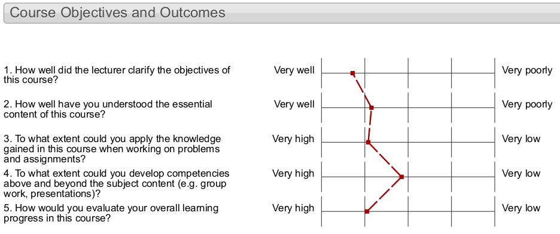
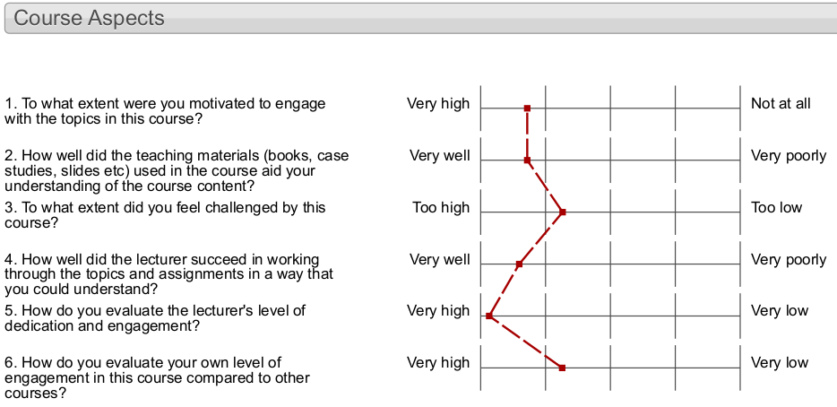

```{r set-options, echo=FALSE, cache=FALSE, message=FALSE, warning=FALSE}
options(width = 100)
library(knitr)
```

## Plan for today

1. Remaining Mock Exam Questions
2. Exercise 6: Visualisation
3. Q&A: Review of Functions in R
4. Focus Group Results
5. Course Evaluation
6. Future Improvements
7. Final Remarks
8. Happy Holidays!🎄

# Mock Exam

# Exercise 6: Visualisation

## Exercise 6 C

Detailed solutions can be found here:
http://tutorials.iq.harvard.edu/R/Rgraphics/Rgraphics.html#putting_it_all_together


# Q&A: Functions in R

## Functions in R

- Functions facilitate reusing R code.
- Implementation of a certain task.
    - sum up numbers in a vector
    - compute a statistic
    - import a CSV file etc.
- Input:Output


# Focus Group Results


## Focus Group Datahandling 2018
- Corina Lo
- Severin Leitner
- Johannes Bernstorff

*Thanks a lot!*

## Positive Points
- Lecture notes
- Students with more experience still like that we look at the very basics ('take a step back')
- Guest lecture: Generally positive, considered interesting/helpful

## Negative Points/Room for Improvement
- Why multiple choice examination and not students project?
- Students are used to having slides in ppt or pdf.
- Books necessary (mandatory)?
- Guest lecture: How to be better prepared/involved?
- More exercises (for self-study)/tutorials


# Course Evaluation

## Course Evaluation: Summary I
```{r echo=FALSE, out.width='99%'}

```

## Course Evaluation: Summary II
```{r echo=FALSE, out.width='99%'}

```

## Course Evaluation: Open Feedback
<center>
*Thanks a lot!*
</center>

## Course Evaluation: Open Feedback

*"Which aspects of this course should be changed so that future students can profit more from it?"*

- Many points consistent with main findings in Focus group! 👍

## Course Evaluation: Open Feedback

*"Which aspects of this course should be changed so that future students can profit more from it?"*

- Many points consistent with main findings in Focus group! 👍
- Challenge: Difficulty/pace of lectures/exercises! 🎃
    - "Too slow"/"Too fast"
    - "Too technical"/"Too trivial"
    - ...

## My Feedback to You
- Comfortable to teach this class
  - Active, focused
  - Good questions


## My Feedback to You
- Comfortable to teach this class
  - Active, focused
  - Good questions
- Exploit learning by doing!
- Engage more in class!

# Improvements

## Improvements

- *More Staff*: 2 Teaching Assistants
    - Faster email responses
    - More tutorials
    - More detailed exercise sessions

## Improvements
- *Course materials:*
    - More exercises/tutorials, but less mandatory reading (books).
    - Slides will also be made available in pdf and/or ppt.
    - Longer availability of exercise instructions

## Improvements
- *Examination*
    - Exam: part multiple choice, part open questions
    - (Examination: Written Exam (80%), Group project (20%))

## Improvements

- *Examination*
    - Exam: part multiple choice, part open questions
    - (Examination: Written Exam (80%), Group project (20%))
- *Other*
    - Guest lecture: case study with material (some prep work for students)


<!-- ## Improvements -->
<!-- <center> -->
<!-- *Aim: *  -->
<!-- *Become the reference introductory course on data science in undergraduate econ.* -->
<!-- </center> -->


# Final Remarks

## Final Remarks
- Materials will be updated: *umatter.github.io*.


## Final Remarks

- Materials will be updated: *umatter.github.io*.
- Keep in touch (easiest way: *LinkedIn*).
    - Connect by pointing to this course.


## Final Remarks

- Materials will be updated: *umatter.github.io*.
- Keep in touch (easiest way: *LinkedIn*).
    - Connect by pointing to this course.
- All the best for your exams! 👍


## Final Remarks

- Materials will be updated: *umatter.github.io*.
- Keep in touch (easiest way: *LinkedIn*).
    - Connect by pointing to this course.
- All the best for your exams! 👍
- All the best for your studies and careers (in data science, of course...)! 👍👍

## Final Remarks

- Materials will be updated: *umatter.github.io*.
- Keep in touch (easiest way: *LinkedIn*).
    - Connect by pointing to this course.
- All the best for your exams! 👍
- All the best for your studies and careers (in data science, of course...)! 👍👍
- And, of course, ...


------

```{}

       .     .                       *** **
                !      .           ._*.                       .
             - -*- -       .-'-.   !  !     .
    .    .      *       .-' .-. '-.!  !             .              .
               ***   .-' .-'   '-. '-.!    .
       *       ***.-' .-'         '-. '-.                   .
       *      ***$*.-'               '-. '-.     *
  *   ***     * ***     ___________     !-..!-.  *     *         *    *
  *   ***    **$** *   !__!__!__!__!    !    !  ***   ***    .   *   ***
 *** ****    * *****   !__!__!__!__!    !      .***-.-*** *     *** * #_
**********  * ****$ *  !__!__!__!__!    !-..--'*****   # '*-..---# ***
**** *****  * $** ***      .            !      *****     ***       ***
************ ***** ***-..-' -.._________!     *******    ***      *****
***********   .-#.-'           '-.-''-..!     *******   ****...     #
  # ''-.---''                           '-....---#..--'****** ''-.---''-
                  Merry Christmas                         #


```


-------


```{}
  _` | __ \   _` |    _` |   __ \   _` | __ \  __ \  |   |
 (   | | | | (   |   (   |   | | | (   | |   | |   | |   |
\__,_|_| |_|\__,_|  \__,_|  _| |_|\__,_| .__/  .__/ \__, |
                                        _|    _|    ____/
  \  |                \ \   /               |
   \ |  _ \ \  \   /   \   / _ \  _` |  __| |
 |\  |  __/\ \  \ /       |  __/ (   | |   _|
_| \_|\___| \_/\_/       _|\___|\__,_|_|   _)
```
