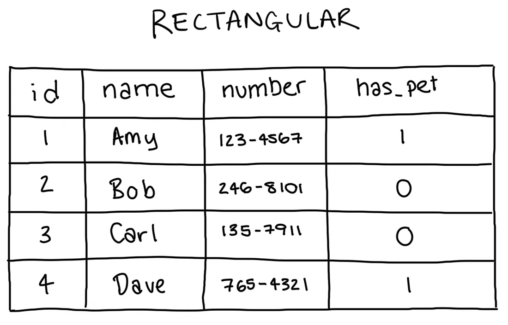
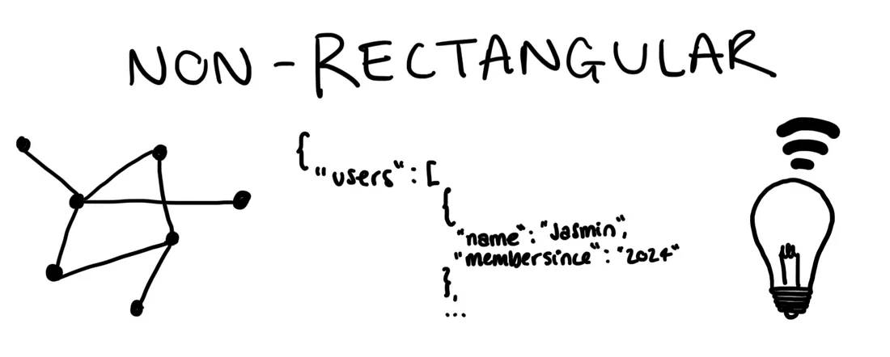
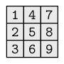

```{r set-options, echo=FALSE, cache=FALSE, warning=FALSE}
options(width = 100)
library(knitr)
knitr::opts_chunk$set(class.source = "chunkstyle")
```


## {class="inverse"}

Recap

## Goals of last lecture

  1. Get the basics of **data processing**
  2. Learn what **binary** and **hexadecimal** systems are
  3. See why **encoding** is crucial for any data project
  4. Realize that both code and data are just **text** at their core
  5. Execute your first website scraper in R.


## The binary system

Microprocessors can only represent two signs (states):

 - 'Off' = `0`
 - 'On' = `1`

```{r onoff, echo=FALSE, out.width = "10%", fig.align='center', purl=FALSE}
include_graphics("../../img/on_off.png")
```


## The binary and the hexadecimal counting frames

#### Binary:

- Only two signs: `0`, `1`.
- Base 2.
- Columns: $2^0=1$, $2^1=2$, $2^2=4$, and so forth.

<br>

#### Hexadecimal:

  - 16 symbols
  - Base 16.
  - `0`-`9` (used like in the decimal system) and `A`-`F` (for the numbers 10 to 15).


## Computers and text
How can a computer understand text if it only understands `0`s and `1`s?

- *Standards* define how `0`s and `1`s correspond to specific letters/characters of different human languages.
- These standards are usually called *character encodings*.
- Coded character sets that map unique numbers (in the end in binary coded values) to each character in the set.
- For example, ASCII (American Standard Code for Information Interchange) or *utf-8*.

```{r ascii, echo=FALSE, out.width = "30%", fig.align='center', fig.cap='ASCII logo. (public domain).', purl=FALSE}
include_graphics("../../img/ascii.gif")
```


## Components of a standard computing environment

```{r components, echo=FALSE, out.width = "80%", fig.align='center', purl=FALSE}
include_graphics("../../img/script-hardware.jpg")
```

[Reading: please read the document "Data Processing Basics" published on Canvas (in materials/handout). This is exam relevant!]{.green-bold}


## Exercise: a website scraper{.smaller}

Last time, we saw that a webpage is nothing but **text** (HTML). We looked at its hexadecimal representation. The size in RAM of our "economist" html object was `468048 bytes`.

<br>


:::: {.columns}

::: {.column width="40%"}
#### From hexadecimal

```{r, echo=TRUE, eval = FALSE}
library(httr)
economist <- GET("https://www.economist.com/")
head(content(economist, as = "raw"), 20)
```
```{}
 [1] 3c 21 44 4f 43 54 59 50 45 20 68 74 6d 6c 3e 3c 68 74 6d 6c
```
:::

::: {.column width="30%"}
#### ... to html...

```{r, echo = TRUE, eval = FALSE}
head(content(economist, as = "text"))
```

```{}
"<!DOCTYPE html><html lang=\"en\"><head>
```

:::

::: {.column width="30%"}
#### ... to website
```{r snap, echo=FALSE, out.width = "100%"}
include_graphics("../../img/economist_example.png")
```
:::

::::


## {class="inverse"}

Warm-up

## Warm-up 1&2

#### What is 234 in binary? Please answer exact response with format 00000000.

```{r, echo=FALSE, eval = FALSE}

decimal_to_binary_integers <- function(decimal) {

  bin <- c()

  while(decimal > 0){
    q <- decimal %% 2
    decimal <- decimal %/% 2
    bin <- c(q, bin)
  }

  bin <- paste0(bin, collapse = "")
  return(bin)
}

decimal_to_binary_integers(234)
```


<br>

#### What is 22C (hex) in decimal?
```{r, echo = FALSE, eval = FALSE}
556
```


## Warm-up 3

Consider the following `R` function:

```{r, echo=TRUE, eval = FALSE}
muLtip <- function(n, limit) {

  product <- 1
  counter <- 1

  while (counter <= n) {
    product <- product * counter
    if (product > limit) {
      return(product)
    }
    counter <- counter + 1
  }
  return(product)
}
```


What is `muLtip(5,20)`?


## Warm-up 4

Translating between binary and hexadecimal is straightforward: each hexadecimal digit maps directly to a group of **4 binary digits**

  | Hexadecimal | Binary
------|-----|----|
  |    0	| 0000
  |    1	| 0001
  |    2	| 0010
  |    3	| 0011
  |    4	| 0100
  |    5	| 0101
  |    ...|
  |   D	  | 1101
  |   E	  | 1110
  |   F	  | 1111


## {class="inverse"}

Today

## Goals of today's lecture: from text to data

#### Our story:
  - Computers store data as bits (Bits → Bytes → Encoded Text)
  - Text encodes meaning
  - Files encode structure (→ Structured Files (CSV))
  - R parses structure into memory. (→ R Parsing → R Data Structures)

#### Goals:

  - Understand how we **import** and structure data from text files
  - Learn **data structures** in R
  - Understand **rectangular data formats**


## {class="inverse"}

From text to data structure


## Structured Data Formats

  - Now that we understand how text and encodings work, we can see how text can represent structured data.
  - We are used to not thinking about the formats of our data... and let the computer choose what to do with data when we click on a file.

<br>

##### [All data are text files]{.green-bold}, but with standardized structure.

  - **Special characters** define the structure.
  - More complex **syntax**, more complex structures can be represented...


## Data in Economics

#### Data take different structures depending on their purpose.

<br>

:::: {.columns}
::: {.column width="50%"}
```{r, echo=FALSE, out.width = "100%"}

```
:::

::: {.column width="50%"}
```{r, echo=FALSE, out.width = "80%"}

```
:::

::::


<div class="footnote-pin">*Credits for pictures: [Jasmin Ludolf](https://jasminludolf.medium.com/two-categories-of-structured-data-rectangular-and-non-rectangular-05b6148544dc)</div>


## Rectangular data

- **Rectangular data** refers to a data structure where information is organized into **rows and columns**.
  - Each row represents an observation or instance of the data.
  - Each column represents a variable or feature of the data.


## Rectangular data

- **Rectangular data** refers to a data structure where information is organized into **rows and columns**.
  - CSV (typical for rectangular/table-like data) and variants of CSV (tab-delimited, fix length etc.)
  - Excel spreadsheets (`.xls`)
  - Formats specific to statistical software (SPSS: `.sav`, STATA: `.dat`, etc.)
  - Built-in R datasets
  - Binary formats


## Non-rectangular data

- **Hierarchical data** (xml, html, json, etc.)
  - XML and JSON (useful for complex/high-dimensional data sets)
  - HTML (a markup language to define the structure and layout of webpages)
- Unstructured **text** data
- **Internet-of-Things** data
- **Images/Pictures** data


# Rectangular data formats

## Table-like formats

Example: `ch_gdp.csv`.

```{}
year,gdp_chfb
1980,184
1985,244
1990,331
1995,374
2000,422
2005,464
```

<br>

<center>
#### What is the structure?
</center>


## Table-like formats

- Reocurring pattern:
  - Special character `,`
  - New lines
  - Table is visible from structure in raw text file...

<br>

<center>
#### How can we instruct a computer to read this text as a 6-by-2 table?
</center>


## Using a simple parser algorithm

  - [Parser]{.green-bold}: sequence of instructions/rules of how to distinguish columns and rows when all that a computer can do is sequentially read one character after the other.
  - Possible if we can agree on certain [**standards**]{.green-bold} of how data structured as a table/matrix is stored in a text file.


## Using a simple parser algorithm

#### In this case: 'Comma-Separated Values' (`.csv`)

  - Commas separate values
  - Other delimiters (`;`, tabs, etc.) possible
  - New lines separate rows/observations

Instructions of how to read a `.csv`-file: **CSV parser**.


## Using a simple CSV parser

Takes a text file with CSV standard structure as input and builds a data structure in the form of a table (represented in RAM).

#### Look for...

  - Commas delimit values/fields in a row
  - The end of a line indicates the end of a row

```{}
00000000: efbb bf79 6561 722c 6764 705f 6368 6662  ...year,gdp_chfb
00000010: 0d31 3938 302c 3138 340d 3139 3835 2c32  .1980,184.1985,2
00000020: 3434 0d31 3939 302c 3333 310d 3139 3935  44.1990,331.1995
00000030: 2c33 3734 0d32 3030 302c 3432 320d 3230  ,374.2000,422.20
00000040: 3035 2c34 3634                           05,464
```


## CSVs and fixed-width format

  - Common format to store and transfer data.
  - Very common in a data analysis context.
  - Natural format/structure when the dataset can be thought of as a table.


<br>

<center>
#### How can `R` read this structure?
</center>


## {class="inverse"}

Importing Rectangular Data from Text-Files


## Comma Separated Values (CSV)

Consider the `swiss`-dataset stored in a CSV:

```{}
"District","Fertility","Agriculture","Examination","Education","Catholic","Infant.Mortality"
"Courtelary",80.2,17,15,12,9.96,22.2
```

<br>

<center>
#### What do we need to read this format properly?
</center>


## Parsing CSVs in R

- `read.csv()` (basic R distribution)
- Returns a `data.frame`

```{r, eval=TRUE, echo=FALSE, purl=FALSE}
swiss_imported <- read.csv("../../data/swiss.csv")
```


```{r, eval=FALSE, purl=FALSE}
swiss_imported <- read.csv("data/swiss.csv")
```


## Parsing CSVs in R

- Alternative 1: `read_csv()` (`readr`/`tidyr`-package)
  - Returns a `tibble`.
- Alternative 2: The `data.table`-package and the `fread()` function (handling large datasets).


```{r, eval=TRUE, echo=FALSE, message=FALSE, warning=FALSE, purl=FALSE}
library(readr)
swiss_imported <- read_csv("../../data/swiss.csv")
```


```{r, eval=FALSE, purl=FALSE}
swiss_imported <- read_csv("data/swiss.csv")
```


## Import and parsing with `readr`

- Why `readr`?
  - Functions for all common rectangular data formats.
  - Consistent syntax.
  - More robust and faster than similar functions in basic R.


## Basic usage of `readr` functions

Parse the first lines of the swiss dataset directly like this...

```{r, echo = TRUE}
library(readr)

read_csv('"District","Fertility","Agriculture","Examination","Education","Catholic","Infant.Mortality"
"Courtelary",80.2,17,15,12,9.96,22.2')

```

or read the entire `swiss` dataset by pointing to the file

```{r, eval=FALSE, echo = TRUE}
swiss <- read_csv("data/swiss.csv")
```


```{r, echo=FALSE, purl=FALSE}
swiss <- read_csv("../../data/swiss.csv")
```


## Basic usage of `readr` functions

In either case, the result is a `data frame` (or `tibble`):
```{r}
swiss
```


## Basic usage of `readr` functions

- Other `readr` functions have practically the same syntax and behavior.
- `read_tsv()` (tab-separated)
- `read_fwf()` (fixed-width)
- ...


## {class="inverse"}

Data structures and data types in R


## Parsing CSVs

Recognizing columns and rows is one thing...

```{r}
swiss
```

<br>

<center>
#### What else did `read_csv()` recognize?
</center>


## Data types in R: Concept refresher

- Recall the introduction to data types and atomic vectors in Lecture 2 ⚛️
- `R` represents data in RAM as **vectors**, which have a
  - Type: `character`, `numeric`, etc.
  - Structure: `data.frame`/`tibble`, etc.
- Parsers in `read_csv()` guess the data types.


## Parsing CSV-columns

- `"12:00"`: type `character`?


## Parsing CSV-columns

  - `"12:00"`: type `character`?
  - What about `c("12:00", "midnight", "noon")`?

## Parsing CSV-columns

  - `"12:00"`: type `character`?
  - What about `c("12:00", "midnight", "noon")`?
  - And now `c("12:00", "14:30", "20:01")`?


## Parsing CSV-columns

#### ... Let's test it!

```{r, echo = TRUE}
read_csv('A,B
         12:00, 12:00
         14:30, midnight
         20:01, noon')
```

<center>
#### How can `read_csv()` distinguish the two cases?
</center>


## Parsing CSV-columns: guess types

  - `read_csv()` guesses the column type by inspecting the first 1000 rows and matching patterns: numeric, date/time, logical, character, etc.
  - Under the hood `read_csv()` used the `guess_parser()`- function to determine which type the two vectors likely contain:

```{r, echo = TRUE}
guess_parser(c("12:00", "midnight", "noon"))
guess_parser(c("12:00", "14:30", "20:01"))

parse_time(c("12:00", "14:30", "20:01"))
```


## Parsing CSV-columns: guess types

  - `read_csv()` guesses the column type by inspecting the first 1000 rows and matching patterns: numeric, date/time, logical, character, etc.
  - Under the hood `read_csv()` used the `guess_parser()`- function to determine which type the two vectors likely contain:

```{r, echo = TRUE, eval = TRUE}
guess_parser("1'300'000")
guess_parser("1'300'000", locale = locale(grouping_mark = "'"))
```
::: aside
Check this page from ["Data cleaning for data scientists"](https://bookdown.org/f_lennert/data-prep_2days/readr.html#rds-and-.rdatafiles) for more examples on `guess_parser()`.
:::


## {class="inverse"}

R data structures in depth


## Structures to work with...

#### We now know how data enters R. Let’s look at how R stores it internally.

- Data structures for storage on hard drive (e.g., csv).
- Representation of data in RAM (e.g. as an R-object)
  - What is the representation of the 'structure' once the data is parsed (read into RAM)?


## Structures to work with...

In the second lecture, we looked at **atomic** vectors as the basic building blocks in `R`.


## Structures to work with (in R)

In the second lecture, we looked at **atomic** vectors as the basic building blocks in `R`.

We distinguish two basic characteristics:

  1. Data types:
      - **integers**;
      - **real numbers** ('numeric values', 'doubles', floating point numbers);
      - **characters** ('string', 'character values');
      - **booleans**


## Structures to work with (in R)

We distinguish two basic characteristics:

  1. Data types.
  2. Basic data structures in RAM:
      - **Vectors**
      - **Arrays/Matrices**
      - **Lists**
      - **Data frames** (very `R`-specific)


## Structures to work with in R

  - A data structure in R is a way of **organizing data in memory**.
  - It defines how elements are grouped, stored, and accessed.
  - R has a few core structures, each designed for a different kind of organization.


| Structure          | Key idea                            | Type     | Dim. |
|--------------------|-------------------------------------|----------|------|
| Vector             | Ordered collection of values        | Homog.   | 1D   |
| Matrix             | 2D rectangular collection           | Homog.   | 2D   |
| Array              | Generalization of a matrix          | Homog.   | nD   |
| List               | Elements can differ in type/size    | Heterog. | Flex |
| Data frame/Tibble  | Equal-length column vectors (table) | Heterog. | 2D   |


## Describe data

The `type` and the `class` of an object can be used to describe an object.

  - `type`: technical and low-level description of the actual storage mode or physical representation of an object.
    - It tells **how the object is stored in memory**.
  <br>

  - `class`: attribute about the nature of an `R` object.
    - It tells you **how to treat the object in a broad sense**.


## Data types: numeric and integers

R interprets these bytes of data as type `double` ('numeric') or type `integer`:

```{r, echo = TRUE}
a <- 1.5
b <- 3
c <- 3L

# Use math operators
a + b
```


## Data types: numeric and integers

```{r, echo = TRUE}
a <- 1.5
typeof(a); class(a)

c <- 3L
typeof(c); class(c)
```


## Data types: character

```{r, echo = TRUE}
a <- "1.5"
b <- "3"
```

<br>

```{r, echo = TRUE}
typeof(a)
class(a)
```

<br>

Now the same line of code as above will result in an error:

```{r, error=TRUE, echo = TRUE}
a + b
```


## Data types: special values

  - `NA`: "Not available", i.e. missing value for any type
  - `NaN`: "Not a number": special case of NA for numeric
  - `Inf`: specific to numeric
  - `NULL`: absence of value


## Data structures: vectors

- Collections of value of same type

```{r, echo = TRUE}
persons <- c("Andy", "Brian", "Andy")
persons
```

```{r, echo = TRUE}
ages <- c(24, 50, 30)
ages
```


## Data structures: vectors

What happens when you create a vector out of `persons` and `ages`?
```{r, eval = FALSE, echo = TRUE}
c(persons, ages)
```
<br>

**"Coercion"**: Process of converting an object from one data type to another.

- *Implicit*: happens automatically when combining objects of different types R will implicitly coerce to the most flexible type.
- *Explicit*: use specific functions to manually convert data types `as.numeric()`, `as.character()`, `as.logical()`, etc.

::: aside
Coercion hierarchy: Types from least to most flexible are: logical <- integer <- double <- character.
:::
<!--   - *Implicit Coercion*: happens automatically when combining objects of different types without explicitly requesting a conversion.  -->
<!--   - *Explicit Coercion*: use specific functions to manually convert one type of data into another. -->


<!-- ## Implicit coercion -->

<!-- R will implicitly coerce to the most flexible type. -->

<!-- ```{r, echo = TRUE} -->
<!-- mixed2 <- c(TRUE, 2, 3) -->
<!-- mixed2 -->
<!-- ``` -->


<!-- ## Explicit coercion -->

<!-- Use functions like `as.numeric()`, `as.character()`, `as.logical()`, to convert data types. -->

<!-- ```{r, echo = TRUE} -->
<!-- as.numeric(c("1.2", "3.4", "5.6")) -->
<!-- as.numeric(c("1.2", "a", "5.6")) -->
<!-- as.integer(c(1.2, 2.9, 3.7)) -->
<!-- ``` -->


## Data structures: matrices

  - Matrices are two-dimensional collections of values of the same type
  - Like vectors, they are homogeneous
  - They are vectors that have a dimension attribute `dim`

```{r matrix, echo=FALSE, out.width = "30%", fig.align='center', purl=FALSE}

```


## Data structures: arrays

Arrays are higher-dimensional collections of values of the same type

```{r array, echo=FALSE, out.width = "40%", fig.align='center', purl=FALSE}
include_graphics("../../img/array.jpg")
```


## Data structures: matrices/arrays

Example:

```{r, echo = TRUE}
my_matrix <- matrix(c(1,2,3,4,5,6), nrow = 3)
my_matrix
```


## Data structures: matrices/arrays

```{r, echo = TRUE}
my_array <- array(c(1,2,3,4,5,6,7,8), dim = c(2,3,4))
my_array
```


## Data frames, tibbles, and data tables

  - Each column contains a vector of a given data type (or factor), but all columns need to be of identical length.
  - Under the hood, a data frame is a list of equal-length vectors.
  - `data.frame`, `tibble`, `data.table`


```{r df, echo=FALSE, out.width = "40%", fig.align='center',  purl=FALSE}
include_graphics("../../img/dataframe.jpg")
```


## Data frames, tibbles, and data tables

Example:

```{r, echo = TRUE}
df <- data.frame(person = persons, age = ages, gender = c(0,1,1))
df
```


## Data structures: lists

Lists can contain different data types in each element, or even different data structures of different dimensions.

```{r list, echo=FALSE, out.width = "40%", fig.align='center', purl=FALSE}
include_graphics("../../img/list.jpg")
```


## Data structures: lists

Example:

```{r, echo = TRUE}
my_list <- list(my_array, my_matrix, df)
my_list
```


## Data attributes

Most common attributes:

  - names and dimnames
  - dim
  - class
  - levels
  - length


## Data attributes

```{r, echo = TRUE}
x <- c(a=1, b=2, c=3)
names(x)

m <- matrix(1:6, nrow=2)
dim(m)
dimnames(m) <- list(c("row1", "row2"), c("col1", "col2", "col3"))
m
```


## Data structures: factors

- Factors are sets of categories.
- The values come from a fixed set of possible values.

```{r factor, echo=FALSE, out.width = "10%", fig.align='center',  purl=FALSE}
include_graphics("../../img/factor.png")
```


## Data structures: factors

Example:

```{r, echo = TRUE}
gender <- factor(c("Male", "Male", "Female"))
gender
```

Factors are "disguised" integers...

```{r, echo = TRUE}
typeof(gender)
```


## Data structures: factors

Two components:

  - the integer (or "levels");
  - the labels.

```{r, echo = TRUE}
levels(gender)
```


## Different data types in one figure

```{r summary, echo=FALSE, out.width = "40%", fig.align='center', purl=FALSE, fig.cap = "Source: http://venus.ifca.unican.es/Rintro/dataStruct.html"}
include_graphics("../../img/data_structure_r.png")
```


## {class="inverse"}

Manipulating rectangular data in R


## Loading built-in datasets

Re-load the `swiss` dataset, or load the built-in dataset.

In order to load built-in datasets, simply use the `data()`-function.

```{r, eval=TRUE, echo = TRUE}
data(swiss)
swiss <- read_csv("../../data/swiss.csv")
```

::: aside
Famous built-in datasets are `mtcars`, `iris`, `USArrests`, etc. The `swiss` dataset is loaded from the package `datasets`, which can be installed with the command `install.packages("datasets")`. Description of the dataset is [here](https://stat.ethz.ch/R-manual/R-devel/library/datasets/html/swiss.html).
:::


## Manipulations with data frames

```{r, echo = FALSE}
swiss <- as.data.frame(swiss)
```


```{r, eval=TRUE, echo = TRUE}
# inspect the structure
str(swiss)

# look at the first few rows
head(swiss, n = 5)
```


## Work with data.frames

#### Select columns

```{r, eval = FALSE, echo = TRUE}
swiss$Fertility # use the $-operator
```

```{r, eval = FALSE, echo = TRUE}
swiss[, 1] # use brackets [] and the column number/index
```

```{r, eval = FALSE, echo = TRUE}
swiss[, "Fertility"] # use the name of the column
```

```{r, eval = FALSE, echo = TRUE}
swiss[, c("Fertility", "Agriculture")] # use the name of the column
```
<br>

#### Select rows
```{r, eval = FALSE, echo = TRUE}
swiss[1,]  # First row
```

```{r, eval = FALSE, echo = TRUE}
swiss[swiss$Fertility > 40,]  # Based on condition ("filter")
```


# Other Common Rectangular Formats

## Spreadsheets/Excel

:::: {.columns}

::: {.column width="80%"}

Needs the additional R-package: `readxl`. Then we use the package's `read_excel()`-function to import data from an excel-sheet.

:::

::: {.column width="20%"}


```{r readxl, echo=FALSE, out.width = "40%", fig.align='center', purl=FALSE}
include_graphics("../../img/readxl.png")
```

:::
::::

```{r, eval=FALSE, echo = FALSE}
# load the package
library(readxl)

# import data from a spreadsheet
swiss_imported <- read_excel("../../data/swiss.xlsx")
```


```{r, eval=FALSE, warning=FALSE, echo = TRUE}
# install the package
install.packages("readxl")

# load the package
library(readxl)

# import data from a spreadsheet
swiss_imported <- read_excel("data/swiss.xlsx")
```


## Write an Excel Spreadsheet

:::: {.columns}
::: {.column width="80%"}
<br>

- Use [`openxlsx`](https://ycphs.github.io/openxlsx/) to write, style, and edit .xlsx files.
- Alternative to the xlsx package with no dependency on Java.

:::

::: {.column width="20%"}

```{r openxlsx, echo=FALSE, out.width = "70%", fig.align='center', purl=FALSE}
include_graphics("../../img/openxlsx.png")
```

:::
::::


## Data from other data analysis software

- STATA, SPSS, etc.
- Additional packages needed:
    - `foreign`
    - `haven`

    <br>

- Parsers (functions) for many foreign formats.
    - For example, `read_spss()` for SPSS' `.sav`-format.


```{r, echo=FALSE, purl=FALSE, warning=FALSE}
# install the package (if not yet installed):
# install.packages("haven")

# load the package
library(haven)

# read the data
swiss_imported <- read_spss("../../data/swiss.sav")

```

```{r, eval=FALSE, echo=TRUE}
# Load library
library(haven)

# Read file from SPSS
swiss_imported <- read_spss("data/swiss.sav")
```


## {class="inverse"}

Exercise


## Exercise

- Download the `financial_data.txt` from Canvas


## {class="inverse"}

Appendix: a side note on data frames and tibbles


## Rectangular data in R and tidyverse

- data frames: base `R`
- tibbles: `tidyverse`


## Tibbles are a modern version of data frames

Similar!

- Tibbles are used in the tidyverse and ggplot2 packages.
- Same information as a data frame.
- Small differences in the manipulation and representation of data.
- See [**Tibble vs. DataFrame**](https://jtr13.github.io/cc21fall1/tibble-vs.-dataframe.html#tibble-vs.-dataframe") for more details.


## Tibbles are a modern version of data frames

```{r, eval=TRUE, message=FALSE, warning=FALSE}
library(tidyverse)

as_tibble(swiss)
```


## Tibbles are a modern version of data frames

```{r, eval=TRUE, message=FALSE, warning=FALSE}
library(tidyverse)

as.data.frame(swiss)
```


## Tibbles vs data frames

- Unlike data frames, tibbles don’t show the entire dataset when you print it
- Tibbles cannot access a column when you provide a partial name of the column, but data frames can.
- When you access only one column of a tibble, it will keep the tibble structure. But when you access one column of a data frame, it will become a vector.
- When assigning a new column to a tibble, the input will not be recycled, which means you have to provide an input of the same length of the other columns. But a data frame will recycle the input.
- Tibbles preserve all the variable types, while data frames have the option to convert string into factor. (In older versions of R, data frames will convert string into factor by default)

::: aside
Source: https://jtr13.github.io/cc21fall1/tibble-vs.-dataframe.html
:::

