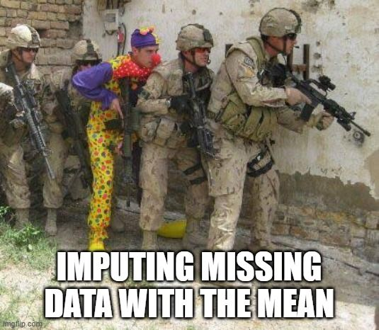

```{r set-options, echo=FALSE, message=FALSE, warning=FALSE, cache=FALSE}
options(width = 100)
library(knitr)
library(dplyr)
library(tidyverse)
library(tidyr)
library(ggthemes)
```


# Recap: Data cleaning and Data Visualization

## Use the five building block from `dplyr()`

```{r, echo=FALSE, out.width = "90%", fig.align='center', fig.cap = 'Source: [Intro to R for Social Scientists](https://jaspertjaden.github.io/course-intro2r/week3.html)', purl=FALSE}
include_graphics("../../img/dplyr_blocks.png")
```


## Important additional tools

- `ifelse(test, yes, no)` returns a value with the same shape as the logical test. Filled with elements selected from either `yes` or `no` depending on whether the element of `test` is `TRUE` or `FALSE`
```{r, echo = TRUE, eval = FALSE}
df |>
  mutate(gender = ifelse(gender == "m", 1, 0))
```
- `case_when` vectorises multiple `ifelse()` statements. It is the `dplyr` equivalent of `if...else`
```{r, echo = TRUE, eval = FALSE}
df |>
  mutate(
    agegroup = case_when(
      age >= 0 & age < 19 ~ "0-18",
      age >= 19 & age < 66 ~ "19-65",
      age >= 66 & age < 100 ~ ">65",
      .default = "999"
    )
  )
```
- `stringr`: str_replace(), str_detect(), etc.
- `tolower` and `trimws`


## Exploratory data analysis
#### "To not mislead others and not embarrass yourself, know your data".*

- Understand the **number of observations**, the **units**, the **quality** of data, the **definitions** of variables, what to do with **missing values**.

#### What type of variation occurs within my variables?

- **Typical values**: mean, mode, range, standard deviation.
- **Surprising values**: outliers, rare values, unusual patterns.

#### What type of covariation occurs between my variables?
- **Covariation** and **Patterns**.


## Missing Values

:::: {.columns}

::: {.column width="50%"}
<br>

  1. Keep in mind the **source of missingness throughout your analysis**
  2. Be aware of the **trade-off between data loss and bias**
  3. **Choose imputation methods wisely** (or, maybe, don't bother)

:::

::: {.column width="50%"}
```{r echo= FALSE, out.width="100%", fig.align="center"}

```

:::
::::


## Data visualization through tables and graphs

#### A **chart** typically contains at least one axis, the **values are represented in terms of visual objects** (dots, lines, bars) and axes typically have scales or labels.

  - If we are interested in exploring, analyzing or communicating **patterns** in the data, charts are more useful than tables.

<br>

#### A **table** typically contains rows and columns, and the **values are represented by text**.

  - If we are interested in exploring, analyzing or communicating **specific numbers** in the data, tables are more useful than graphs.


## The grammar of graphics

- The *`ggplot2`* package is an implementation of Leland Wilkinson's 'Grammar of Graphics'.

- `ggplot2` is so good that it has become *THE* reference [In python, use `plotnine` to apply the grammar of graphics.]


## Grammar of graphics with `ggplot2`

```{r echo= FALSE,out.width="55%", fig.align="center"}
include_graphics("../../img/grammargraphics.jpg")
```


## The grammar of graphics in action

Example from [A Comprehensive Guide to the Grammar of Graphics for Effective Visualization of Multi-dimensional Data](https://towardsdatascience.com/a-comprehensive-guide-to-the-grammar-of-graphics-for-effective-visualization-of-multi-dimensional-1f92b4ed4149) using the built-in `mtcars` dataset in R.

```{r echo= TRUE, fig.align="center"}
mtcars # mtcars is a built-in dataset in R
```


## From two dimensions...
```{r echo= TRUE, fig.align="center"}
ggplot(mtcars, aes(x = wt, y = mpg)) +
  geom_point() +
  theme_bw()
```


## To three dimensions...

```{r echo= TRUE, fig.align="center"}
ggplot(mtcars, aes(x = wt, y = mpg, color=factor(gear))) +
  geom_point() +
  theme_bw()
```

## To four dimensions...

```{r echo= TRUE, fig.align="center"}
ggplot(mtcars, aes(x = wt, y = mpg, color=factor(gear), size = cyl)) +
  geom_point() +
  theme_bw()
```


## To five dimensions
```{r echo= TRUE, fig.align="center"}
ggplot(mtcars, aes(x = wt, y = mpg, color=factor(gear), size = cyl)) +
  geom_point() +
  facet_wrap(~am) +
  theme_bw()
```

## To six dimensions
```{r echo= TRUE, fig.align="center"}
ggplot(mtcars, aes(x = wt, y = mpg, color=factor(gear), size = cyl)) +
  geom_point() +
  facet_grid(am ~ carb) +
  theme_bw()
```


## Quiz on `geom_line()` vs `geom_smooth()`

:::: {.columns}

::: {.column width="50%"}
```{r echo= TRUE, fig.align="center", eval = FALSE}
ggplot(mtcars, aes(x = wt, y = mpg)) +
  geom_point() +
  geom_line() +
  theme_bw()
```

:::

::: {.column width="50%"}
```{r echo= TRUE, fig.align="center", eval = FALSE}
ggplot(mtcars, aes(x = wt, y = mpg)) +
  geom_point() +
  geom_smooth(method = "lm", se = FALSE) +
  theme_bw()
```

:::
::::

## Quiz on `geom_line()` vs `geom_smooth()`

:::: {.columns}

::: {.column width="50%"}
```{r echo= TRUE, fig.align="center"}
ggplot(mtcars, aes(x = wt, y = mpg)) +
  geom_point() +
  geom_line() +
  theme_bw()
```

:::

::: {.column width="50%"}
```{r echo= TRUE, fig.align="center"}
ggplot(mtcars, aes(x = wt, y = mpg)) +
  geom_point() +
  geom_smooth(method = "lm", se = FALSE) +
  theme_bw()
```

:::
::::


## Quiz on size, fill, color arguments

:::: {.columns}

::: {.column width="50%"}
```{r echo= TRUE, fig.align="center", eval = FALSE}
mtcars |>
  ggplot(aes(x = wt, y = mpg)) +
  geom_point(color = "blue") +
  theme_bw()
```

:::

::: {.column width="50%"}
```{r echo= TRUE, fig.align="center", eval = FALSE}
mtcars |>
  ggplot(aes(x = wt, y = mpg, color=factor(gear))) +
  geom_point() +
  theme_bw()
```

:::
::::

## Quiz on size, fill, color arguments

:::: {.columns}

::: {.column width="50%"}
```{r echo= TRUE, fig.align="center", eval = T}
mtcars |>
  ggplot(aes(x = wt, y = mpg)) +
  geom_point(color = "blue") +
  theme_bw()
```

:::

::: {.column width="50%"}
```{r echo= TRUE, fig.align="center", eval = T}
mtcars |>
  ggplot(aes(x = wt, y = mpg, color=factor(gear))) +
  geom_point() +
  theme_bw()
```

:::

::::


## Quiz on `geom_bar()`

Which code produced the figure? (This question would not be an exam question, as it requires specific knowledge of `geom_bar()`. Solve it with R.)

```{r echo= TRUE, fig.align="center"}
got_data <- tibble(
  house = c("Stark", "Stark", "Stark", "Lannister", "Lannister", "Lannister",
            "Targaryen", "Targaryen", "Targaryen"),
  soldiers = c(5000, 3000, 500, 4000, 3800, 1900, 4200, 3500, 5000),
  year = c(1,2,3,1,2,3,1,2,3)
)
```

<br>

:::: {.columns}

::: {.column width="50%"}
```{r, echo = TRUE, eval = FALSE}
ggplot(got_data, aes(x = year, y = soldiers, fill = house)) +
  geom_bar(stat = "identity") +
  theme_classic()
```

```{r, echo = TRUE, eval = FALSE}
ggplot(got_data, aes(x = year, y = soldiers, fill = house)) +
  geom_histogram() +
  theme_classic()
```

```{r, echo = TRUE, eval = FALSE}
ggplot(got_data, aes(x = year, fill = house)) +
  geom_bar() +
  theme_classic()
```
:::

::: {.column width="50%"}

```{r echo= FALSE, fig.align="center"}
ggplot(got_data, aes(x = year, y = soldiers, fill = house)) +
  geom_bar(stat = "identity") +
  theme_classic()
```
:::

::::


<!--

# Today

## 📢 Announcements: about the exam

#### Exam for exchange students
- 🎁 19.12.2024 at 16:15 in room 01-207.

#### Lockdown browser
- Exam and LockDown Browser: check Sharepoint on [StudentWeb](https://universitaetstgallen.sharepoint.com/sites/PruefungenDE/SitePages/en/Digitale-Pr%C3%BCfungen-(BYOD).aspx#how-to-prepare-for-a-digital-exam) and test on Canvas. <br>**Password**: DataHandling2023


## 📢 Announcements: about the exam

#### Expectations for the exam:

  - Same format as quizzes and mock exam, including True/False questions, multiple-choice, and multiple-correct options. These are designed to test your understanding of the material.
  - There will also be 3-4 essay-style questions aimed at evaluating your ability to apply your knowledge to new situations.

    - E.g., you might be asked to explain particular steps of the data analysis process in a given situation. You can use code, R concepts, or you can explain in plain English. The more precise the better.

  - **You will not be required to write exact R code**, but you should be able to interpret and understand the code provided in the exam.
  - I expect you to be familiar with all R commands and concepts covered in the lectures, exercises, in-class code, and additional practice exercises.
  - The readings are not mandatory for the exam. The focus will be on the material discussed in class and during the exercises.
 -->


# Today


## Goals for today

#### Building on what we covered last week:

1. [Know how to conduct exploratory data analysis (EDA).]{style="color:#6b7280;"}
2. [Visualize data using tables.]{style="color:#6b7280;"}
3. Visualize data using the grammar of graphics.
4. Produce effective data visualization.


# From graphs to effective data visualization


## Data visualization: some principles

- Values are represented by their **position relative to the axes**: line charts and scatterplots.

- Values are represented by the **size of an area**:  bar charts and area charts.

- Values are **continuous**: use chart type that visually connects elements (line chart).

- Values are **categorical**: use chart type that visually separates elements (bar chart).


::: {.aside}
(Source: [Data Visualization Basics for Economists](https://hhsievertsen.github.io/EconDataBook/data-visualization-basics.html))
:::


## {class="inverse"}
“Greatest number of ideas in the shortest time with the least ink in the smallest space” (Edward Tufte, 1983)


## Data visualization: some principles

:::: {style="display: flex;"}

::: {}
Recommendations from Edward Tufte's "The Visual Display of Quantitative Information" (1983)

  1. Lie Factor
  2. Data-to-ink Ratio
  3. Data density

:::

::: {}
```{r, echo=FALSE, out.width = "70%", fig.align='center',  purl=FALSE}
include_graphics("../../img/tufte.jpg")
```
:::

::::


## Lie Factor, or strive for graphical integrity

:::: {.columns}

::: {.column width="50%"}
<br>

We can quantify the **Lie Factor** of a graph as a measure of how much the graphic distorts the data.

"The representation of numbers, as physically measured on the surface of the graphic itself, should be directly proportional to the quantities represented." (Tufte, 1983)

Lie Factor = $\frac{\text{size of effect shown in graphic}}{\text{size of effect in data}}$

:::

::: {.column width="50%"}
```{r, echo=FALSE, out.width = "60%", fig.align='center',  purl=FALSE}
include_graphics("../../img/doctors_tufte.jpg")

```
:::

<!-- # Lie factor of 2.25 -->
<!-- From 1964 to 1990, 55% reduction in the number of doctors (from 27% to 12%). The number on the far left (27%) is a little over double the number on the far right (12%), so the picture of doctor on the left is a little more than twice as tall as the doctor on the right. The height of the doctor goes from around 8cm to 4cm on my screen.
The problem is that these doctors have width in addition to height and that the size of each doctor is proportional to both its width and its height. So the size of the doctor on the left is far more than twice the size of the doctor on the right.
The data increases by 2.25 from right to left. The picture increases by 5.0625 (squared). This is a lie factor of 2.25. -->

```{r, echo=FALSE, eval = FALSE}
effect_data <- 27/12 #2.25
effect_size <- (27*(3*effect_data))/(12*3)
effect_data^2
effect_size/(effect_data)

effect_data <- (12/27 )
effect_size <- (12*(3))/(27*3*effect_data)
effect_size/(effect_data)
```

::::


## Lie Factor, or strive for graphical integrity

:::: {.columns}

::: {.column width="50%"}
<br>

Lie Factor = $\frac{\text{Yang had 39.1% of total ink}}{\text{Yang had 22.5%}}$ = 1.74
:::

::: {.column width="50%"}
```{r, echo=FALSE, out.width = "100%", fig.align='center',  purl=FALSE}
include_graphics("../../img/yangPOLL.jpg")
```
:::

<!-- Using a rule on the monitor: -->
<!-- Yang: 12.5*2 = 25 -->
<!-- Bernie: 8*1.5 = 12 -->
<!-- Buttigieg: 7*1.5 = 10.5 -->
<!-- Biden: 6*1.5 = 9 -->
<!-- Warren: 5*1.5 = 7.5 -->

<!-- In reality: 22.5/(22.5+21+17.9+11.5+9.6) = 27.27% -->
<!-- In the graph: 25/(25+12+10.5+9+7.5) = 39.1%, or 43.2% larger -->
::::

## Thou shalt not truncate the Y axis.

```{r, echo=FALSE, out.width = "50%", fig.align='center',  purl=FALSE}
include_graphics("../../img/carlson.png")
```

<!-- In reality, the effect is 18.5%  (77/65) -->
<!-- In the graph, the effect is 9.24 larger (19/7) -->


## Thou shalt not truncate the Y axis.

```{r echo= FALSE, out.width="120%", fig.align="center", fig.cap = "Source: [The lie factor and the baseline paradox](https://nightingaledvs.com/the-lie-factor-and-the-baseline-paradox/)" }
include_graphics("https://i0.wp.com/nightingaledvs.com/wp-content/uploads/2021/06/Hilje-6.png?resize=768%2C433&ssl=1")
```


## Avoid pie charts
```{r, echo=FALSE, out.width = "100%", fig.align='center',  purl=FALSE}
library(gridExtra)

# Create sample data
df1 <- data.frame(
  category = c("A", "B"),
  value = c(85, 15)
)

df2 <- data.frame(
  category = c("A", "B"),
  value = c(55, 45)
)

# Pie chart
pie_chart <- ggplot(df1, aes(x = "", y = value, fill = category)) +
  geom_bar(stat = "identity", width = 1, color = "white") +
  coord_polar("y") +
  geom_text(aes(label = category),
            position = position_stack(vjust = 0.5),
            size = 7, color = "white") +
  labs(title = "Pie Chart") +
  theme_void() +
  scale_fill_brewer(palette = "Set1") +
  theme(
    plot.title = element_text(size = 14, face = "bold", hjust = 0.5),
    legend.position = "none"  # Remove the legend
  )

pie_chart2 <- ggplot(df2, aes(x = "", y = value, fill = category)) +
  geom_bar(stat = "identity", width = 1, color = "white") +
  coord_polar("y") +
  geom_text(aes(label = category),
            position = position_stack(vjust = 0.5),
            size = 7, color = "white") +
  labs(title = "Pie Chart") +
  theme_void() +
  scale_fill_brewer(palette = "Set1") +
  theme(
    plot.title = element_text(size = 14, face = "bold", hjust = 0.5),
    legend.position = "none"  # Remove the legend
  )

# Combine the charts
grid.arrange(pie_chart, pie_chart2, ncol = 2)

```

"All variations lead to overestimation of small values and underestimation of large ones." [Kosara et al, 2018](https://diglib.eg.org/server/api/core/bitstreams/b0fc6407-96c8-4127-b1cb-6ca990b2ddb0/content)


## Avoid pie charts, please!

```{r, echo=TRUE, out.width = "100%", fig.align='center',  purl=FALSE}
#| code-fold: true
#| code-summary: "Show the code"

# Libraries
library(tidyverse)
library(patchwork)

# create 3 data frame:
namesS <- c("Standard", "Health+", "Medicall", "GateKeeper", "Risk-")
data1 <- data.frame( name=factor(namesS, levels = namesS), value=c(17,18,20,22,24) )
data2 <- data.frame( name=factor(namesS, levels = namesS), value=c(20,18,21,20,20) )
data3 <- data.frame( name=factor(namesS, levels = namesS), value=c(24,23,21,19,18) )

# Plot
plot_pie <- function(data, vec){
ggplot(data, aes(x="name", y=value, fill=name)) +
  geom_bar(width = 1, stat = "identity") +
  coord_polar("y", start=0, direction = -1) +
  scale_fill_brewer(type = "div") +
  geom_text(aes(y = vec, label = rev(name), size=4, color=c( "white", rep("black", 4)))) +
  scale_color_manual(values=c("black", "white")) +
  theme_minimal() +
  theme(
    legend.position="none",
    plot.title = element_text(size=14),
    panel.grid = element_blank(),
    axis.text = element_blank(),
    legend.spacing=unit(0, "null")
  ) +
  xlab("") +
  ylab("")

}

# A function to make barplots
plot_bar <- function(data){
  ggplot(data, aes(x=name, y=value, fill=name)) +
    geom_bar( stat = "identity") +
    scale_fill_brewer(type = "div") +
    scale_color_manual(values=c("black", "white")) +
    theme_minimal() +
    theme(
      legend.position="none",
      plot.title = element_text(size=14),
      panel.grid = element_blank(),
    ) +
    ylim(0,25) +
    xlab("") +
    ylab("")
}
```

```{r, echo=FALSE, out.width = "80%", fig.align='center',  purl=FALSE}
a <- plot_pie(data1, c(10,35,55,75,93))
b <- plot_pie(data2, c(10,35,53,75,93))
c <- plot_pie(data3, c(10,29,50,75,93))
a + b + c
```

## Avoid pie charts, please!
```{r, echo=FALSE, out.width = "80%", fig.align='center',  purl=FALSE}
a <- plot_bar(data1)
b <- plot_bar(data2)
c <- plot_bar(data3)
a + b + c
```

::: {.aside}
(Source: My own experience, [The Issue with Pie Charts](https://www.data-to-viz.com/caveat/pie.html))
:::


## Different types of colors for different types of data

```{r echo=FALSE, eval = TRUE, out.width = "100%", message=FALSE, warning=FALSE, fig.align='center'}

n <- 40
data <- data.frame(
  x = 1:n,
  y = runif(n, min = 0, max = 5),
  group = rep(letters[1:5], each = n/5)
)

# Create a scatterplot
p <- ggplot(data, aes(x = x, y = y, color = group)) +
  geom_point(size = 3) +
  labs(
    x = "",
    y = "",
    color = ""
  ) +
  theme_classic() +
  theme(legend.position = "none")

p2 <- p +
  labs(
    title = "Palette: Sequential",
    subtitle = 'scale_color_brewer(palette = "BuPu")'
  ) +
  scale_color_brewer(palette = "BuPu")

p3 <- p +
  labs(
    title = "Palette: Qualitative",
    subtitle = 'scale_color_brewer(palette = "Dark2")'
  ) +
  scale_color_brewer(palette = "Dark2")

p4 <- p +
  labs(
    title = "Palette: R Color brewer: Diverging",
    subtitle = 'scale_color_brewer(palette = "RdYlGn")'
  ) +
  scale_color_brewer(palette = "RdYlGn")

library(harrypotter)
p1 <- p +
  labs(
    title = "Palette: Gryffindor 🧙",
    subtitle = 'scale_color_hp(house = "Gryffindor", discrete = TRUE)'
  ) +
  scale_color_hp(house = "Gryffindor", discrete = TRUE)

grid.arrange(p2, p3, p4, p1, ncol = 2)

```


## Only what matters should be reported

- Data-ink Ratio = $\frac{\text{ink used for data points}}{\text{total ink used to print the graphic
}}$

  - Proportion of a graphic's ink devoted to the non-redundant display of data-information
  - **Data ink**: data points and measured quantities, such as the dots in a scatter plot
  - **Non-data ink**: functional marks such as titles, labels, axes, gridlines and tick points or decorative marks

#### Idea: maximize data-ink ratio

  - Limits to this approach: we still need some ink to interpret and understand the data.
  - No chart junk!


## Only what matters should be reported

```{r echo=FALSE, out.width = "100%", message=FALSE, warning=FALSE, fig.align='center'}
library(gridExtra)
library(ggthemes)

# High data-ink ratio graph (plot1)
plot1 <- mtcars |>
  group_by(cyl) |>
  count() |>
  ggplot(aes(x = as.factor(cyl), y = n, fill = as.factor(cyl), label = n)) +
  geom_bar(stat = "identity") +
  geom_label(color = "white", fontface = "bold", show.legend = FALSE) +
  labs(
    title = "Car Cylinder Count with Low Data-Ink Ratio",
    subtitle = "Detailed representation with color, labels, and gridlines",
    x = "Number of Cylinders",
    y = "Count of Cars"
  ) +
  theme_minimal() +
  theme(
    panel.background = element_rect(fill = "lightblue", color = NA),
    panel.grid.major = element_line(color = "gray70", size = 0.5),
    panel.grid.minor = element_line(color = "gray85", size = 0.25),
    legend.position = "none",
    plot.title = element_text(face = "bold", size = 16),
    plot.subtitle = element_text(size = 12, color = "gray20")
  )

# Minimalist graph (plot2)
plot2 <- mtcars |>
  group_by(cyl) |>
  count() |>
  ggplot(aes(x = as.factor(cyl), y = n)) +
  geom_bar(stat = "identity", fill = "gray50") +
  labs(
    title = "Car Cylinder Count with High Data-Ink Ratio",
    x = "Number of Cylinders",
    y = "Count of Cars"
  ) +
  theme_minimal() +
  theme(
    plot.title = element_text(face = "bold", size = 14),
    axis.title = element_text(size = 10),
    axis.text = element_text(size = 8)
  )

# Arrange both plots side by side
grid.arrange(plot1, plot2, ncol = 2)
```
<details> <summary>Show code for the graphs</summary>
```{r echo=TRUE, eval = FALSE, out.width = "100%", message=FALSE, warning=FALSE, fig.align='center'}
library(gridExtra)
library(ggthemes)

# High data-ink ratio graph (plot1)
plot1 <- mtcars |>
  group_by(cyl) |>
  count() |>
  ggplot(aes(x = as.factor(cyl), y = n, fill = as.factor(cyl), label = n)) +
  geom_bar(stat = "identity") +
  geom_label(color = "white", fontface = "bold", show.legend = FALSE) +
  labs(
    title = "Car Cylinder Count with Low Data-Ink Ratio",
    subtitle = "Detailed representation with color, labels, and gridlines",
    x = "Number of Cylinders",
    y = "Count of Cars"
  ) +
  theme_minimal() +
  theme(
    panel.background = element_rect(fill = "lightblue", color = NA),
    panel.grid.major = element_line(color = "gray70", size = 0.5),
    panel.grid.minor = element_line(color = "gray85", size = 0.25),
    legend.position = "none",
    plot.title = element_text(face = "bold", size = 16),
    plot.subtitle = element_text(size = 12, color = "gray20")
  )

# Minimalist graph (plot2)
plot2 <- mtcars |>
  group_by(cyl) |>
  count() |>
  ggplot(aes(x = as.factor(cyl), y = n)) +
  geom_bar(stat = "identity", fill = "gray50") +
  labs(
    title = "Car Cylinder Count with High Data-Ink Ratio",
    x = "Number of Cylinders",
    y = "Count of Cars"
  ) +
  theme_minimal() +
  theme(
    plot.title = element_text(face = "bold", size = 14),
    axis.title = element_text(size = 10),
    axis.text = element_text(size = 8)
  )

# Arrange both plots side by side
grid.arrange(plot1, plot2, ncol = 2)
```
</details>


## Only what matters should be reported

```{r echo= FALSE, out.width="120%", fig.align="center", fig.cap = "Source: [simplexct.com](https://simplexct.com/data-ink-ratio)" }
include_graphics("../../img/datainkration.png")
```


## Only what matters should be reported

```{r echo= FALSE, out.width="120%", fig.align="center", fig.cap = "Source: [simplexct.com](https://simplexct.com/data-ink-ratio)" }
include_graphics("https://img.pagecloud.com/28E0b8Fkrd98Y1K8fxPD8bX0NqM=/918x0/filters:no_upscale()/simplexct/images/Fig2-b7d62.png")
```


## Only what matters should be reported

Works for tables as well...

:::: {.columns}

::: {.column width="50%"}
```{r echo= FALSE, out.width="120%", fig.align="center", fig.cap = "Source: [simplexct.com](https://simplexct.com/data-ink-ratio-tables)"}
include_graphics("https://img.pagecloud.com/7xNdhRMc4inFClYsHQ5xxa4YQW4=/936x0/filters:no_upscale()/simplexct/images/Fig2-wd319.png")
```
:::

::: {.column width="50%"}
```{r echo= FALSE, out.width="120%", fig.align="center" }
include_graphics("https://img.pagecloud.com/6e1pFdr0cwYRNL4ehktNetsGuCI=/936x0/filters:no_upscale()/simplexct/images/Fig3-h15bd.png")
```
:::

::::

## Data density

The data density takes the number of data points that are being graphed relative to the physical size of the graphic to capture the principle of aiming to present many numbers in a small space:

- Data density = $\frac{\text{number of entries in data matrix}}{\text{area of data graphic}}$


## Data density

```{r echo=FALSE, eval = TRUE, out.width = "100%", message=FALSE, warning=FALSE, fig.align='center'}
two_by_two_matrix <- data.frame(candidate = c("Trump", "Harris"),
                                votes = c(49.8, 48.3))

```

:::: {.columns}

::: {.column width="50%"}

```{r echo=FALSE, eval = TRUE, out.width = "90%", message=FALSE, warning=FALSE, fig.align='center'}
ggplot(two_by_two_matrix, aes(x = candidate, y = votes)) +
  geom_col(fill = "skyblue") +
  geom_text(aes(label = votes), vjust = -0.5) +
  labs(subtitle = "Data Density Example",
       title = "Election results",
       x = "Candidate",
       y = "Votes") +
  theme_minimal()
```

:::

::: {.column width="30%"}

```{r echo=FALSE, eval = TRUE, out.width = "100%", message=FALSE, warning=FALSE, fig.align='center'}
library(gtExtras)
two_by_two_matrix |>
  gt() |>
  tab_header(
    title = md("Election results"),
    subtitle = md("Data Density Example")
  )
```
<!-- Give people the data so they can exercise their full powers – don’t limit them. Give the control of the information to the viewer instead of the editor. -->
<!-- Data-thin displays move viewers towards ignorance and passivity. -->

:::

::: {.column width="20%"}
**49.8% voted for Trump, 48.3% for Harris.**
:::

::::

:::: {.columns}

::: {.column width="50%"}
(1) Graph
:::

::: {.column width="30%"}
(2) Table
:::

::: {.column width="20%"}
(3) Text
:::

::::


## Data visualization: from a graph to a story


#### Two pieces of advice I personally received:

  1. If possible, **fit your whole story in one graph**.
  2. Your audience should understand your graph **without the need of listening to you** or **reading your text.**

<br>

- Be simple and avoid unnecessary fanciness.
- Avoid pie charts and 3D charts.


## Have fun with ggplot

:::: {.columns}

::: {.column width="50%"}

- Follow great dataviz leaders and influencers to learn how to master your craft: [data-to-viz (great!)](https://www.data-to-viz.com/#explore), [Yan Holtz](https://www.yan-holtz.com/), [Nicola Rennie](https://nrennie.rbind.io/), etc.
- Check [Tidytuesday](https://github.com/rfordatascience/tidytuesday), a weekly community of practice.

:::

::: {.column width="50%"}
```{r echo= FALSE, out.width="120%", fig.align="center" }

```
:::

::::


# A Design problem (self-study)

## A Design Problem

What is wrong with the graph below? Create your own version of the graph. If we have time, we will solve this example in class. If not, try to solve it on your own before you check the detailed solution below.


```{r echo= FALSE, out.width="120%", fig.align="center", fig.cap = "Source: [perceptual edge](https://perceptualedge.com/example3.php)" }
include_graphics("../../img/example3problem.gif")
```


## A Design Problem

Use the following data to create your own version of the graph:

```{r, echo = TRUE}
dataChallenge <- data.frame(
  Location = rep(c("Bahamas Beach", "French Riviera", "Hawaiian Club"), each = 3),
  Fiscal_Year = rep(c("FY93", "FY94", "FY95"), times = 3),
  Revenue = c(
    250000, 275000, 350000,  # Bahamas Beach (FY93, FY94, FY95)
    260000, 200000, 210000,  # French Riviera (FY93, FY94, FY95)
    450000, 500000, 400000   # Hawaiian Club (FY93, FY94, FY95)
  )
)
```


## The problem with this graph

  - The 3-D bars are impossible to read.
  - The heavy grid lines offer nothing but distraction.
  - The vertically-oriented labels (i.e., the resort names and years) are difficult to read.
  - The years run from back to front, which is counter-intuitive.


## A first solution: comparative performance

:::: {.columns}

::: {.column width="60%"}
```{r echo=FALSE, out.width="85%", fig.width=4.9, fig.height=3.5, message=FALSE}
ggplot(dataChallenge, aes(x = Fiscal_Year, y = Revenue, fill = Location)) +
  geom_bar(stat = "identity", position = position_dodge()) +
  labs(
    title = "Resort Revenues by Location and Year",
    x = "",
    y = "Revenue (in USD)"
  ) +
  scale_y_continuous(labels = scales::dollar) +
  scale_x_discrete(labels = c("1993", "1994", "1995")) +
  theme_classic() +
  theme(legend.position = "bottom")
```
:::

::: {.column width="40%"}

- The three resorts have been arranged in order of rank, based on revenue, to highlight their comparative performance.
- The years have been arranged from left to right, which is intuitive.
- The legend has been placed below the bars.

:::
::::
<details> <summary>Show code</summary>
```{r echo=TRUE, eval = FALSE, message=FALSE}
ggplot(dataChallenge, aes(x = Fiscal_Year, y = Revenue, fill = Location)) +
  geom_bar(stat = "identity", position = position_dodge()) +
  labs(
    title = "Resort Revenues by Location and Year",
    x = "Year",
    y = "Revenue (in USD)"
  ) +
  scale_y_continuous(labels = scales::dollar) +
  scale_x_discrete(labels = c("1993", "1994", "1995")) +
  theme_classic() +
  theme(legend.position = "bottom")
```
</details>


## A second solution: change of revenue over time

:::: {.columns}

::: {.column width="60%"}
```{r echo=FALSE, out.width="85%", fig.width=4.9, fig.height=3.5, message=FALSE}
ggplot(dataChallenge, aes(x = Fiscal_Year, y = Revenue, color = Location,
                          group = Location)) +
  geom_line() +
  labs(
    title = "Resort Revenues by Location and Year",
    x = "",
    y = "Revenue (in USD)"
  ) +
  scale_y_continuous(labels = scales::dollar) +
  scale_x_discrete(labels = c("1993", "1994", "1995"),
                   expand = expansion(add = c(0.5, 0.5))) +
  theme_classic() +
  theme(legend.position = "bottom")
```
:::

::: {.column width="40%"}

- This design makes it easy to see how revenue has changed from year to year at each of these resorts.
- However, the magnitudes are difficult to read because the y-axis does not start at 0!
- The eye is still going back and forth between the lines and the legend.

:::
::::
<details> <summary>Show code</summary>
```{r echo=TRUE, eval = FALSE, message=FALSE}
ggplot(dataChallenge, aes(x = Fiscal_Year, y = Revenue, color = Location,
                          group = Location)) +
  geom_line() +
  labs(
    title = "Resort Revenues by Location and Year",
    x = "",
    y = "Revenue (in USD)"
  ) +
  scale_y_continuous(labels = scales::dollar) +
  scale_x_discrete(labels = c("1993", "1994", "1995"),
                   expand = expansion(add = c(0.5, 0.5))) +
  theme_classic() +
  theme(legend.position = "bottom")
```
</details>


## A second solution: change of revenue over time

:::: {.columns}

::: {.column width="60%"}
```{r echo=FALSE, out.width="85%", fig.width=4.9, fig.height=3.5, message=FALSE}
ggplot(dataChallenge, aes(x = Fiscal_Year, y = Revenue, color = Location,
                          group = Location)) +
  geom_line(size = 2) +
  geom_text(data = dataChallenge[dataChallenge$Fiscal_Year == "FY95", ],
            aes(label = Location), hjust = 0, nudge_x = 0.1, nudge_y = 0) +
  labs(
    title = "Resort Revenues by Location and Year",
    x = "",
    y = "Revenue (in USD)"
  ) +
  scale_y_continuous(labels = scales::dollar, limits = c(0, 500000)) +
  scale_x_discrete(labels = c("1993", "1994", "1995"),
                   expand = expansion(add = c(0.5, 1))) +
  theme_classic() +
  theme(legend.position = "none")  +
  scale_color_brewer(palette = "Set1")
```
:::

::: {.column width="40%"}

- This design makes it easy to see how revenue has changed from year to year at each of these resorts.

:::
::::
<details> <summary>Show code</summary>
```{r echo=TRUE, eval = FALSE, message=FALSE}
ggplot(dataChallenge, aes(x = Fiscal_Year, y = Revenue, color = Location,
                          group = Location)) +
  geom_line(size = 2) +
  geom_text(data = dataChallenge[dataChallenge$Fiscal_Year == "FY95", ],
            aes(label = Location), hjust = 0, nudge_x = 0.1, nudge_y = 0) +
  labs(
    title = "Resort Revenues by Location and Year",
    x = "",
    y = "Revenue (in USD)"
  ) +
  scale_y_continuous(labels = scales::dollar, limits = c(0, 500000)) +
  scale_x_discrete(labels = c("1993", "1994", "1995"),
                   expand = expansion(add = c(0.5, 1))) +
  theme_classic() +
  theme(legend.position = "none")  +
  scale_color_brewer(palette = "Set1")
```
</details>


## A second solution: change of revenue over time

:::: {.columns}

::: {.column width="60%"}
```{r echo=FALSE, out.width="85%", fig.width=4.9, fig.height=3.5, message=FALSE}
ggplot(dataChallenge, aes(x = Fiscal_Year, y = Revenue, color = Location,
                          group = Location)) +
  geom_line(size = 2) +
  geom_text(data = dataChallenge[dataChallenge$Fiscal_Year == "FY95", ],
            aes(label = Location), hjust = 0, nudge_x = 0.1, nudge_y = 0) +
  labs(
    title = "Resort Revenues by Location and Year",
    x = "",
    y = "Revenue (in USD)"
  ) +
  scale_y_continuous(labels = scales::dollar, limits = c(0, 500000)) +
  scale_x_discrete(labels = c("1993", "1994", "1995"),
                   expand = expansion(add = c(0.5, 1))) +
  theme_classic() +
  theme(legend.position = "none") +
  scale_color_brewer(palette = "Greys")
```
:::

::: {.column width="40%"}

- Different color palette.

:::
::::
<details> <summary>Show code</summary>
```{r echo=FALSE, message=FALSE}
ggplot(dataChallenge, aes(x = Fiscal_Year, y = Revenue, color = Location,
                          group = Location)) +
  geom_line(size = 2) +
  geom_text(data = dataChallenge[dataChallenge$Fiscal_Year == "FY95", ],
            aes(label = Location), hjust = 0, nudge_x = 0.1, nudge_y = 0) +
  labs(
    title = "Resort Revenues by Location and Year",
    x = "",
    y = "Revenue (in USD)"
  ) +
  scale_y_continuous(labels = scales::dollar, limits = c(0, 500000)) +
  scale_x_discrete(labels = c("1993", "1994", "1995"),
                   expand = expansion(add = c(0.5, 1))) +
  theme_classic() +
  theme(legend.position = "none") +
  scale_color_brewer(palette = "Greys")
```
</details>


## Conclusion

Data visualization is an art of story-telling, deception, and scientific exactitude 🤓.


